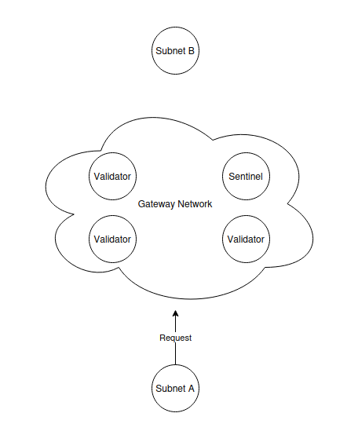
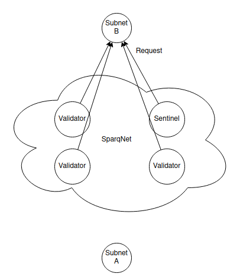
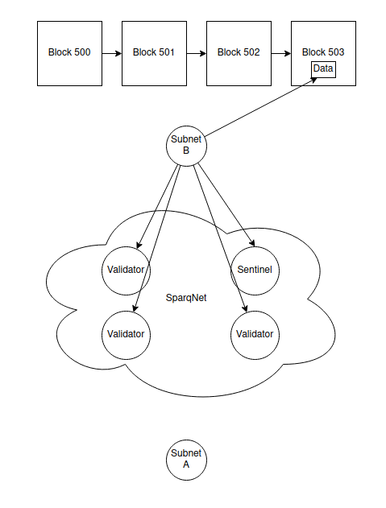
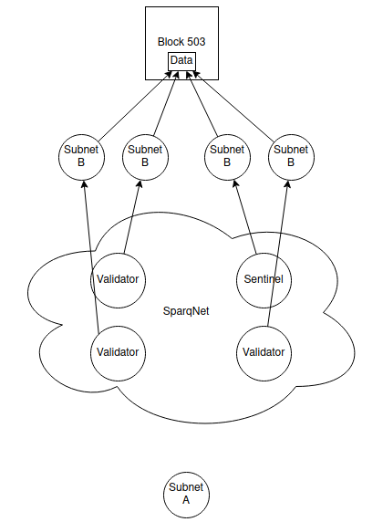
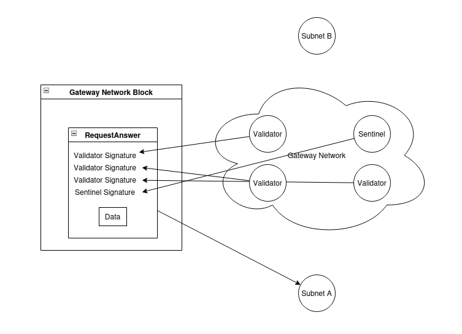

# 1.3 - Bridging

[As explained earlier](1-1.md), there are inherent flexibility problems with **native** and **application-specific** chains when compared to traditional EVM chains.

Those problems could heavily damage the reputation of a project built on them, and our solution is to allow Sparq-enabled blockchains to natively communicate with each other by using SparqNet as a middleman. We call that **bridging**.

It's possible to bridge *arbitrary data* and *tokens*, both *between SparqNet nodes* and *between SparqNet and external networks*.

## SparqNet <-> SparqNet Data Bridging

Bridging data from a SparqNet chain (A) to another (B) is simple:

* A writes a request on the next block and relays the request with the block reference to SparqNet.

* The randomly selected Validators and Sentinels check A's request and relay it to B.

* B gathers the data within its chain inside a merkled item, then sends it and its reference within its own chain to SparqNet to be permanently stored.

* Validators and Sentinels check the data sent by B against other nodes of B to ensure that the data is inside that given block.

* Validators and Sentinels sign the data and publish it inside SparqNet, while also relaying it back to A.

* A verifies the signatures and checks if the randomly selected nodes were using the network's random number generator seed.

## SparqNet <-> SparqNet Token Bridging

The same method for arbitrary data bridging is used for token bridging, but there are extra checkups to guarantee that a given chain is not minting another chain's tokens.

Due to the system's design, when doing a cross-chain transaction we can only ensure that the data *exists*, not that it is *valid in context*. That breach allows a given chain to mint the native token of another chain, because SparqNet does not verify if the token is valid inside that network.

We avoid this problem by keeping a "token table" of the chains. A token table is a simple "spreadsheet" of the chains and their token balances, except for the given chain's native token, since the chain itself can freely mint its own token and that still requires checks within itself, so we don't need to keep it on the table.

For example, we have chains A, B, and C, each one with tokens of each other, where SparqNet keeps track of:

-  How many B's and C's exist on A
-  How many A's and C's exist on B
-  How many A's and B's exist on C

When bridging another chain's tokens, SparqNet checks if that chain has enough balance to do so. When bridging your own tokens, SparqNet only has to increase the balance on the target chain, since the `exit` transaction from your chain has to be included in one of your blocks, which means it has been verified and validated inside your own network, so there's no need to verify and validate it again from the outside.

SparqNet <-> SparqNet Bridge follows mint/burn mechanisms.

## SparqNet <-> External Bridging (Ethereum, Solana, etc.)

There are multiple edge cases related to external bridging. For example, not only it's not possible to natively push data into these chains without paying transaction fees, but those external networks are also limited on both processing power and how much signature verification can be done.

Knowing this, at least for now, the current bridging implementation for them is centralized and owned by Sparq Labs Inc. to ensure operational safety.

SparqNet <-> External bridge follows lock/release mechanisms.

## How is safety ensured?

Nodes that will read from a given chain are determined using `RandomGen`, the trustless decentralized random number generator developed by Sparq Labs Inc..

We ensure to keep a "fair" selection of nodes, but even then there is the possibility of a 51% attack. For example, in a network with 100 nodes, if a given malicious user controls 50 of them, and all of them get selected for driving a cross-chain request and a block, they could collude and forward any message they wanted. We avoid this by introducing Sentinels to the network to ensure this collusion doesn't happen.

See the following links for more details on [RandomGen](../ch2/2-3.md), [rdPoS](../ch4/4-2.md), [Sentinels and Validators](1-2.md).

