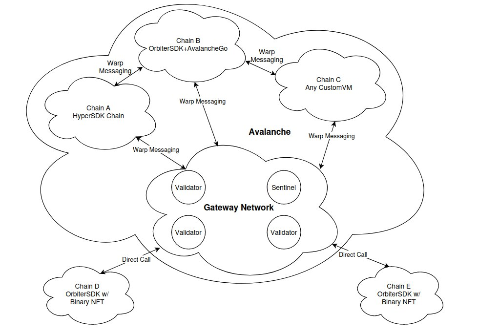

# 1.4 - Bridging

As explained in [1.1](1-1.md), there are inherent flexibility problems with **native** and **application-specific** chains when compared to traditional EVM chains.

Those problems could heavily damage the reputation of a project built on them, and our solution is to allow Sparq-enabled blockchains to natively communicate with each other by using the Gateway Network as a middleman. We call that **bridging**.

It's possible to bridge *arbitrary data* and *tokens*, both *between OrbiterSDK nodes* and *between OrbiterSDK and external networks*.

## OrbiterSDK <-> OrbiterSDK Data Bridging

Bridging data from a OrbiterSDK chain (A) to another (B) is simple:

* Chain A logs a request in the upcoming block and communicates this, along with the block reference, to the Gateway Network.

* A set of randomly selected Validators and Sentinels review Chain A's request and forward it to Chain B.

* Chain B retrieves the data from its chain, encapsulating it within a merkled item. This data and its internal reference are subsequently transmitted to the Gateway Network for permanent storage.

* Validators and Sentinels corroborate the data submitted by Chain B with other nodes from Chain B to validate its presence in the designated block.

* Validators and Sentinels signs the data and publish it inside the gateway, while also relaying it back to A.

* A verifies the signatures and checks if the randomly selected nodes were using the network's random number generator seed.

It is possible for Subnet A to only send information to the target chain without having to wait for an answer, this call can possibly trigger logic within the target chain, depending on how their developers decided to handle your message.

## OrbiterSDK <-> OrbiterSDK Token Bridging

The same method for arbitrary data bridging is used for token bridging, but there are extra checkups to make sure that a given chain is not minting another chain's tokens.

Due to how the project was designed, when doing a cross-chain transaction we can only ensure that the data *exists*, not that it is *valid in context*. That breach allows a given chain to mint the native token of another chain, because the Gateway Network does not verify if the token is valid inside that network.

We avoid this problem by keeping a "token table", which is just a "spreadsheet" of chains and their external token balances. Of course, this doesn't include the given chain's own native token, since it can freely mint its own token itself and does its own internal validations to avoid invalid minting conditions.

For example, we have chains A, B, and C, each one with tokens of each other. The Gateway Network keeps track of:

* How many B's and C's exist on A
* How many A's and C's exist on B
* How many A's and B's exist on C

When bridging another chain's tokens, Gateway Network checks if that chain has enough balance to do so. When bridging your own tokens, the Gateway Network only has to increase the balance on the target chain, since the `exit` transaction from your chain has to be included in one of your blocks, which means it has been verified and validated inside your own network, so there's no need to do it again from the outside.

OrbiterSDK <-> OrbiterSDK Bridge follows mint/burn mechanisms.

## OrbiterSDK <-> AvalancheGo Subnet Bridging.

The Gateway Network is designed as an Avalanche Subnet, making it inherently compatible with the Avalanche Warp Messaging system. This compatibility means that blockchains developed with OrbiterSDK with AvalancheGo can easily leverage this warp system. They can efficiently communicate with other parts of the Avalanche network without relying entirely on the Gateway Network, enhancing speed and reliability.

By integrating the warp system into our bridging tactics, we enhance the reach of OrbiterSDK. It's not confined to just communicating with other OrbiterSDK blockchains but can connect with any subnet in the Avalanche framework.

In essence, any network—be it an Avalanche subnet or an OrbiterSDK subnet—can interface with one another. The mode of communication shifts slightly, with the warp messaging system facilitating exchanges from the gateway network to the Avalanche subnet.

See the example below on how messages are sent from an OrbiterSDK subnet to an AvalancheGo subnet, while the mechanisms to ensure data existence remains the same.

## OrbiterSDK <-> External Bridging (Ethereum, Solana, etc.)

There are multiple edge cases related to external bridging. For example, not only it's not possible to natively push data into these chains without paying transaction fees, but those external networks are also limited on both processing power and how much signature verification can be done.

Knowing this, at least for now, the current bridging implementation for them is centralized and owned by Sparq Labs Inc. to ensure operational safety.

OrbiterSDK <-> External bridge follows lock/release mechanisms.

## How is safety ensured?

Nodes that will read from a given chain are determined using `RandomGen`, the trustless decentralized random number generator developed by Sparq Labs Inc.

We ensure to keep a "fair" selection of nodes, but even then there is the possibility of a 51% attack - in a network with 100 nodes, if a given malicious user controls 50 of them, and all of them get selected for driving a cross-chain request and a block, they could collude and forward any message they wanted. We avoid this by introducing Sentinels to the network to ensure this collusion doesn't happen.

See the following links for more details on [How rdPoS works](1-3.md), [How consensus works](1-2.md), [RandomGen](../ch2/2-1-1.md#randomgen)
