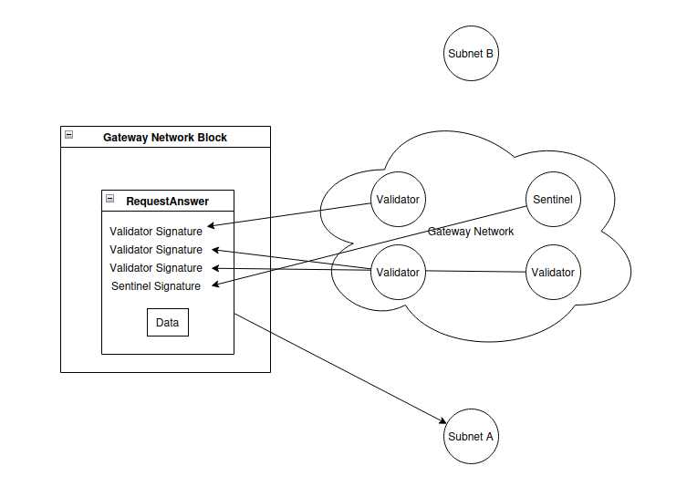

# 1.4 - Bridging

As explained in [1.1 - Sparq overview](1-1.md), compared to EVM chains, there are inherent flexibility problems with **native** and **application-specific** Subnets or DApp chains.

Those problems could heavily damage the reputation of a project built on them, and our solution is to allow SparqNet-enabled blockchains to natively communicate with each other by using SparqNet as a middleman. We call that *bridging*.

It's possible to bridge *arbitrary data* and *tokens*, both *between SparqNet nodes* and *between SparqNet and external networks*.

## SparqNet <-> SparqNet Data Bridging

Bridging data from a SparqNet Subnet (A) to another (B) is simple:

* A writes a request to the next block and relays the request with the block reference to SparqNet.

* The randomly selected Validators and Sentinels (using `RandomGen`) check A's request and relay it to B.

* B gathers the data within its blockchain inside a merkled item, then sends it and its reference within its own blockchain to SparqNet to be permanently stored.

* Validators and Sentinels check the data sent by B against other nodes of B to ensure that the data is inside that given block.

* Validators and Sentinels sign the data and publish it inside SparqNet, while also relaying it back to A.

* A verifies the signatures and checks if the randomly selected nodes were using the network's `RandomGen` seed.

## SparqNet <-> SparqNet Token Bridging

The same method for arbitrary data bridging is used for token bridging, but there are extra checkups to guarantee that a given Subnet is not minting another Subnet's tokens.

Due to the system's design, when doing a cross-chain transaction we can only ensure that the data *exists*, not that it is *valid in context*. That breach allows a given Subnet to mint the native token of another Subnet, because SparqNet does not verify if the token is valid inside that network.

We avoid this problem by keeping a "token table" of the Subnets. A token table is a simple "spreadsheet" of the subnets and their token balances, except for the given Subnet's native token, since the Subnet itself can freely mint its own token and that still requires checks within itself, so we don't need to keep it on the table.

For example, we have Subnet A, B, and C, each one with tokens of each other, where SparqNet keeps track of:

-  How many B's and C's exist on A
-  How many A's and C's exist on B
-  How many A's and B's exist on C

When bridging another Subnet's tokens, SparqNet checks if that Subnet has enough balance to do so. When bridging your own tokens, SparqNet only has to increase the balance on the target Subnet, since the `exit` transaction from your Subnet has to be included in one of your blocks, which means it has been verified and validated inside your own network, thus there's no need to verify and validate it again from the outside.

SparqNet <-> SparqNet Bridge follows mint/burn mechanisms.

## SparqNet <-> External Bridging (Ethereum, Solana, etc.)

Due to the limited processing power of these networks, the current bridging implementation for them is centralized and owned by Sparq Labs Inc..

SparqNet <-> External bridge follows lock/release mechanisms.

## How is safety ensured?

The nodes that will read from a given Subnet are determined using `RandomGen`, the trustless decentralized randomness generator developed by Sparq Labs Inc..

We ensure to keep a "fair" selection of nodes, but even then there is the possibility of a 51% attack. For example, in a network with 100 nodes, if a given malicious user controls 50 of them, and all of them get selected for driving a cross-chain request and a block, they could collude and forward any message they wanted.

We avoid this by introducing Sentinels to the network. Sentinels are Sparq Labs powered Validators that ensure this collusion doesn't happen. Sentinels are not able to create new blocks, but rather work together with Validators to drive the network forward.

More details on [1.2 - How Sparq works](1-2.md) and [1.3 - rdPoS](1-3.md).

