# 2.1.1 - The utils folder

This subchapter contains a brief overview of each one of the components inside the `src/utils` folder.

## Block

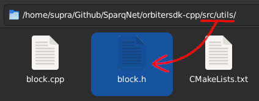

The `src/utils/block.h` file contains the **Block** class - the abstraction of a block sent through the network and stored in the blockchain.

The class only contains the bare structure and data of a block - it doesn't do any kind of operation, validation or verification on it. That's [rdPoS](../ch1/1-3.md) territory.

## Contract Reflection Interface

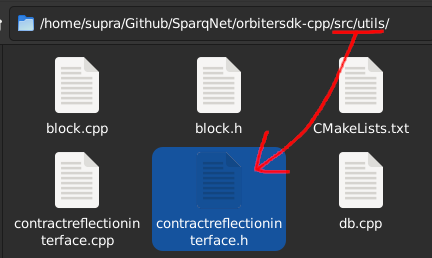

The `src/utils/contractreflectioninterface.h` file contains the **ContractReflectionInterface** namespace - utility functions for enabling [reflections](https://en.wikipedia.org/wiki/Reflective_programming) in C++ through the extensive use of templates, which helps with writing native contracts in a quicker and easier way (e.g. registering functions and variables using less lines of code, abstracting away and taking care of most details).

## Database

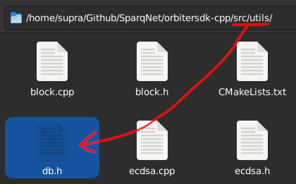

The `src/utils/db.h` file contains the **DB** class - an abstraction of a [Speedb](https://github.com/speedb-io/speedb) database used internally for various kinds of storage - as well as helper classes, structures and namespaces to manipulate the database.

## DynamicException

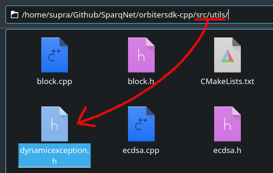

The `src/utils/dynamicexception.h` file contains the **DynamicException** class - a custom exception class inherited from `std::exception` used across the whole project. It is meant to be used when there's no applicable exception from the STD library for a given error that should be catched - usually the STD library is too generic, as the project grows some exceptions may become specific to the point we need to handle them in a customized manner.

## Secp256k1

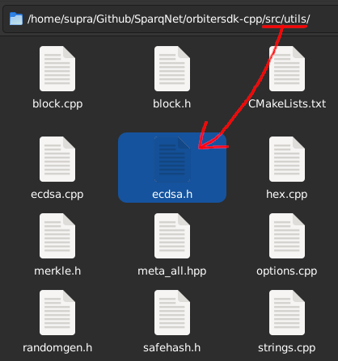

The `src/utils/ecdsa.h` file contains the **Secp256k1** namespace - helper functions that abstract the functionalities of Bitcoin's [secp256k1](https://en.bitcoin.it/wiki/Secp256k1) elliptic curve cryptography library, used for handling, deriving and recovering private/public keys and addresses, as well as signing and verifying signed messages.

The file also contains a few aliases for easier key handling, which are based on our own string abstractions (see FixedBytes below):

* **PrivKey** (same as **Hash**, or **FixedBytes\<32>**) - alias for a given private key
* **PubKey** (same as **FixedBytes\<33>**) - alias for a *compressed* public key
* **UPubKey** (same as **FixedBytes\<65>**) - alias for an *uncompressed* public key

## Hex

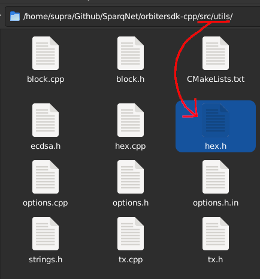

The `src/utils/hex.h` file contains the **Hex** class - an abstraction of a strictly hex-formatted string (meaning it only accepts the characters within the range of `0x[1-9][a-f][A-F]`), which can also be set to strict or not (which defines whether the string REQUIRES the `0x` prefix or not to be considered valid). Also contains aliases for working with raw-byte strings, such as **Byte, Bytes, BytesArr and BytesArrView**.

## JsonAbi

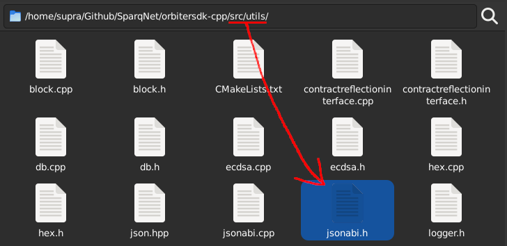

The `src/utils/jsonabi.h` file contains the **JsonAbi** namespace - utility functions for managing and converting contract ABI data to JSON format, used by the contract ABI generator tool in `src/main-contract-abi.cpp`.

## Logger

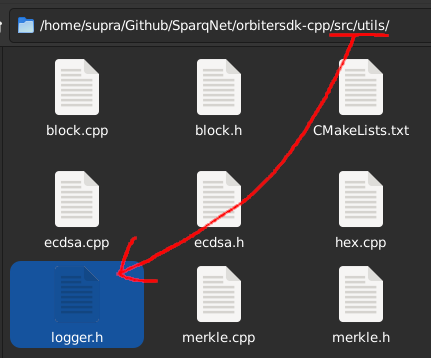

The `src/utils/logger.h` file contains the **Logger** class - a singleton responsible for logging any kind of info - and helper components such as the **Log** namespace (a namespace with predefined string names for referencing other modules), the **LogInfo** class (encapsulated log data), and the **LogType** enum (for flagging the severity of log messages).

The `Logger::logToFile()` and `Logger::logToDebug()` functions print the given details to the respective `log.txt` and `debug.txt` files inside the node's directory.

## Merkle

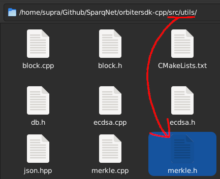

The `src/utils/merkle.h` class contains the **Merkle** class - a custom implementation of a Merkle Tree, adapted from the following sites:

* https://medium.com/coinmonks/implementing-merkle-tree-and-patricia-tree-b8badd6d9591
* https://lab.miguelmota.com/merkletreejs/example/

A "Merkle Tree" is a data structure in binary tree format (e.g. "heap sort"), where data is stored on the "leaves", and the "branches" are paths to reach said data. This structure is commonly used on the crypto space as a tool for *verification*: it hashes the previous layers in pairs to make new layers, bottom-up, until it reaches a single result which would be the "root" of the tree - this makes the root a unique fingerprint for the entire tree, so you only need to check the root hash to verify that both the tree and its leaves were not tampered with.

## Options

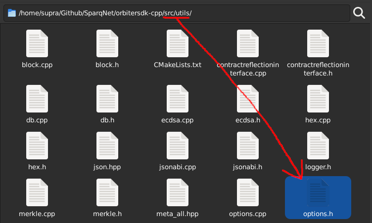

The `src/utils/options.h` file contains the **Options** class - a singleton with data about the node, frequently accessed by the SDK. This file is pre-generated from its respective `options.h.in` file during the CMake build process, as some of the info have to be gathered on-the-spot from the CMake config files.

## RandomGen

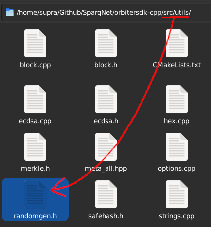

The `src/utils/randomgen.h` contains the **RandomGen** class - the implementation of the RNG (Random Number Generator) used in [rdPoS](../ch1/1-3.md) for almost everything related to consensus, responsible for ensuring a satisfactory level of deterministic randomness for the algorithm, and shuffling Validator lists.

This deterministic randomness guarantees that every node has a chance to answer for a given request (block, randomness, bridging, etc.), while making sure that selected nodes from the network are truly random and not malicious nodes from a bad actor.

For `RandomGen` to be useful, it needs to be seeded with a truly random number. Therefore, we have to pay attention to the current state of `RandomGen`, making sure that all nodes are always in the same internal state so they can properly sync with each other.

## SafeHash

The `src/utils/safehash.h` contains the **SafeHash** struct - a custom hashing implementation for use with `std::unordered_map`, replacing the one used as default by C++'s `std` library, like this for example: `std::unordered_map<Hash, uint64_t, SafeHash> cachedBlocks;`.

Essentially, the `std` implementation of `unordered_map` uses `uint64_t` hashes, which is vulnerable to a potentially dangerous edge case where collisions could happen by having an enormous number of accounts and distributing them in a way that they have the same hash across all nodes.

[This article from CodeForces](https://codeforces.com/blog/entry/62393) provides a fix, which we implemented so we could continue using `std::unordered_map` normally, as it has blazing fast query times. It's not a perfect fix, since it still uses `uint64_t`, but it's better than nothing since nodes keep different hashes.

## FixedBytes and its child classes

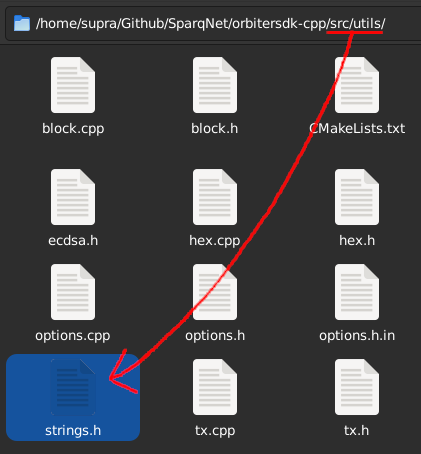

The `src/utils/strings.h` file contains the **FixedBytes** template class - an abstraction of a normal `std::array` with a fixed size. For example, a `FixedBytes<10> str;` would have *exactly* 10 characters in it - no more, no less. If initialized as an empty string, it will remain as a 10-character string nonetheless, albeit all characters would be "empty" (or `\x00` to be more exact).

Even though FixedBytes can be used on its own (*it's meant to store only bytes*, after all), it also serves as a base for specific classes, also declared within the same file and created with the intent of dealing with the many different ways that data strings are managed and transferred through the project in a better, less confusing and less convoluted way. They all inherit from the base FixedBytes class, applying fixed sizes of their own:

* **Hash** inherits **FixedBytes\<32>** and abstracts a given 32-byte hash
* **Functor** inherits **FixedBytes\<4>** and abstracts the first 4 bytes of a Solidity function's keccak hash
* **Signature** inherits **FixedBytes\<65>** and abstracts a given full ECDSA signature (r, s and v)
* **Address** inherits **FixedBytes\<20>** and abstracts a given 20-byte address

## Transactions

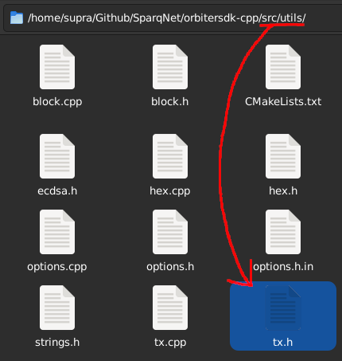

The `src/utils/tx.h` file contains the **TxBlock** and **TxValidator** classes - abstractions for a block transaction and a Validator transaction, respectively. The implementation logic and details for transactions within SparqNet are derived from the "Account" model, used by Ethereum and implemented by the [Aleth](https://github.com/ethereum/aleth) library, which is different from the "UTXO" model used by Bitcoin.

## Utils

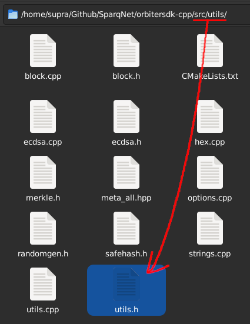

The `src/utils/utils.h` file contains the **Utils** namespace - a place for more generalized miscellaneous utility functions, namespaces, enums and typedefs used throughout OrbiterSDK as a whole.

This list is only an example and does not reflect the entire contents of the file. We suggest you read the [Doxygen](https://doxygen.nl/) docs for more info about the class:

* Aliases for working with:
    * Raw-byte strings (**Byte, Bytes, BytesArr, BytesArrView**), as well as helper functions for converting and/or manipulating them (e.g. `appendBytes()`)
    * Call data (**ethCallInfo, ethCallInfoAllocated**)
    * Unsigned integer types (**uintX_t, SafeUintX_t**)
* Enums for network type (**Networks**) and contract function type (**Function Types**)
* The `Account` struct, used to maintain account balance and nonce statuses
* The `EventParam` struct, used for abstracting a contract event parameter
* `safePrint()`, used to print details to the node's terminal (which can be checked by attaching a tmux session to it)
* The `sha3()` function, used extensively as the primary hash function for the entire project
* Functions that convert byte strings to unsigned integers and vice-versa (e.g. `uint256ToBytes()` and `bytesToUint256()`), as well as raw byte strings to normal string and vice-versa (e.g. `bytesToString()` and `stringToBytes()`)
* `padLeft()` and `padRight()`, used for adding padding to strings at their left and right sides, respectively
* `padLeftBytes()` and `padRightBytes()`, same as above, but specifically for use with raw byte strings
* `toLower()` and `toUpper()`, used for converting strings to all-lower and all-upper case, respectively
