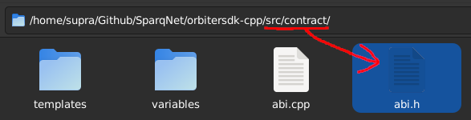
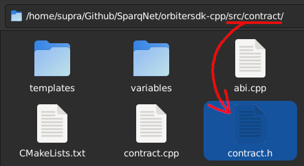
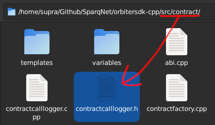
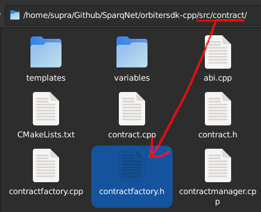
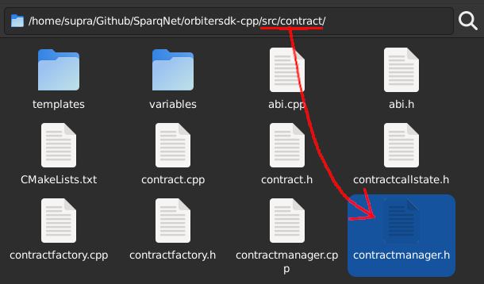
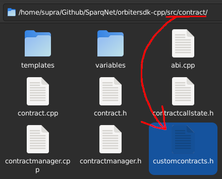
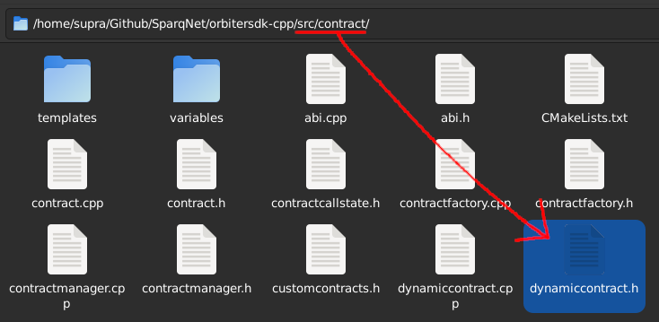
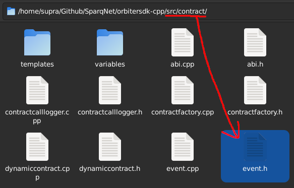
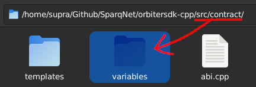
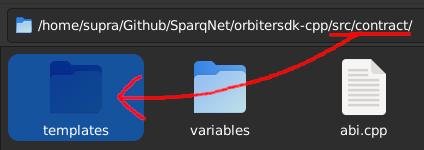

# 2.1.2 - The contract folder

This subchapter contains a brief overview of each one of the components inside the `src/contract` folder. See Chapter 3 for a more general information on contracts.

## ABI

The `src/contract/abi.h` file contains the **ABI** namespace - helper functions for handling Solidity ABI types and data natively, as well as the encoding and decoding of said data. See [Chapter 3.7](../ch3/3-7.md) for more information.

## BaseContract

The `src/contract/contract.h` file contains the **BaseContract** class - the base from which all smart contracts are derived - as well as the **ContractGlobals** and **ContractLocals** helper classes that provide access to global and local variables, respectively, for those contracts to work.

## ContractCallLogger

The `src/contract/contractcalllogger.h` file contains the **ContractCallLogger** class - it manages temporary data from contract nested call chains, such as used SafeVariables and altered balances, acting as the one who effectively decides whether those changes are commited or reverted during a contract call.

## ContractFactory

The `src/contract/contractfactory.h` file contains the **ContractFactory** class - responsible for creating the contracts and deploying them to the blockchain (more specifically to the ContractManager class).

## ContractManager and ContractManagerInterface

The `src/contract/contractmanager.h` contains the **ContractManager** and **ContractManagerInterface** classes - they represent the bulk of the contract functionality in OrbiterSDK.

*ContractManager* is responsible for maintaining all deployed contracts within the blockchain, while *ContractManagerInterface* is responsible for handling communications between contracts and the contract manager itself. See [Chapter 3.1](../ch3/3-1.md) for more information.

## CustomContracts

The `src/contract/customcontracts.h` file contains a tuple that holds all the registered contracts within the blockchain. See Chapters [3.4](../ch3/3-4.md) and [3.5](../ch3/3-5.md) for more information.

## DynamicContract

The `src/contract/dynamiccontract.h` file contains the **DynamicContract** class - the base from which all Dynamic Contracts are derived (while *BaseContract* is used for Protocol Contracts). See [Chapter 3.1](../ch3/3-1.md) for more information.

## Event and EventManager

The `src/contract/event.h` file contains the **Event** and **EventManager** classes - they represent the subset of contract functionality related to Solidity events.

*Event* is responsible for abstracting a Solidity event's structure and data, while *EventManager* is responsible for maintaining all emitted events within the blockchain.

## The variables subfolder

The `src/contract/variables` subfolder contains implementations for SafeVariables - special types that abstract safe versions of variables used within contracts. See [Chapter 3.1](../ch3/3-1.md) for more information.

## The templates subfolder

The `src/contract/templates` subfolder contains several contract templates and examples - it's also meant to be the folder where user-coded contracts are stored. See [Chapter 3.1](../ch3/3-1.md) for more information.
