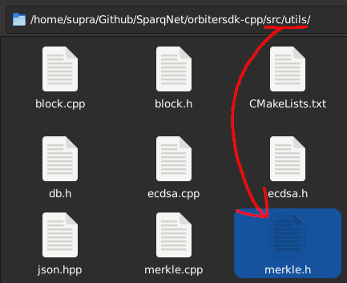

# 2.2 - Merkle and Patricia Trees

The Sparq project contains custom implementations of Merkle and Patricia trees, both declared in `src/utils/merkle.h`.

Those structures are known as "Merkle"/"Patricia", "Merkle Trie"/"Patricia Trie", "Merkle Tree"/"Patricia Tree", etc. The implementation was adapted from the following sites:

* https://medium.com/coinmonks/implementing-merkle-tree-and-patricia-tree-b8badd6d9591
* https://lab.miguelmota.com/merkletreejs/example/

## Concepts

We recommend reading the articles to better understand the concepts, but to sum it up, they're both data structures in binary tree format (e.g. "heap sort"), where data is stored on the "leaves", and the "branches" are paths to reach said data.

The difference between both structures is in the branches' (and also the root's) behaviour:

* A **Merkle tree** is mainly used for **verification**. It hashes the previous layers in pairs to make new layers, bottom-up, until it reaches a single result which would be the "root" of the tree - this makes the root a unique fingerprint for the entire tree, so you only need to check the root hash to verify that both the tree and its leaves were not tampered with
* A **Patricia Tree** is mainly used for **storage**. It breaks the "key" in several smaller pieces, using them to build a branch path that leads to the value - for example, a string can be cut into individual characters, and every character becomes a branch node, where the whole branch becomes a "key" that leads to a unique value

## Implementation

The Ethereum project uses a unified, customized combination of both trees, called MPT ("Merkle Patricia Tree"), to store the database state, transaction receipts, and other kinds of data structures. Sparq on the other hand implements those structures separately, using three classes: `Merkle`, `PNode` and `Patricia`.

Their nodes are abstracted by the classes `Hash` (for `Merkle`, declared in Utils) and `PNode` (for `Patricia`, declared internally by the class itself for exclusive use - the class still uses `Hash` for inserts, searches and deletions).

The `Merkle` class:
* Has a single attribute that represents the whole built tree, and getters for the tree, leaves and root
* Requires a list of `Hash`es, Block or Validator transactions to be constructed
* Has a method to check the integrity of one of the leaves - `getProof()`, which returns the verification path of a given leaf, bottom-up

The `PNode` class:
* Represents a single node inside a Patricia tree, with two fields - the data field and a character field that acts as the node's unique ID
* The root node is labeled as `/` and the leaf node has non-empty data
* Can contain `PNode`s as children, which can be added to and searched for
* Is not interacted with directly, only used by `Patricia` internally

The `Patricia` class:
* Has a single `PNode` attribute that represents the root of the tree
* Is responsible for inserting, searching and deleting values in the tree
* Deleting a value from a leaf node does NOT delete the branch itself, only the data - that means every branch created in it, empty or not, remains in memory
