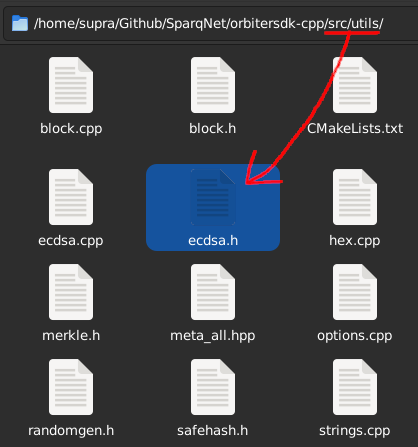
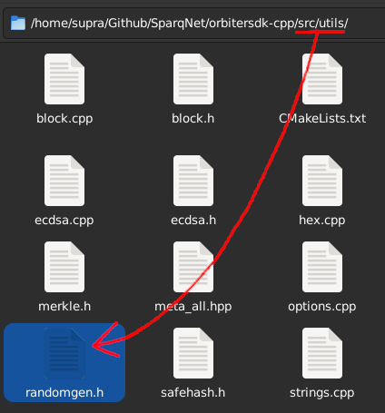
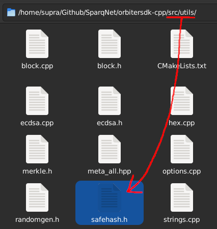

# 2.3 - Secp256k1, RandomGen and SafeHash

## Secp256k1

The **Secp256k1** namespace, declared in `src/utils/ecdsa.h`, contains helper functions that abstract the functionalities of Bitcoin's [secp256k1](https://en.bitcoin.it/wiki/Secp256k1) elliptic curve cryptography library.

The library is commonly used for handling, deriving and recovering private/public keys and addresses, as well as signing and verifying signed messages.

The file also contains a few aliases for easier key handling, which are based on our own string abstractions (see [2.5](2-5.md) for more info):

* **PrivKey** (same as **Hash**) - alias for a given private key
* **PubKey** (same as **FixedStr\<33>**) - alias for a *compressed* public key
* **UPubKey** (same as **FixedStr\<65>**) - alias for an *uncompressed* public key

## RandomGen

The **RandomGen** class, declared in `src/utils/randomgen.h`, contains the implementation of the RNG (Random Number Generator) used in [rdPoS](../ch4/4-2.md) for almost everything related to consensus.

Not only it is responsible for ensuring a satisfactory level of deterministic randomness for the algorithm, it's also responsible for shuffling Validator lists. This deterministic randomness guarantees that every node has a chance to answer for a given request (block, randomness, bridging, etc.), while making sure that selected nodes from the network are truly random and not malicious nodes from a bad actor.

For `RandomGen` to be useful, it needs to be seeded with a truly random number. Therefore, we have to pay attention to the current state of `RandomGen`, making sure that all nodes are always in the same internal state so they can properly sync with each other.

## SafeHash

The **SafeHash** struct, declared in `src/utils/safehash.h`, contains a custom hashing implementation for use with `std::unordered_map`, replacing the one used as default by C++'s `std` library. The reason this was implemented is [this article from CodeForces](https://codeforces.com/blog/entry/62393).

Essentially, `std::unordered_map`, as it is on the `std` library, uses `uint64_t` hashes. Because of that, there's an edge case where collisions could happen, and all it takes is having many accounts and distributing them in a way that they have the same hash across all nodes.

This could be potentially dangerous in practice, but the article provides a fix, which we implemented so we could continue using `std::unordered_map` normally, as it has blazing fast query times. It's not a perfect fix, since it still uses `uint64_t`, but it's better than nothing since nodes keep different hashes.

The struct is mainly used like this: `std::unordered_map<Hash, uint64_t, SafeHash> cachedBlocks` - putting SafeHash as the third parameter in the map replaces the default hashing function used by it with our custom implementation.
