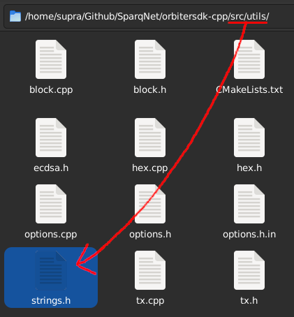
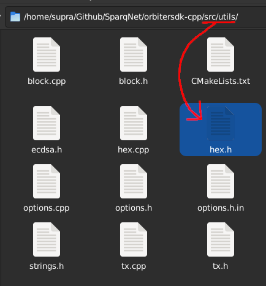

# 2.5 - Hex, FixedBytes and derivatives

Due to the many different ways that data strings are managed and transferred through the project, we created our own string abstractions to deal with them in a better, less confusing and less convoluted way.

## The FixedBytes class

The **FixedBytes** class, declared in `src/utils/strings.h`, is an abstraction of a normal `std::array`. For example, a `FixedBytes<10> str;` would have *exactly* 10 characters in it - no more, no less. If initialized as an empty string, it will remain as a 10-character string nonetheless, albeit all characters would be "empty" (or `\x00` to be more exact).

This class is the base for all the other abstractions, except for Hex (more on that below), as all classes inherit from it with fixed sizes of their own:

* **Hash** inherits **FixedBytes\<32>** and abstracts a given 32-byte hash
* **Signature** inherits **FixedBytes\<65>** and abstracts a given full ECDSA signature (r, s and v)
* **Address** inherits **FixedBytes\<20>** and abstracts a given 20-byte address

Even though the classes above inherit `FixedBytes`, it can be used on its own as well. *It's meant to store only bytes.*
## The Hex class

The **Hex** class, declared in `src/utils/hex.h`, is an abstraction of a `std::string`, *it's meant to store ONLY valid and hex-formatted strings*, which means it can only store the characters `0x[1-9][a-f][A-F]`.

This is on purpose, as having a different class for pure hex strings makes it easier to discern what exactly we're working with. Not only the class filters any invalid character and refuses to build the string if it finds one of them, it can also be set to be strict or not (a strict hex string REQUIRES the `0x` prefix for it to be considered valid).

## TL;DR When do I use each one?

* Use **FixedBytes** for any fixed size bytes array
* Use **Hash**, **Signature** or **Address** for their respective use cases
* Use **Hex** specifically for any hex string
