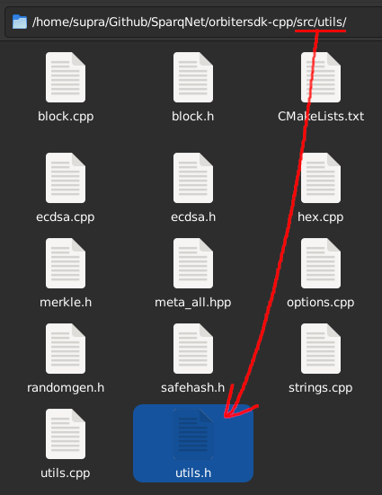

# 2.6 - The Utils namespace

The **Utils** namespace, declared inside `src/utils/utils.h`, contains several miscellaneous utility functions, namespaces and enums used throughout the whole project, such as:

* A `Log` namespace, with short label strings for each module in the project
* `logToFile()` and `logToDebug()`, used with the `Log` namespace to print details to the respective `log.txt` and `debug.txt` files inside the node's directory
* `safePrint()`, used to print details to the node's terminal (which can be checked by attaching a tmux session to it)
* The `Account` struct, used in [State](../ch4/4-4.md) to maintain account balance and nonce statuses
* The `sha3()` function, used extensively as the primary hash function for the entire project
* Functions that convert byte strings to unsigned integers and vice-versa (e.g. `uint256ToBytes()` and `bytesToUint256()`)
  * Those functions work with 8, 16, 32, 64, 160 and 256-bit unsigned integers
* `padLeft()` and `padRight()`, used for adding padding to strings at their left and right sides, respectively
* `padLeftBytes()` and `padRightBytes()`, same as above, but specifically for raw byte strings
* `toLower()` and `toUpper()`, used for converting strings to all-lower and all-upper case, respectively

This list is only an example and does not reflect the entire contents of the file. We suggest you read the [Doxygen](https://doxygen.nl/) docs for more info about the class.
