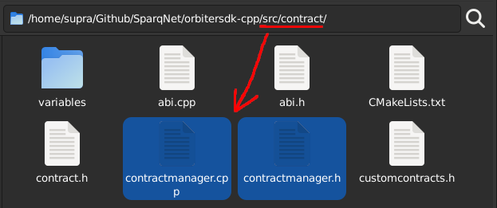

# 3.1 - Contracts in Sparq

Contracts in Sparq work similar to Solidity contracts - developers can implement diverse logic structures within the network, and directly interact with the blockchain's current state. The main difference is, in Sparq, contracts are *native, compiled C++ code*, taking advantage of the absence of an EVM and its constraints, having full control of the contract's logic and unleashing blazing fast performance.

This chapter will comprehensively cover creating new contracts for Sparq using OrbiterSDK. In general terms, to create a contract from scratch, you must:

* Develop the contract's logic in C++
* Manually code several methods to parse arguments of transactions calling your contract
* Use a database to manage the storage of your local variables

The rules explained throughout this chapter ensure that contracts remain compatible with frontend Web3 tools (e.g. MetaMask, ethers.js, web3.js, etc.). Those are designed to interact with Solidity contracts and thus require a similar interface.

To call your contract's functions from a frontend, you'll need to generate its ABI - you can either do it directly with our generator tool (explained further in [Chapter 3.4](3-4.md)), or replicate their definitions in Solidity and use an external tool like Ethereum's [Remix](https://remix.ethereum.org/) or any other of your preference. This ABI can then be used your preferred Web3 frontend.

## Types of Contracts

OrbiterSDK offers two types of contracts: **Dynamic Contracts** and **Protocol Contracts**. The differences between both types come from how they are created and managed within the SDK.

### Dynamic Contracts (recommended)

* Can only be handled by the `ContractManager` class (see below), which enables the chain owner to create an unlimited number of Dynamic Contracts
* Can use **SafeVariables** - an additional layer of protection that allows a better control on whether variable changes are commited to the state or automatically reverted when necessary (e.g. when a transaction fails)
* Can only be called when a block is being processed
* Are directly loaded into memory and work very similarly to Solidity contracts
* OrbiterSDK provides ready-to-use templates for the following Dynamic Contracts: `ERC20`, `ERC20Wrapper`, and `NativeWrapper`

### Protocol Contracts

* Are directly integrated into the blockchain, therefore not linked to the `ContractManager` class and not contained by it, which removes some restrictions but adds others (see [Chapter 3.6](3-6.md))
* Cannot use SafeVariables as they only work with Dynamic Contracts - so it's all up to you (for the most part) as to where to place the contract's variables and their commit/revert logic within the source code of the blockchain

### The ContractManager class

The `ContractManager` class (declared in `src/contract/contractmanager.h`) is a *Protocol Contract*, responsible for:

* Handling the creation and loading of all Dynamic Contracts registered within the blockchain (which you can get a list of by calling `getContractList()` - it returns an `(address[], string[])` map with the currently registered contracts)
* Managing global variables for those contracts, such as contract name, address, owner, balance, etc.
* Calling any function registered within your contract if the functor/signature matches
* Automatically committing/reverting changes made to the account state when necessary (for non-view functions)
