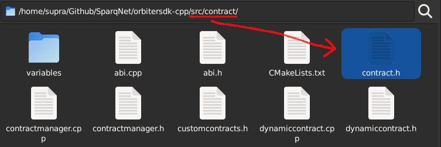
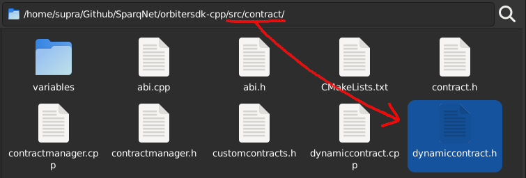

# 3.2 - Contract rules overview

When creating contracts for Sparq, there are a few rules that must be followed to ensure they will work as intended. While each contract type has its own rules, some other rules apply to both as well. This will be explained and demonstrated further in the next few subchapters.

## General contract rules

As a general stance, contracts must:

* Inherit from their respective base class, depending on their type (see below) and make sure you're passing the right arguments for their constructors
* Implement and initialize variables within the state and database during contract construction (loading) *and* destruction (saving), and the required view and non-view functions that manage them
* Register callbacks for contract functions with their proper functors/signatures (if functions are called by an RPC `eth_call` or a transaction)
* Ensure that their assigned name and their own class name match - both contract constructors take a `contractName` string as an argument (i.e. if your contract is called "TestContract", your constructor's definition would be `TestContract(...) : DynamicContract(interface, "TestContract", ...)`), and *both names HAVE to match*, otherwise a segfault may happen

## Rules for Protocol Contracts

Protocol Contracts specifically must:

* Inherit `BaseContract` from `src/contract/contract.h`:

* Override `ethCall()` functions to parse transaction arguments, manage state changes during their processing (depending on whether the call is committing or not), and commit/revert variables when necessary

## Rules for Dynamic Contracts

Dynamic Contracts specifically must:

* Inherit `DynamicContract` from `src/contract/dynamiccontract.h` and any type of SafeVariable used from the `src/contract/variables` folder:

* Provide a `ConstructorArguments` tuple with the contract's constructor argument types for registering the contract, and two registering functions: `registerContract()` for contract metadata and variables, and `registerContractFunctions()` for contract functions
* Provide two constructors: one for creating the contract from scratch within `ContractManager`, and the other for loading the contract from the database
* Develop functions for handling your contract's creation and logic
* Use SafeVariables for the contract's internal variables, which should be `private` and always referenced with `this` to ensure correct semantics
    * e.g. `string name` and `uint256 value` in Solidity should be `SafeString name` and `SafeUint256_t value` in C++, respectively - referencing them would be `this->name`, `this->value`...
* Allow loops using containers such as `SafeUnorderedMap`, but keep in mind how Safe Containers work
  * e.g. when you access a key from a `SafeUnorderedMap`, it'll check if it exists and copy *only* the key, not the entire map or its value, so when iterating a loop, you can't assume the "temporary" value is the original one
  * We recommended you only loop inside *view* functions to ensure value safety, but you can do it on non-view functions as well, just be careful when doing so
* Trigger state changes only via transaction calls to contract functions
* Call `updateState(true)` at the end of the contract's constructor

### Global Contract Variables

For both contract types (Protocol *and* Dynamic), you can use the following global functions during an `ethCall()`:

| Global Function         | Description                                             | Return type         |
|-------------------------|---------------------------------------------------------|---------------------|
| getContractAddress()    | Returns the contract's address                          | const Address&      |
| getContractCreator()    | Returns the contract's owner                            | const Address&      |
| getContractChainId()    | Returns the contract's chainId                          | const uint64_t&     |
| getContractName()       | Returns the contract's name                             | const std::string&  |
| getDBPrefix()           | Returns the contract's database prefix                  | const Bytes&        |
| getNewPrefix(newPrefix) | Same as getDBPrefix() but with newPrefix appended to it | const Bytes         |
| getOrigin()             | Returns the transaction's origin                        | const Address&      |
| getCaller()             | Returns the transaction's caller                        | const Address&      |
| getValue()              | Returns the transaction's value                         | const uint256_t&    |
| getCommit()             | Returns if the call is committing to state              | bool                |
| getCoinbase()           | Returns the coinbase address (creator of current block) | const Address&      |
| getBlockHeight()        | Returns the current block height                        | const uint256_t&    |
| getBlockTimestamp()     | Returns the current block timestamp                     | const uint256_t&    |

For Dynamic Contracts specifically, you can also use the following global functions:

| Global Function                                                           | Description                               | Return type               |
|---------------------------------------------------------------------------|-------------------------------------------|---------------------------|
| getContract(address)                                                      | Returns a pointer to a contract of type T | const T                   |
| callContractViewFunction(address, function, args)                         | Calls a contract's view function          | Same as view function     |
| callContractFunction(address, function, args)                             | Calls a contract's non-view function      | Same as non-view function |
| callCreateFunction(address, gas, gasPrice, callerValue, contractArgs...)  | Calls a contract's create function        | Address                   |
| getBalance(address)                                                       | Get the current balance of an address     | uint256_t                 |
| sendTokens(address, value)                                                | Send tokens to an address                 | void                      |

