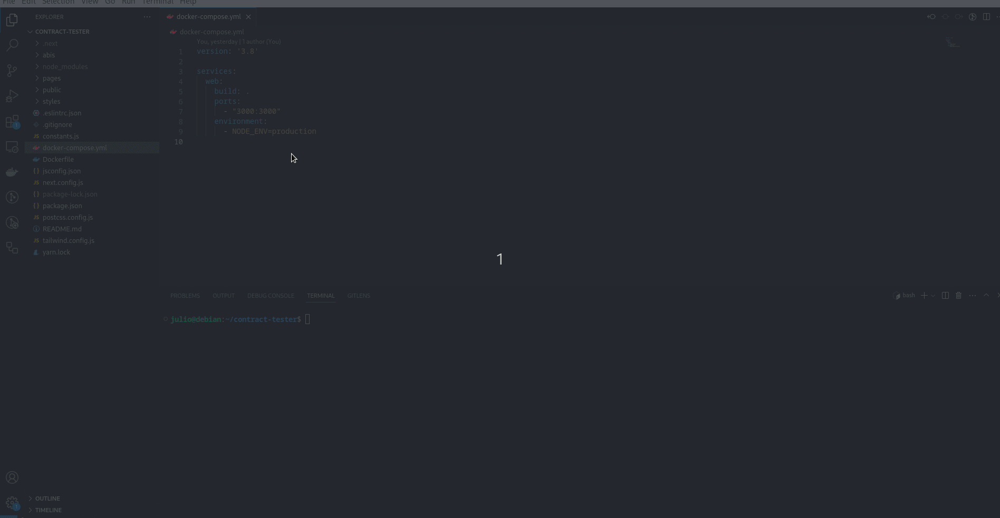

# 3.3 - Setting up the development environment

This subchapter explains how to set up [OrbiterSDK](https://github.com/SparqNet/orbitersdk-cpp), our open-core blockchain SDK project, to start creating and deploying your contracts in it. This is an overview/"more approachable" version of the project's README.md file - be sure to read it as well.

You're able to tweak out almost everything related to the SDK. We offer pre-existing solutions for all of those, but you are free to hack into them as you wish, just be careful not to break it apart. That includes but it isn't limited to:

* Consensus
* Block processing
* Transaction processing
* Contract processing
* Communication between nodes, etc.

As OrbiterSDK is not running a virtual machine of any kind, and contracts are natively compiled with the blockchain itself, which requires them to exist alongside the project's source code, it is impossible to submit a transaction with bytecode for a respective contract. Because of that, we strongly encourage you to fork the project, play around with the code and start developing your own contracts locally.

## Forking

In order to fork the project, you can head over to the [GitHub repository](https://github.com/SparqNet/orbitersdk-cpp) and click on the "Fork" button. After that, you can clone your forked repository and start developing on your own.


## Setup

You can setup the environment in two ways: *using Docker*, or *manually*. Manual setup has instructions for APT-based distros (e.g. Debian, Ubuntu, Mint, etc.), but other distros should work as long as you're meeting all the requirements on dependencies.

### Docker (recommended)

Using the Docker image is the recommended way to develop on the SDK. It will ensure that you have the correct environment to build and deploy the network, without worrying about dependencies or which host distro you're using.

Fork the project and clone your forked repository:

```bash
# Clone your repository
git clone https://github.com/YOUR_USER_NAME/orbitersdk-cpp.git
# Go to the project directory
cd orbitersdk-cpp
# add remote repository as upstream
git remote add upstream https://github.com/SparqNet/orbitersdk-cpp
```

Then, install Docker on your system (if you don't have it installed already). Instructions for your system can be found on the links below:

* [Docker for Windows](https://docs.docker.com/docker-for-windows/install/)
* [Docker for Mac](https://docs.docker.com/docker-for-mac/install/)
* [Docker for Linux](https://docs.docker.com/desktop/install/linux-install/)

Once Docker is installed, go to the root directory of your cloned repository (where the `Dockerfile` is located), and run the following command: `docker build -t orbitersdk-cpp-dev:latest .` (if you're on Linux or Mac, use `sudo`) - this will build the image and tag it as `orbitersdk-cpp-dev:latest`. You can change the tag to whatever you want, but remember to change it on the next step.

After building the image, run it with the following command (again, if using Linux or Mac, run as `sudo`): `docker run -it -v /path/to/your/sdk:/orbitersdk-cpp -p 8080-8099:8080-8099 -p 8110-8111:8110-8111 orbitersdk-cpp-dev:latest` - where:

* `/path/to/your/sdk` is the absolute/full path to the root directory of your cloned repository (you can save the path in an environment variable like `$SDK_PATH` for example and use it)
* `:/orbitersdk-cpp` is the absolute/full path *inside the container* where your repository's folder will be mounted
* The `-p` flags expose the ports used by the nodes - the example exposes the default ports 8080-8099 and 8110-8111, if you happen to use different ports, change them accordingly

When running the container, you will be logged in as the root user and will be able to develop, build and deploy the network within the container. Remember that we are using our local SDK repo as a volume, so every change in the local folder will be reflected to the container in real time, and vice-versa (so you can develop outside and use the container only for build and deploy). You can also integrate the container with your favorite IDE or editor.

#### VSCode + Docker extension

To integrate the container with VSCode, you need to install the [Docker extension](https://marketplace.visualstudio.com/items?itemName=ms-azuretools.vscode-docker) and configure it to use the container. After installing it, there is a `docker-compose.yml` file on the root of the repository that you can use to build and run the container. The only thing that you need to do is to change the `volumes` section to point to your local SDK folder:

```yaml
volumes:
  - /path/to/your/sdk:/orbitersdk-cpp
```

After editing the `docker-compose.yml` file, right-click on it and select `Compose Up` to build and run the container so you can start developing on it. Click on the Docker extension icon on the left side of the VSCode window and you will see the container running. You can also right-click on the container and select `Attach Shell` to open a terminal on the container.
  

## Manually setup development environment

TODO: update this when extrev is merged

You can follow this steps if you want to build the SDK in your own system. OrbiterSDK requires several dependencies (as of v0.0.2):

* **GCC** with support for **C++20** or higher
* **CMake 3.19.0** or higher
* **Abseil (absl)**
* **Boost 1.74** or higher (components: *chrono, filesystem, program-options, system, thread, nowide*)
* **CryptoPP 8.2.0** or higher
* **gRPC** + **Protobuf 3.12** or higher + **libc-ares**
* **LevelDB** + **libsnappy**
* **libscrypt**
* **OpenSSL 1.1.1**
* **zlib**

Here's a one-liner that should work on Debian 11 (Bullseye) or greater, as well as its derived distributions:

```bash
sudo apt install git build-essential cmake tmux clang-tidy autoconf libtool pkg-config libabsl-dev libboost-all-dev libc-ares-dev libcrypto++-dev libgrpc-dev libgrpc++-dev libleveldb-dev libscrypt-dev libsnappy-dev libssl-dev zlib1g-dev openssl protobuf-compiler protobuf-compiler-grpc
```

### CMake caveat

Note that Debian 11 specifically ships CMake *3.18.4*, which is not enough for OrbiterSDK's *3.19.0* requirement. In this case, you'll need to either install it separately, or compile it from source.

First, make sure you've uninstalled the system's CMake with `sudo apt purge cmake`, to avoid conflicts.

We recommend downloading the installer from [CMake's website](https://cmake.org/download/), installing it to somewhere like `/opt` and symlinking it to `/usr/local`, like so (change `$CMAKEVER` for the version number you wish):

```bash
# Assume CMAKEVER=3.19.0
# Download CMake installer
wget https://github.com/Kitware/CMake/releases/download/v$CMAKEVER/cmake-$CMAKEVER-linux-x86_64.sh
# Make it executable
chmod +x ./cmake-$CMAKEVER-linux-x86_64.sh
# Run it with the following parameters
sudo ./cmake-$CMAKEVER-linux-x86_64.sh --prefix=/opt --include-subdir --skip-license
# Symlink the CMake executable so you can call it directly
sudo ln -s /usr/local/bin/cmake /opt/cmake-$CMAKEVER-linux-x86_64/bin/cmake
# Symlink other binaries here if you wish
```

If you want to compile it from source, follow the steps below. They will install CMake 3.26.3, but you can change the version to any other you want like it was done above:

```bash
# Download CMake source
wget https://github.com/Kitware/CMake/releases/download/v3.26.3/cmake-3.26.3.tar.gz
# Extract the cmake-3.26.3.tar.gz file
tar -zxvf cmake-3.26.3.tar.gz
# Go to the extracted directory
cd cmake-3.26.3
# Bootstrap CMake (use --parallel=X where X is the number of cores you want to use to speed up the process)
./bootstrap --parallel=$(nproc)
# Compile CMake (use -jX where X is the number of cores you want to use to speed up the process)
make -j$(nproc)
# Install CMake
sudo make install
```

## Compiling

After forking the project, you can now setup your own local testnet. This is strongly recommended, as it will ensure your environment is properly setup and that you are able to compile the project with your contracts in it.

Clone your forked repository by following the steps below:

```bash
# Clone your repository
git clone https://github.com/YOUR_USER_NAME/orbitersdk-cpp.git
# Go to the project directory
cd orbitersdk-cpp
# add remote repository as upstream
git remote add upstream https://github.com/SparqNet/orbitersdk-cpp
# Fetch all tags
git fetch --tags upstream
# Update all tags within your repository
git push -f --tags
# Switch to a branch for contract development on latest release (change the version accordingly)
git checkout -b contract-development v0.0.2
```

After cloning, the following commands will build the project within the folder which `scripts/AIO-setup.sh` (a script that automatically builds and deploys a local testnet) will use later.

```bash
# Create the folder and enter it
mkdir build_local_testnet && cd build_local_testnet
# Configure cmake (DEBUG=ON will enable debug symbols and address sanitizer)
cmake -DDEBUG=ON ..
# Build the project - you can use either one of the lines below
make -j$(nproc)
# or...
cmake --build . -- -j$(nproc)
```

After building, you can optionally run a test bench with the following command: `./orbitersdkd-tests -d yes` (the `-d yes` parameter will give a verbose output). You can also use filter tags to test specific parts of the project (e.g. `./orbitersdkd-tests [utils] -d yes` will test all the components inside the `src/utils` folder, `[utils][tx]` will test only the transaction-related components inside utils, etc.).

Usable tags are:

* `[utils]` - everything in `src/utils`
    * `[utils][*]` - replace `*` with one of the class names: `block`, `db`, `hex`, `merkle`, `randomgen`, `secp256k1`, `strings`, `tx`
* `[contract]` - everything in `src/contract`
    * `[contract][*]` - replace `*` with one of the class names: `abi`, `contractmanager`, `erc20`, `erc20wrapper`, `nativewrapper`
    * `[contract][variables]` - all SafeVariable types
    * `[contract][variables][*]` - replace `*` with one of the class names: `safebool`, `safestring`, `safeaddress`, `safeuint8_t`, `safeuint16_t`, `safeuint32_t`, `safeuint64_t`, `safeuint256_t`, `safeunorderedmap`
* `[core]` - everything in `src/core`
    * `[core][*]` - replace `*` with one of the class names: `blockchain`, `options`, `rdpos`, `state`, `storage`
    * `[core][rdpos][net][p2p]` - only P2P-related functionality - append `[heavy]` for very taxing functionality
* `[net]` - everything in `src/net`
    * `[net][http][jsonrpc]` - only JSONRPC-related functionality

## Deploying

Go back to the project's root folder and run `./scripts/AIO-setup.sh`. This script will create two folders on the project's root - `build_local_testnet` and `local_testnet` - and build and deploy a fresh new instance of a local testnet.

Once the local testnet is deployed, you can connect any Web3 client to it. We recommend using [Metamask](https://metamask.io) as it is the most popular one, but you're free to use any other client you wish.

Running the script again will stop the testnet, rebuild it, replace it and restart it on the spot. If you wish to manually stop the testnet for some reason, call `tmux kill-server` (as we use tmux to properly deploy it). You can also read the script to find out the specific names of the tmux sessions to manually restart or stop accordingly.

You can use the following flags when calling the script to customize deployment:

| Flag | Description | Default Value |
|------|-------------|---------------|
| --clean | Clean the build folder before building | false |
| --no-deploy | Only build the project, don't deploy the network | false |
| --debug=\<bool\> | Build in debug mode | true |
| --cores=\<int\> | Number of cores to use for building | Maximum available |
As an example, `./scripts/AIO-setup.sh --clean --no-deploy --debug=false --cores=4`will clean the build folder, only build the project, build in release mode and use 4 cores for building. Remember that GCC uses around 1.5GB of RAM per core, so, for stability, it is recommended to adjust the number of cores to the available RAM on your system.

## MetaMask config

Here's how to configure MetaMask to connect to your local testnet:

| Field | Value                    |
| :--- |:-------------------------|
| Network Name | OrbiterSDK Local Testnet |
| New RPC URL | http://127.0.0.1:8090    |
| Chain ID | 808080                   |
| Currency Symbol | SPARQ                    |


Once you're connected, import the following private key for the chain owner account: `0xe89ef6409c467285bcae9f80ab1cfeb3487cfe61ab28fb7d36443e1daa0c2867`. This account contains 1000 SPARQ Tokens from the get go and is able to call the `ContractManager` contract.
