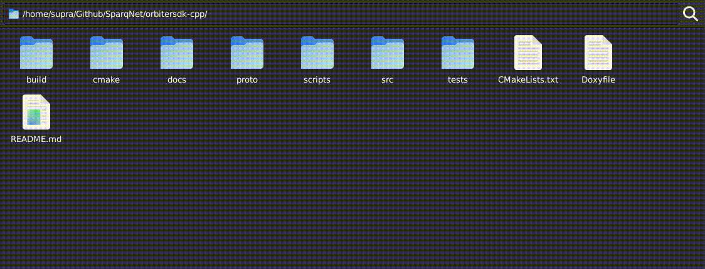

# 3.4.3 - Deploying and Testing

Now that the contract is finished and implemented, all that's left to do is deploy it. Though we would algo suggest writing some tests to make sure it's working as intended. This subchapter will explain how to do both.

## Generating the ABI

We have a tool that is compiled with the project that generates the ABI of your contract. Its executable is compiled from the `src/main-contract-abi.cpp` file, with the following code snippet by default:


```cpp
#include "utils/jsonabi.h"

int main() { return JsonAbi::writeContractsToJson<ContractTypes>(); }
```

Compile the project and run `./contractabigenerator`. All of your Dynamic Contracts registered in `src/contract/customcontracts.h` (in the `ContractTypes` tuple shown earlier in the previous step) will have their ABIs generated inside the `ABI` folder, as `<ContractName>.json`.

If you want a finer control of which ABIs you want to generate, replace `ContractTypes` with the exact names of the contract classes that should be generated:

```cpp
#include "utils/jsonabi.h"

int main() {
  return JsonAbi::writeContractsToJson<ERC20, ERC20Wrapper, ..., SimpleContract>();
}
```

The `ContractManager` contract will always have its ABI generated in both cases.

## Deploying the Blockchain

Go back to the project's root, compile and deploy the blockchain by running `./scripts/AIO-setup.sh`. See [Chapter 3.3](3-3.md) for more information. Your contract should be initialized alongside the blockchain, ready to be interacted with.

## Testing the Contract

We use the [catch2](https://github.com/catchorg/Catch2) framework to test our project as a whole, so it is expected to have at least a little bit of familiarity with how it works (it's pretty easy!).

For testing contracts specifically, we have developed our own test suite called `SDKTestSuite`, in `tests/sdktestsuite.hpp` (the `.cpp` file is for testing the test suite itself). Using this test suite is highly recommended, as it simulates the environment of the blockchain (e.g. creating blocks, advancing the chain, taking care of the state and its variables, etc.) to make sure contracts are behaving the way they would in the actual deployed blockchain. Check the [Doxygen](https://doxygen.nl) docs, as well as the contract test files in the `tests/contract` subfolder, for more information on how to use the test suite.

First, create a new file in the `tests/contract` folder with the name of your contract - in our case, `tests/contract/simplecontract.cpp` (which already exists as it is part of the project).



Then, add the file to the `CMakeLists.txt` file in the parent folder:


```cmake
set(TESTS_SOURCES
  # ...
  ${CMAKE_SOURCE_DIR}/tests/contract/simplecontract.cpp
  # ...
)
```

Finally, write your tests. In this case, for `SimpleContract`, tests should look like this:

```cpp
#include "../../src/libs/catch2/catch_amalgamated.hpp"
#include "../../src/utils/db.h"
#include "../../src/utils/options.h"
#include "../../src/core/rdpos.h"
#include "../../src/contract/abi.h"
#include "../../src/contract/contractmanager.h"
#include "../../src/contract/templates/simplecontract.h"

#include "../sdktestsuite.hpp"

#include <filesystem>

namespace TSimpleContract {
  TEST_CASE("SimpleContract class", "[contract][simplecontract]") {
    SECTION("SimpleContract creation") {
      SDKTestSuite sdk("testSimpleContractCreation");
      Address simpleContract = sdk.deployContract<SimpleContract>(
        std::string("TestName"), uint256_t(19283187581)
      );
      std::string name = sdk.callViewFunction(simpleContract, &SimpleContract::getName);
      uint256_t value = sdk.callViewFunction(simpleContract, &SimpleContract::getValue);
      REQUIRE(name == "TestName");
      REQUIRE(value == 19283187581);
    }

    SECTION("SimpleContract setName and setValue") {
      SDKTestSuite sdk("testSimpleContractSetNameAndSetValue");
      Address simpleContract = sdk.deployContract<SimpleContract>(
        std::string("TestName"), uint256_t(19283187581)
      );

      std::string name = sdk.callViewFunction(simpleContract, &SimpleContract::getName);
      uint256_t value = sdk.callViewFunction(simpleContract, &SimpleContract::getValue);
      REQUIRE(name == "TestName");
      REQUIRE(value == 19283187581);

      Hash nameTx = sdk.callFunction(simpleContract, &SimpleContract::setName, std::string("TryThisName"));
      Hash valueTx = sdk.callFunction(simpleContract, &SimpleContract::setValue, uint256_t("918258172319061203818967178162134821351"));
      name = sdk.callViewFunction(simpleContract, &SimpleContract::getName);
      value = sdk.callViewFunction(simpleContract, &SimpleContract::getValue);
      REQUIRE(name == "TryThisName");
      REQUIRE(value == uint256_t("918258172319061203818967178162134821351"));

      auto nameEvent = sdk.getEventsEmittedByTx(nameTx, &SimpleContract::nameChanged, std::make_tuple(EventParam<std::string, true>("TryThisName")));
      auto valueEvent = sdk.getEventsEmittedByTx(valueTx, &SimpleContract::valueChanged, std::make_tuple(EventParam<uint256_t, true>(uint256_t("918258172319061203818967178162134821351"))));
      REQUIRE(nameEvent.size() == 1);
      REQUIRE(valueEvent.size() == 1);
    }
  }
}
```

Keep in mind that we're not accessing the contract directly, we're interacting with it through `SDKTestSuite`, and that requires us to parse its inputs and outputs accordingly.

In order to run your tests, compile the project as you normally would (see [Chapter 3.3](3-3.md) for more information on how to set up your environment), and then run `./orbitersdkd-tests -d yes [simplecontract]` from within your build directory.

The `[simplecontract]` label forces only the tests for the contract to run (this is set in the `TEST_CASE()` lines in the example above). The `-d yes` flag makes it more verbose, showing exactly which test case is being run at the moment.
