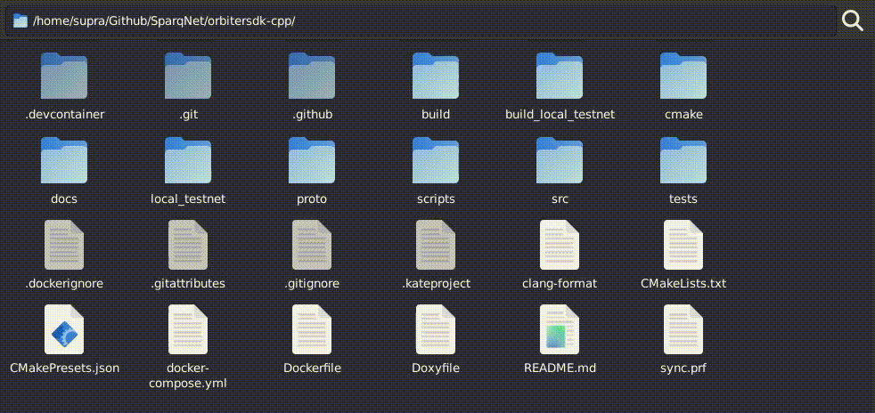

# 3.4 - Creating a Dynamic Contract (Simple)

Let's create a simple Solidity contract that allows two variables - `name` and `value` - to be changed by the owner of the contract, as well as perform basic operations with structs/tuples and event emissions. We will call this contract `SimpleContract`.

## Solidity Example

We'll be using the following Solidity code as a reference:

```solidity
// SPDX-License-Identifier: MIT
pragma solidity ^0.8;

contract SimpleContract {
  private string name_;
  private uint256 value_;

  event nameChanged(string indexed name);
  event valueChanged(uint256 indexed value);

  struct NameAndValue {
    string name;
    uint256 value;
  }

  struct NameAndValueArr {
    string[] name;
    uint256[] value;
  }

  function getName() public view returns(string memory) { return name_; }

  function getValue() public view returns(uint256) { return value_; }

  function setName(string memory argName) public { name_ = argName; }

  function setValue(uint256 argValue) public { value_ = argValue; }

  function getNames(uint256 i) public view returns(string[] memory) {
    string[] memory names = new string[](i);
    for (uint256 j = 0; j < i; j++) { names[j] = name_; }
    return names;
  }

  function getValues(uint256 i) public view returns(uint256[] memory) {
    uint256[] memory values = new uint256[](i);
    for (uint256 j = 0; j < i; j++) {
      values[j] = value_;
    }
    return values;
  }

  function setNames(string[] memory argName) public {
    name_ = "";
    for (uint256 i = 0; i < argName.length; i++) {
      name_ = string(abi.encodePacked(name_, argName[i]));
    }
  }

  function setValues(uint256[] memory argValue) public {
    value_ = 0;
    for (uint256 i = 0; i < argValue.length; i++) {
      value_ += argValue[i];
    }
  }

  function getNameAndValue() public view returns(NameAndValue memory) {
    NameAndValue memory nameAndValue;
    nameAndValue.name = name_;
    nameAndValue.value = value_;
    return nameAndValue;
  }

  function getNamesAndValues(uint256 i) public view returns(NameAndValueArr memory) {
    NameAndValueArr memory nameAndValues;
    nameAndValues.name = new string[](i);
    nameAndValues.value = new uint256[](i);
    for (uint256 j = 0; j < i; j++) {
      nameAndValues.name[j] = name_;
      nameAndValues.value[j] = value_;
    }
    return nameAndValues;
  }

  function getNamesAndValuesInTuple(uint256 i) public view returns(NameAndValue[] memory) {
    NameAndValue[] memory nameAndValues = new NameAndValue[](i);
    for (uint256 j = 0; j < i; j++) {
      nameAndValues[j].name = name_;
      nameAndValues[j].value = value_;
    }
    return nameAndValues;
  }

  function getNamesAndValuesInArrayOfArrays(uint256 i) public view returns(NameAndValue[][] memory) {
    NameAndValue[][] memory nameAndValues = new NameAndValue[][](i);
    for (uint256 j = 0; j < i; j++) {
      nameAndValues[j] = new NameAndValue[](i);
      for (uint256 k = 0; k < i; k++) {
        nameAndValues[j][k].name = name_;
        nameAndValues[j][k].value = value_;
      }
    }
    return nameAndValues;
  }

  function setNamesAndValues(string[] memory argName, uint256[] memory argValue) public {
    name_ = "";
    value_ = 0;
    for (uint256 i = 0; i < argName.length; i++) {
      name_ = string(abi.encodePacked(name_, argName[i]));
    }
    for (uint256 i = 0; i < argValue.length; i++) {
      value_ += argValue[i];
    }
  }

  function setNamesAndValuesInTuple(NameAndValue[] memory argNameAndValue) public {
    name_ = "";
    value_ = 0;
    for (uint256 i = 0; i < argNameAndValue.length; i++) {
      name_ = string(abi.encodePacked(name_, argNameAndValue[i].name));
      value_ += argNameAndValue[i].value;
    }
  }

  function setNamesAndValuesInArrayOfArrays(NameAndValue[][] memory argNameAndValue) public {
    name_ = "";
    value_ = 0;
    for (uint256 i = 0; i < argNameAndValue.length; i++) {
      for (uint256 j = 0; j < argNameAndValue[i].length; j++) {
        name_ = string(abi.encodePacked(name_, argNameAndValue[i][j].name));
        value_ += argNameAndValue[i][j].value;
      }
    }
  }
}
```

## Creating the Files

To recreate this contract as a native Sparq contract, first we need to create its header (`.h`) and source (`.cpp`) files, as is customary in C++ development - the header will have the definition of our contract class, and the source will have its implementation details.

Go to your local testnet's root folder, into the `src/contract/templates` subfolder, and create two new files - `simplecontract.h` and `simplecontract.cpp`. Those files will contain the declaration and definition of your contract's logic, respectively.



Then, add both files to the `CMakeLists.txt` file in the same folder, so they can be compiled with the project:

```cmake
set(CONTRACT_HEADERS
  # ...
  ${CMAKE_SOURCE_DIR}/src/contract/templates/simplecontract.h
  # ...
)
set(CONTRACT_SOURCES
  # ...
  ${CMAKE_SOURCE_DIR}/src/contract/templates/simplecontract.cpp
  # ...
)
```

In the following subchapters, we'll implement the header file first, then the source file, write some tests and finally deploy the contract alongside the blockchain.
