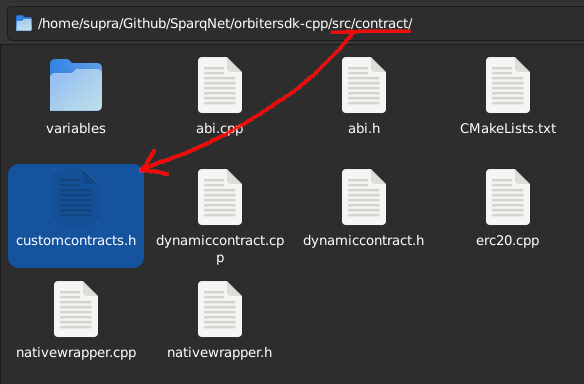
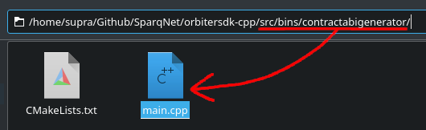
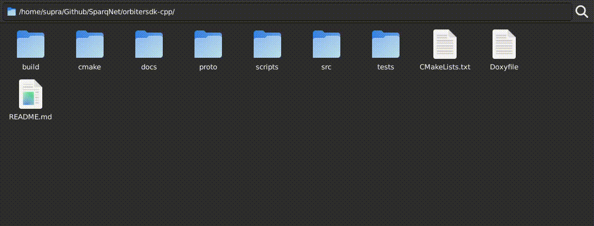
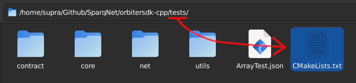

# 3.4 - Creating a Dynamic Contract (Simple)

Let's create a simple Solidity contract that allows two private variables to be changed by the owner of the contract. We will call this contract `SimpleContract`.

## Solidity Example

We'll be using the following Solidity code as a reference:

```solidity
// SPDX-License-Identifier: MIT
pragma solidity ^0.8;

contract SimpleContract {
  address owner;
  string name;
  uint256 value;

  constructor(string memory argName, uint256 argValue) {
    owner = msg.sender;
    name = argName;
    value = argValue;
  }

  function getName() public view returns(string memory) {
    return name;
  }

  function getValue() public view returns(uint256) {
    return value;
  }

  function setName(string memory argName) public {
    require(msg.sender == owner, "Not owner");
    name = argName;
  }

  function setValue(uint256 argValue) public {
    require(msg.sender == owner, "Not owner");
    value = argValue;
  }
}
```

The contract has a pretty simple structure - a constructor that sets its owner, and two functions that allow the owner to change the `name` and `value` variables.

## Step 1 - Creating the Files

To recreate this contract as a native Sparq contract, first we need to create its header (`.h`) and source (`.cpp`) files, as is customary in C++ development - the header will have the definition of our contract class, and the source will have its implementation details.

Go to your local testnet's root folder, into the `src/contract` subfolder, and create two new files - `simplecontract.h` and `simplecontract.cpp`. Those files will contain the declaration and definition of your contract's logic, respectively.


Then, add both files to the `CMakeLists.txt` file in the same folder, so they can be compiled with the project:

```cmake
set(CONTRACT_HEADERS
  # ...some lines...
  ${CMAKE_SOURCE_DIR}/src/contract/simplecontract.h
  # ...more lines...
)
set(CONTRACT_SOURCES
  # ...some lines...
  ${CMAKE_SOURCE_DIR}/src/contract/simplecontract.cpp
  # ...more lines...
)
```

## Step 2 - Declaring the Contract Class

Open the header file (`src/contract/simplecontract.h`) and add the following lines:

```cpp
#ifndef SIMPLECONTRACT_H
#define SIMPLECONTRACT_H

#include "dynamiccontract.h"
#include "variables/safestring.h"
#include "variables/safeuint256_t.h"

class SimpleContract : public DynamicContract {
  private:
    // ...
  public:
    // ...
};

#endif // SIMPLECONTRACT_H
```

This is a simple skeleton so we can start building the proper contract. From top to bottom:

* We create [include guards](https://en.wikipedia.org/wiki/Include_guard) as a safety measure
* We include the `DynamicContract` class and two SafeVariable classes for the contract's inner variables - `SafeString` and `SafeUint256_t`, which represent a Solidity `string` and `uint256` type, respectively (check the `src/contract/variables` subfolder for all available variable abstractions)
* We create our `SimpleContract` class, inherit it from `DynamicContract`, and leave some space for the private and public members that will be coded next

### Step 2.1 - Declaring the Contract Variables and Functions

Now we can declare the variables of the contract and their respective functions in the header. We have to pay attention to some rules described earlier in [Chapter 3.2](3-2.md):

- Internal variables MUST be `private` and inherit one of the SafeVariable classes
- View functions MUST be `const` and return an ABI-supported type directly (see Solidity types on [Chapter 3.7](3-7.md)) 
- Non-view functions can return either `void` or an ABI-supported type directly, if necessary
- `registerContract()` MUST be `public static void`
- `registerContractFunctions()` MUST be `private void override`

So our class declaration would look something like this (Solidity equivalents are commented for reference):

```cpp
class SimpleContract : public DynamicContract {
  private:
    SafeString name;  // string name
    SafeUint256_t value; // uint256 value
    void registerContractFunctions() override;

  public:
    std::string getName() const;  // function getName() public view returns(string memory)
    uint256_t getValue() const;   // function getValue() public view returns(uint256)
    void setName(const std::string& argName); // function setName(string memory argName) public
    void setValue(uint256_t argValue);  // function setValue(uint256 argValue) public

    static void registerContract() {
      ...
    }
};
```

Notice we can use primitive types on getters and setters just fine, as the contract's inner variables already ensure commit/revert safety due to their types being inherited from their SafeVariable counterparts.

### Step 2.2 - Declaring the Contract Constructor and Destructor

Like any C++ derived class, we must call its base class constructor and pass the proper arguments to it (besides the arguments for the derived class itself) so it can be constructed properly.

Any contract derived from `DynamicContract` must have a destructor marked as `override` (so the compiler knows we are overriding the base class destructor and can properly call it), and *two* constructors - one for creating a new contract from scratch, and another for loading the contract from the database. Our example would look like this:

```c++
// Constructor from scratch. Create new contract with given name and value.
SimpleContract(
  const std::string& name,
  uint256_t value,
  ContractManagerInterface &interface,
  const Address& address,
  const Address& creator,
  const uint64_t& chainId,
  const std::unique_ptr<DB> &db
);

// Constructor from load. Load contract from database.
SimpleContract(
  ContractManagerInterface &interface,
  const Address& address,
  const std::unique_ptr<DB> &db
);

// Destructor.
~SimpleContract() override;
```

Notice we declare our contract's inner variables as primitive arguments in the first constructor (from scratch), for the same reasons as the previous step. Both constructors also take a few other arguments required by the base DynamicContract constructor:

```cpp
// Constructor that creates the contract from scratch
DynamicContract(
  const std::string& contractName,
  ContractManagerInterface &interface,
  const Address& address,
  const Address& creator,
  const uint64_t& chainId,
  const std::unique_ptr<DB> &db
);

// Constructor that loads the contract from the database
DynamicContract(
  ContractManagerInterface &interface,
  const Address& address,
  const std::unique_ptr<DB> &db
);
```

`interface`, `address`, `creator`, `chainId` and `db` are internal variables used by the base class, and should *always* be declared *last*.

Keep in mind that, when calling the base class constructor later on, the `contractName` argument MUST be EXACTLY the same as your contract's class name. This is because `contractName` is used to load the contract type from the database, so incorrectly naming it will result in a segfault at load time.

### Step 2.3 - Registering the Contract Class

One last thing we have to do within our header is properly register the contract class. All Dynamic Contracts use reflections/metaprogramming to automate most of the hard work for both our contract and the ContractManager class.

First, define a `public` tuple called `ConstructorArguments` with the contract's variable types from its first constructor (the one from scratch - in our example, name is `const std::string&` and value is `uint256_t`):

```cpp
#ifndef SIMPLECONTRACT_H
#define SIMPLECONTRACT_H

#include "dynamiccontract.h"
#include "variables/safestring.h"
#include "variables/safeuint256_t.h"

class SimpleContract : public DynamicContract {
  // ...some code...
  public:
    using ConstructorArguments = std::tuple<const std::string&, uint256_t>;
    // ...more code
}
```

Then, create a `public static void` function called `registerContract()`, that will register the contract class itself by calling `ContractReflectionInterface::registerContract<>()` and passing a few arguments to it, like this:

```c++
class SimpleContract : public DynamicContract {
  public:
    // ...some code...
    static void registerContract() {
      ContractReflectionInterface::registerContract<
        SimpleContract, const std::string&, uint256_t,
        ContractManagerInterface&,
        const Address&, const Address&, const uint64_t&,
        const std::unique_ptr<DB>&
      >(
        std::vector<std::string>{"name", "value"},
        std::make_tuple("getName", &SimpleContract::getName, "view", std::vector<std::string>{}),
        std::make_tuple("getValue", &SimpleContract::getValue, "view", std::vector<std::string>{}),
        std::make_tuple("setName", &SimpleContract::setName, "nonpayable", std::vector<std::string>{"argName"}),
        std::make_tuple("setValue", &SimpleContract::setValue, "nonpayable", std::vector<std::string>{"argValue"})
      );
    }
}
```

Inside the chevrons (`registerContract<...>()`):

* The first argument is the contract's class type (in this case, `SimpleContract`)
* The following arguments are all the types of arguments inside its first constructor (from scratch - the same ones that were put inside `ConstructorArguments`) - you can copy-paste the constructor's arguments as-is and take out the names
    * It's important to remember that contract arguments should be declared *before* the internal arguments used by the base class constructor, as stated in the previous step

Inside the parentheses (`registerContract<>(...)`):

* The first argument is a list of all the exact names of the arguments in the constructor - in this case, `"name"` and `"value"`
  * Note this does not include arguments used by the base class' constructor (e.g. `interface`, `address`, `creator`, `chainId`, `db`), only the ones inherent to the contract itself
* The following arguments are tuples, one for each function from the contract, that contain respectively:
  * The exact name of the function (`"getName"`)
  * A reference to the function itself (`&SimpleContract::getName`)
  * The [state mutability](https://docs.soliditylang.org/en/latest/contracts.html#state-mutability) of said function (`"view"`, `"payable"`, `"nonpayable"` or `"pure"`)
  * A list of arguments that the function takes, if any (or a blank list if none)

Every contract MUST have both `ConstructorArguments` *and* `registerContract()` implemented in order to be registered, even if `ConstructorArguments` is empty (has no arguments at all).

Finally, we go to the `src/contract/customcontracts.h` file, include our contract's header and add it to the `ContractTypes` tuple, like this:



```c++
#include "erc20.h"
#include "erc20wrapper.h"
#include "nativewrapper.h"
#include "simplecontract.h" // <--- Add this line

using ContractTypes = std::tuple<ERC20, ERC20Wrapper, NativeWrapper, SimpleContract>; // <--- Add your contract here
```

### Step 2.4 - Generating the ABI

We have a tool that is compiled with the project that generates the ABI of your contract. To use it, go to `src/main-contract-abi.cpp`:



This file is set to compile an executable that will do the work of generating ABIs for registered contracts. Use one of the snippets below, then compile the project and run `./contractabigenerator`. The outputs should be inside the `ABI` folder, as `<ContractName>.json`.

#### Generate all ABIs

If you want to generate the ABI of absolutely everything (including ContractManager itself, as it is also a contract), copy-paste this snippet:

```cpp
#include "utils/jsonabi.h"

int main() {
    return JsonAbi::writeContractsToJson<ContractTypes>();
}
```

`ContractTypes` is a tuple that contains all the Dynamic Contracts registered in `src/contract/customcontracts.h`, as shown earlier in the previous step. The `JsonAbi` namespace takes care of reuniting them all and mass-generating the ABIs for you.

#### Generate specific ABIs

Alternatively, if you want a finer control of which ABIs you want to generate (e.g. ignore ContractManager or any other contract that you don't want to generate the ABI right now), copy-paste this snippet and specify which contracts you want to generate by adding their class names inside the chevrons in `writeContractsToJson<...>()`:

```c++
#include "utils/jsonabi.h"

int main() {
  return JsonAbi::writeContractsToJson<
    ERC20, ERC20Wrapper, NativeWrapper, SimpleContract
  >();
}
```

## Full Contract Header

That all said, our full example contract header should look something like this:

```cpp
#ifndef SIMPLECONTRACT_H
#define SIMPLECONTRACT_H

#include "dynamiccontract.h"
#include "variables/safestring.h"
#include "variables/safeuint256_t.h"

class SimpleContract : public DynamicContract {
  private:
    SafeString name;      // string name
    SafeUint256_t value;  // uint256 value
    void registerContractFunctions() override;

  public:
    using ConstructorArguments = std::tuple<const std::string&, uint256_t>;

    // Constructor from scratch. Create new contract with given name and value.
    SimpleContract(
      const std::string& name,
      uint256_t value,
      ContractManagerInterface &interface,
      const Address& address,
      const Address& creator,
      const uint64_t& chainId,
      const std::unique_ptr<DB> &db
    );

    // Constructor from load. Load contract from database.
    SimpleContract(
      ContractManagerInterface &interface,
      const Address& address,
      const std::unique_ptr<DB> &db
    );

    // Destructor.
    ~SimpleContract() override;

    std::string getName() const;  // function getName() public view returns(string memory)
    uint256_t getValue() const;   // function getValue() public view returns(uint256)
    void setName(const std::string& argName); // function setName(string memory argName) public
    void setValue(uint256_t argValue);  // function setValue(uint256 argValue) public

    static void registerContract() {
      ContractReflectionInterface::registerContract<
        SimpleContract, const std::string&, uint256_t,
        ContractManagerInterface&,
        const Address&, const Address&, const uint64_t&,
        const std::unique_ptr<DB>&
      >(
        std::vector<std::string>{"name", "value"},
        std::make_tuple("getName", &SimpleContract::getName, "view", std::vector<std::string>{}),
        std::make_tuple("getValue", &SimpleContract::getValue, "view", std::vector<std::string>{}),
        std::make_tuple("setName", &SimpleContract::setName, "nonpayable", std::vector<std::string>{"argName"}),
        std::make_tuple("setValue", &SimpleContract::setValue, "nonpayable", std::vector<std::string>{"argValue"})
      );
    }
};

#endif // SIMPLECONTRACT_H
```

## Step 3 - Defining the Contract Class

With the header, declarations and (most of the) registering done, now we can proceed to the implementation itself. Open `src/contract/simplecontract.cpp` and `#include "simplecontract.h"` right at the beginning.

### Step 3.1 - Defining the Contract Constructors and Destructor

First, we need to implement the constructors and destructor of our contract class. Remember that:

* The base `DynamicContract` constructor must be called and its respective arguments must be passed in order
* Private contract variables must be accessed with `this` (e.g. `this->name`)
* The `registerContractFunctions()` and `updateState(true)` functions must be called at the end of both constructors

Our source file will look something like this:

```cpp
#include "simplecontract.h"

SimpleContract::SimpleContract(
  const std::string& name,
  uint256_t value,
  ContractManagerInterface &interface,
  const Address& address,
  const Address& creator,
  const uint64_t& chainId,
  const std::unique_ptr<DB> &db
) : DynamicContract(interface, "SimpleContract", address, creator, chainId, db), name(this), value(this) {
  this->name = name;
  this->value = value;
  registerContractFunctions();
  this->updateState(true);
}

SimpleContract::SimpleContract(
  ContractManagerInterface &interface,
  const Address& address,
  const std::unique_ptr<DB> &db
) : DynamicContract(interface, address, db), name(this), value(this) {
  this->name = Utils::bytesToString(db->get(std::string("name"), this->getDBPrefix()));
  this->value = Utils::bytesToUint256(db->get(std::string("value"), this->getDBPrefix()));
  registerContractFunctions();
  this->updateState(true);
}

SimpleContract::~SimpleContract() {
  this->db->put(std::string("name"), Utils::stringToBytes(this->name.get()), this->getDBPrefix());
  this->db->put(std::string("value"), Utils::uint256ToBytes(this->value.get()), this->getDBPrefix());
  return;
}
```

Notice that, in the first constructor, we use `SimpleContract` as the `contractName` argument in the base `DynamicContract` constructor. As stated in Step 2.2, this match is a *requirement*, otherwise it will result in a segfault. Both constructors initialize the inner variables of the contract - the first one using the arguments directly, and the second one loading them directly from the database.

The destructor is responsible for saving the contract variables to the database, so that they can be loaded later by the second constructor, when `ContractManager` is being constructed. `this->getDBPrefix()` is a getter for the contract's own prefix in the database, which would be equivalent to `DBPrefix::contracts` + the contract's address.

Keep in mind that the database stores data as *raw bytes* - this is why we use the respective conversion functions from Utils when saving (`XyzToBytes()`) and loading (`bytesToXyz()`) variables.

### Step 3.2 - Defining the Contract Functions

Now, let's implement the proper functions of our contract - first, the *view* functions (that only read and never change the contract's variables when called), then, the *non-view* functions (that *do* change the contract's variables when called).

#### View functions

As stated earlier in Step 2.1, view functions must be `const` and return one of the ABI-supported types. In this case, the return values are the variables of the contract, so we can return the inner data from the SafeVariable by calling the `get()` function.

```cpp
std::string SimpleContract::getName() const { return this->name.get(); }
uint256_t SimpleContract::getValue() const { return this->value.get(); }
```

#### Non-view functions

Likewise, non-view functions can return either `void` or one of the ABI-supported types if necessary (e.g. if we want to return some specific value for some reason - it's not the case here as we're only setting a value). In this case, we must also check that whoever is calling those functions is the actual creator of the contract (as it's coded in the original Solidity code reference at the start of this subchapter).

As said in [Chapter 3.2](3-2.md), any contract has access to the caller of a function and the address of a contract's creator by calling `this->getCaller()` and `this->getContractCreator()`, respectively, so we can use those to prevent calls from unwanted addresses.

```cpp
void SimpleContract::setName(const std::string& argName) {
  if (this->getCaller() != this->getContractCreator()) {
    throw std::runtime_error("Only contract creator can call this function.");
  }
  this->name = argName;
}

void SimpleContract::setValue(uint256_t argValue) {
  if (this->getCaller() != this->getContractCreator()) {
    throw std::runtime_error("Only contract creator can call this function.");
  }
  this->value = argValue;
}
```

### Step 3.3 - Registering the Contract Functions

After all functions are implemented, we must implement one more - `registerContractFunctions()`, which is responsible for registering the other functions so they can be called later by a transaction or an RPC `eth_call`.

The first thing it should do is call `registerContract()` right away, so it's guaranteed that the contract itself will be registered before its functions, like so:

```cpp
void SimpleContract::registerContractFunctions() {
  registerContract();
  // ...
}
```

As for the functions themselves, you can register them in two ways: *automatic*, or *manual*. We recommend (and will focus on) the automatic approach as it requires less effort to implement, but both ways should work regardless.

#### Automatic registering

Functions can be automatically registered using the reflection interface included in `DynamicContract`. Every contract deriving from it has access to the interface. The register function should look like this:

```cpp
void SimpleContract::registerContractFunctions() {
  registerContract();
  this->registerMemberFunction("getName", &SimpleContract::getName, this);
  this->registerMemberFunction("getValue", &SimpleContract::getValue, this);
  this->registerMemberFunction("setName", &SimpleContract::setName, this);
  this->registerMemberFunction("setValue", &SimpleContract::setValue, this);
}
```

All you need to do is call `this->registerMemberFunction()` for each function your contract has, always passing three arguments to it: the function's name, a reference to the function, and `this` (a pointer to the contract itself). The reflection will take care of sorting out all the details.

#### Manual registering

If you want a finer control or a more verbose approach, functions can be manually registered using their functors/signatures, just like in Solidity, which means:

* The name of the function and types of the arguments...
* ...separated by commas and enclosed in parentheses, without any extra spaces (e.g. `func(string,uint256)`)...
* ...hashed with keccak256 (in our case, `Utils::sha3()`)...
* ...taking only the first 4 bytes (8 hex characters) of the hash (also called the "functor").

This is all done by calling one of the following functions on the derived contract:

```cpp
void registerFunction(const Functor& functor, std::function<ReturnType(const ethCallInfo& tx)> f);
void registerPayableFunction(const Functor& functor, std::function<ReturnType(const ethCallInfo& tx)> f);
void registerViewFunction(const Functor& functor, std::function<ReturnType(const ethCallInfo& str)> f);
```

Each function should be used for their effective purpose:

* `registerFunction()` is used to register a *callable* function (a function that is called by a transaction)
* `registerPayableFunction()` is used to register a *callable* AND *payable* function
* `registerViewFunction()` is used to register a *view* function

The `functor` argument should be the function signature by Solidity standards, as in:

* `getContractBalance(address token)` -> `Utils::sha3("getContractBalance(address)").substr(0,4)` -> `0x43ab265f`
* `getUserBalance(address token, address user)` -> `Utils::sha3("getUserBalance(address,address)").substr(0,4)` -> `0x6805d6ad`
* And so on and so forth...

The function argument `f` should be a lambda function, responsible for parsing the `ethCallInfo` argument and calling the proper function. `ethCallInfo` is a `std::tuple` with the following information:

| Index | Description                          | Type                   |
|-------|--------------------------------------|------------------------|
| 0     | From (where the call is coming from) | Address                |
| 1     | To (where the call is going to)      | Address                |
| 2     | Caller Gas Limit (if Tx)             | uint256_t              |
| 3     | Caller Gas Price (if Tx)             | uint256_t              |
| 4     | Caller Value                         | uint256_t              |
| 5     | Caller Functor                       | Functor                |
| 6     | Caller Data                          | BytesArrView           |

You can access each information by using `std::get<index>(ethCallInfo)`, e.g. `std::get<5>(ethCallInfo)` will get the functor, and `std::get<6>(ethCallInfo)` will get the data itself, which contains the rest of the ABI encoded parameters.

Notice that the caller data in `ethCallInfo` is *not owned* (BytesArrView is only a view), so you MUST be sure that the data allocated in it is valid during the whole life of the tuple. Some places use `ethCallInfoAllocated` instead, which takes a Bytes object (which is truly owned) as the last parameter rather than a BytesArrView.

When registering manually, call info should be properly ABI-encoded/decoded. We provide an [ABI namespace](https://github.com/SparqNet/orbitersdk-cpp/blob/main/src/contract/abi.h), which contains an encoder and decoder that you can use to encode and/or decode Solidity's ABI strings in order to call a function.

In a manual implementation, the register function would look something like this:

```cpp
void SimpleContract::registerContractFunctions() {
  this->registerViewFunction(Utils::sha3("getName()").get().substr(0,4), [this](const ethCallInfo &callInfo) {
    return this->getName();
  });
  this->registerViewFunction(Utils::sha3("getValue()").get().substr(0,4), [this](const ethCallInfo &callInfo) {
    return this->getValue();
  });
  this->registerFunction(Utils::sha3("setName(string)").get().substr(0,4), [this](const ethCallInfo &callInfo) {
    std::vector<ABI::Types> types = { ABI::Types::string };
    ABI::Decoder decoder(types, std::get<6>(callInfo));
    return this->setName(decoder.getData<std::string>(0));
  });
  this->registerFunction(Utils::sha3("setValue(uint256)").get().substr(0,4), [this](const ethCallInfo &callInfo) {
    std::vector<ABI::Types> types = { ABI::Types::uint256 };
    ABI::Decoder decoder(types, std::get<6>(callInfo));
    return this->setValue(decoder.getData<uint256_t>(0));
  });
}
```

## Full Contract Source

That all said, our full example contract source will look something like this:

```c++
#include "simplecontract.h"

SimpleContract::SimpleContract(
  const std::string& name,
  uint256_t value,
  ContractManagerInterface &interface,
  const Address& address,
  const Address& creator,
  const uint64_t& chainId,
  const std::unique_ptr<DB> &db
) : DynamicContract(interface, "SimpleContract", address, creator, chainId, db), name(this), value(this) {
  this->name = name;
  this->value = value;
  registerContractFunctions();
  this->updateState(true);
}

SimpleContract::SimpleContract(
  ContractManagerInterface &interface,
  const Address& address,
  const std::unique_ptr<DB> &db
) : DynamicContract(interface, address, db), name(this), value(this) {
  this->name = Utils::bytesToString(db->get(std::string("name"), this->getDBPrefix()));
  this->value = Utils::bytesToUint256(db->get(std::string("value"), this->getDBPrefix()));
  registerContractFunctions();
  this->updateState(true);
}

SimpleContract::~SimpleContract() {
  this->db->put(std::string("name"), Utils::stringToBytes(this->name.get()), this->getDBPrefix());
  this->db->put(std::string("value"), Utils::uint256ToBytes(this->value.get()), this->getDBPrefix());
  return;
}

std::string SimpleContract::getName() const { return this->name.get(); }

uint256_t SimpleContract::getValue() const { return this->value.get(); }

void SimpleContract::setName(const std::string& argName) {
  if (this->getCaller() != this->getContractCreator()) {
    throw std::runtime_error("Only contract creator can call this function.");
  }
  this->name = argName;
}

void SimpleContract::setValue(uint256_t argValue) {
  if (this->getCaller() != this->getContractCreator()) {
    throw std::runtime_error("Only contract creator can call this function.");
  }
  this->value = argValue;
}

void SimpleContract::registerContractFunctions() {
  registerContract();
  this->registerMemberFunction("getName", &SimpleContract::getName, this);
  this->registerMemberFunction("getValue", &SimpleContract::getValue, this);
  this->registerMemberFunction("setName", &SimpleContract::setName, this);
  this->registerMemberFunction("setValue", &SimpleContract::setValue, this);
}
```

## Step 4 - Deploying the Blockchain

We are done! All that's left is to go back to the project's root, compile and deploy the blockchain by running `./scripts/AIO-setup.sh`. See [Chapter 3.3](3-3.md) for more information.

## Step 5 (Optional) - Testing the Contract

We use the [catch2](https://github.com/catchorg/Catch2) framework to test our project as a whole, so it is possible to create an automated test using catch2 for your contract.

In order to do that, you must create a new file in the `tests/contract` folder with the name of your contract - in our case, `tests/contract/simplecontract.cpp`:



Add the file to the `CMakeLists.txt` file in the parent folder:



```cmake
set(TESTS_SOURCES
  # ...some lines...
  ${CMAKE_SOURCE_DIR}/tests/contract/simplecontract.cpp
  # ...more lines...
)
```

And then copy this to `tests/contract/simplecontract.cpp`:

```cpp
#include "../../src/libs/catch2/catch_amalgamated.hpp"
#include "../../src/contract/erc20.h"
#include "../../src/contract/abi.h"
#include "../../src/utils/db.h"
#include "../../src/utils/options.h"
#include "../../src/contract/contractmanager.h"
#include "../../src/core/rdpos.h"

#include <filesystem>

// Forward Declaration.
ethCallInfoAllocated buildCallInfo(const Address& addressToCall, const Functor& function, const Bytes& dataToCall);

void initialize(
  std::unique_ptr<Options>& options,
  std::unique_ptr<DB>& db,
  std::unique_ptr<ContractManager> &contractManager,
  const std::string& dbName,
  const PrivKey& ownerPrivKey,
  const std::string& name,
  const uint256_t& value,
  bool deleteDB = true
) {
  if (deleteDB) {
    if (std::filesystem::exists(dbName)) {
      std::filesystem::remove_all(dbName);
    }
  }

  options = std::make_unique<Options>(Options::fromFile(dbName));
  db = std::make_unique<DB>(dbName);
  std::unique_ptr<rdPoS> rdpos;
  contractManager = std::make_unique<ContractManager>(nullptr, db, rdpos, options);

  if (deleteDB) {
    // Create the contract.
    ABI::Encoder::EncVar createNewSimpleContractVars;
    createNewSimpleContractVars.push_back(name);
    createNewSimpleContractVars.push_back(value);
    ABI::Encoder createNewSimpleContractEncoder(createNewSimpleContractVars);
    Bytes createNewSimpleContractData = Hex::toBytes("0x6de23252");
    Utils::appendBytes(createNewSimpleContractData, createNewSimpleContractEncoder.getData());

    TxBlock createNewSimpleContractTx = TxBlock(
      ProtocolContractAddresses.at("ContractManager"),
      Secp256k1::toAddress(Secp256k1::toUPub(ownerPrivKey)),
      createNewSimpleContractData,
      8080,
      0,
      0,
      0,
      0,
      0,
      ownerPrivKey
    );

    contractManager->callContract(createNewSimpleContractTx);
  }
}

namespace TSimpleContract {
  TEST_CASE("SimpleContract class", "[contract][simplecontract]") {
    PrivKey ownerPrivKey(Hex::toBytes("0xe89ef6409c467285bcae9f80ab1cfeb3487cfe61ab28fb7d36443e1daa0c2867"));
    Address owner = Secp256k1::toAddress(Secp256k1::toUPub(ownerPrivKey));
    SECTION("SimpleContract creation") {
      Address contractAddress;
      {
        std::unique_ptr<Options> options;
        std::unique_ptr<DB> db;
        std::unique_ptr<ContractManager> contractManager;
        initialize(options, db, contractManager, "SimpleContractCreationTest", ownerPrivKey, "TestName", 19283187581);

        // Get the contract address.
        contractAddress = contractManager->getContracts()[0].second;

        ABI::Encoder getNameEncoder({}, "getName()");
        ABI::Encoder getValueEncoder({}, "getValue()");

        Bytes nameData = contractManager->callContract(buildCallInfo(contractAddress, getNameEncoder.getFunctor(), getNameEncoder.getData()));
        Bytes valueData = contractManager->callContract(buildCallInfo(contractAddress, getValueEncoder.getFunctor(), getValueEncoder.getData()));

        ABI::Decoder nameDecoder({ABI::Types::string}, nameData);
        ABI::Decoder valueDecoder({ABI::Types::uint256}, valueData);

        REQUIRE(nameDecoder.getData<std::string>(0) == "TestName");
        REQUIRE(valueDecoder.getData<uint256_t>(0) == 19283187581);
      }

      std::unique_ptr<Options> options;
      std::unique_ptr<DB> db;
      std::unique_ptr<ContractManager> contractManager;
      initialize(options, db, contractManager, "SimpleContractCreationTest", ownerPrivKey, "TestName", 19283187581, false);

      REQUIRE(contractAddress == contractManager->getContracts()[0].second);

      ABI::Encoder getNameEncoder({}, "getName()");
      ABI::Encoder getValueEncoder({}, "getValue()");

      Bytes nameData = contractManager->callContract(buildCallInfo(contractAddress, getNameEncoder.getFunctor(), getNameEncoder.getData()));
      Bytes valueData = contractManager->callContract(buildCallInfo(contractAddress, getValueEncoder.getFunctor(), getValueEncoder.getData()));

      ABI::Decoder nameDecoder({ABI::Types::string}, nameData);
      ABI::Decoder valueDecoder({ABI::Types::uint256}, valueData);

      REQUIRE(nameDecoder.getData<std::string>(0) == "TestName");
      REQUIRE(valueDecoder.getData<uint256_t>(0) == 19283187581);
    }

    SECTION("SimpleContract setName and setValue") {
      Address contractAddress;
      {
        std::unique_ptr<Options> options;
        std::unique_ptr<DB> db;
        std::unique_ptr<ContractManager> contractManager;
        initialize(options, db, contractManager, "SimpleContractSetNameAndSetValue", ownerPrivKey, "TestName", 19283187581);

        // Get the contract address.
        contractAddress = contractManager->getContracts()[0].second;

        ABI::Encoder getNameEncoder({}, "getName()");
        ABI::Encoder getValueEncoder({}, "getValue()");

        Bytes nameData = contractManager->callContract(buildCallInfo(contractAddress, getNameEncoder.getFunctor(), getNameEncoder.getData()));
        Bytes valueData = contractManager->callContract(buildCallInfo(contractAddress, getValueEncoder.getFunctor(), getValueEncoder.getData()));

        ABI::Decoder nameDecoder({ABI::Types::string}, nameData);
        ABI::Decoder valueDecoder({ABI::Types::uint256}, valueData);

        ABI::Encoder setNameEncoder({"TryThisName"}, "setName(string)");
        ABI::Encoder setValueEncoder({uint256_t("918258172319061203818967178162134821351")}, "setValue(uint256)");

        Bytes setNameBytes;
        Utils::appendBytes(setNameBytes, setNameEncoder.getFunctor().get());
        Utils::appendBytes(setNameBytes, setNameEncoder.getData());

        Bytes setValueBytes;
        Utils::appendBytes(setValueBytes, setValueEncoder.getFunctor().get());
        Utils::appendBytes(setValueBytes, setValueEncoder.getData());

        TxBlock setNameTx(
          contractAddress,
          owner,
          setNameBytes,
          8080,
          0,
          0,
          0,
          0,
          0,
          ownerPrivKey
        );

        TxBlock setValueTx(
          contractAddress,
          owner,
          setValueBytes,
          8080,
          0,
          0,
          0,
          0,
          0,
          ownerPrivKey
        );

        contractManager->callContract(setNameTx);
        contractManager->callContract(setValueTx);

        nameData = contractManager->callContract(buildCallInfo(contractAddress, getNameEncoder.getFunctor(), getNameEncoder.getData()));
        valueData = contractManager->callContract(buildCallInfo(contractAddress, getValueEncoder.getFunctor(), getValueEncoder.getData()));

        nameDecoder = ABI::Decoder({ABI::Types::string}, nameData);
        valueDecoder = ABI::Decoder({ABI::Types::uint256}, valueData);

        REQUIRE(nameDecoder.getData<std::string>(0) == "TryThisName");
        REQUIRE(valueDecoder.getData<uint256_t>(0) == uint256_t("918258172319061203818967178162134821351"));
      }

      std::unique_ptr<Options> options;
      std::unique_ptr<DB> db;
      std::unique_ptr<ContractManager> contractManager;
      initialize(options, db, contractManager, "SimpleContractSetNameAndSetValue", ownerPrivKey, "TestName", 19283187581, false);

      REQUIRE(contractAddress == contractManager->getContracts()[0].second);

      ABI::Encoder getNameEncoder({}, "getName()");
      ABI::Encoder getValueEncoder({}, "getValue()");

      Bytes nameData = contractManager->callContract(buildCallInfo(contractAddress, getNameEncoder.getFunctor(), getNameEncoder.getData()));
      Bytes valueData = contractManager->callContract(buildCallInfo(contractAddress, getValueEncoder.getFunctor(), getValueEncoder.getData()));

      ABI::Decoder nameDecoder({ABI::Types::string}, nameData);
      ABI::Decoder valueDecoder({ABI::Types::uint256}, valueData);

      REQUIRE(nameDecoder.getData<std::string>(0) == "TryThisName");
      REQUIRE(valueDecoder.getData<uint256_t>(0) == uint256_t("918258172319061203818967178162134821351"));
    }
  }
}
```

This code is an entire test suite that checks several things within our SimpleContract example, such as:

* If the contract was properly created, by calling the `initialize()` function which will create the contract within `ContractManager` (the function mostly remains the same across all contracts, only changing the contract name, and the contract parameters)
* If our database destructor is working properly, by creating a `ContractManager` and the contract within, then unloading it, loading it again, and checking if the contract is still there
* If our functions work, by calling `ContractManager` with transactions that call said functions (where `buildCallInfo()` is a forward declaration for usage within a view function of your contract)

Keep in mind that we're not accessing the contract directly, we're interacting with it through `ContractManager`, and that requires us to parse its inputs and outputs accordingly.

In order to run your tests, compile the project as you normally would (see [Chapter 3.3](3-3.md) for more information on how to set up your environment), and then run `./orbitersdkd-tests [simplecontract] -d yes` from within your build directory.

The `[simplecontract]` label forces only the tests for the contract to run (this is set in the `TEST_CASE()` lines in the example above). The `-d yes` flag makes it more verbose, showing exactly which test case is being run at the moment.
