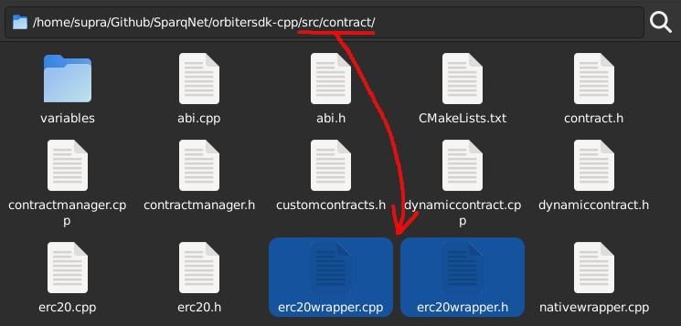

# 3.5 - Creating a Dynamic Contract (Advanced)

Let's create a simple Dynamic Contract that can be used for depositing and withdrawing ERC20 tokens. This subchapter assumes you went through [Chapter 3.4](3-4.md) first, as most of the heavy explanations are there.

This example uses an already existing contract within the project - the `ERC20Wrapper` contract. This is due to the fact that `ERC20Wrapper` is a very simple contract, while it shows differences between Solidity and OrbiterSDK contracts when calling other contracts. Check the `src/contract/erc20wrapper.h` and `src/contract/erc20wrapper.cpp` files for reference:



## Solidity Example

We'll be using the following Solidity code as a reference:

```solidity
// SPDX-License-Identifier: MIT
pragma solidity ^0.8;

import "@openzeppelin/contracts/token/ERC20/IERC20.sol";

contract ERC20Wrapper {
  mapping (address => mapping (address => uint256)) private _tokensAndBalances;

  function getContractBalance(address token) public view returns(uint256) {
    IERC20 erc20 = IERC20(token);
    return erc20.balanceOf(address(this));
  }

  function getUserBalance(address token, address user) public view returns (uint256) {
    return _tokensAndBalances[token][user];
  }

  function withdraw(address token, uint256 value) public {
    require(_tokensAndBalances[token][msg.sender] >= value, "User doesn't have enough balance");
    IERC20 erc20 = IERC20(token);
    _tokensAndBalances[token][msg.sender] -= value;
    erc20.transfer(msg.sender, value);
  }

  function transferTo(address token, address to, uint256 value) public {
    require(_tokensAndBalances[token][msg.sender] >= value, "User doesn't have enough balance");
    IERC20 erc20 = IERC20(token);
    _tokensAndBalances[token][msg.sender] -= value;
    erc20.transfer(to, value);
  }

  function deposit(address token, uint256 value) public {
    IERC20 erc20 = IERC20(token);
    erc20.transferFrom(msg.sender, address(this), value);
    _tokensAndBalances[token][msg.sender] += value;
  }
}
```

### Step 1 - Creating the files

In order to recreate this contract, first we need to create the header and source files for it (`erc20wrapper.h` and `erc20wrapper.cpp`, as stated above), then add both files to the `CMakeLists.txt` file inside the same folder:

```cmake
set(CONTRACT_HEADERS
  ...
  ${CMAKE_SOURCE_DIR}/src/contract/erc20wrapper.h
  ...
)
set(CONTRACT_SOURCES
  ...
  ${CMAKE_SOURCE_DIR}/src/contract/erc20wrapper.cpp
  ...
)
```

### Step 2 - Creating the contract header and registering

Inside `erc20wrapper.h`, let's implement the header:

```cpp
#ifndef ERC20WRAPPER_H
#define ERC20WRAPPER_H

#include <memory>
#include <tuple>

#include "../utils/db.h"
#include "abi.h"
#include "contractmanager.h"
#include "dynamiccontract.h"
#include "erc20.h"
#include "variables/safeuint256_t.h"
#include "variables/safeunorderedmap.h"

/// Template for an ERC20Wrapper contract.
class ERC20Wrapper : public DynamicContract {
  private:
    /**
     * Map for tokens and balances. Solidity counterpart:
     * mapping(address => mapping(address => uint256)) internal _tokensAndBalances;
     */
    SafeUnorderedMap<Address, std::unordered_map<Address, uint256_t, SafeHash>> _tokensAndBalances;

    /// Function for calling the register functions for contracts.
    void registerContractFunctions() override;

  public:

    /**
    * ConstructorArguments is a tuple of the contract constructor arguments in the order they appear in the constructor.
    */
    using ConstructorArguments = std::tuple<>;
    
    /**
     * Constructor for loading contract from DB.
     * @param interface Reference to the contract manager interface.
     * @param contractAddress The address where the contract will be deployed.
     * @param db Reference pointer to the database object.
     */
    ERC20Wrapper(
      ContractManagerInterface& interface,
      const Address& contractAddress, const std::unique_ptr<DB>& db
    );

    /**
     * Constructor for building a new contract from scratch.
     * @param interface Reference to the contract manager interface.
     * @param address The address where the contract will be deployed.
     * @param creator The address of the creator of the contract.
     * @param chainId The chain id of the contract.
     * @param db Reference pointer to the database object.
     */
    ERC20Wrapper(
      ContractManagerInterface& interface,
      const Address& address, const Address& creator,
      const uint64_t& chainId, const std::unique_ptr<DB>& db
    );

    /// Register contract class via ContractReflectionInterface.
    static void registerContract() {
      ContractReflectionInterface::registerContract<
        ERC20Wrapper, ContractManagerInterface &,
        const Address &, const Address &, const uint64_t &,
        const std::unique_ptr<DB> &
      >(
        std::vector<std::string>{},
        std::make_tuple("getContractBalance", &ERC20Wrapper::getContractBalance, "view", std::vector<std::string>{"tokenAddress"}),
        std::make_tuple("getUserBalance", &ERC20Wrapper::getUserBalance, "view", std::vector<std::string>{"tokenAddress", "userAddress"}),
        std::make_tuple("withdraw", &ERC20Wrapper::withdraw, "nonpayable", std::vector<std::string>{"tokenAddress", "value"}),
        std::make_tuple("transferTo", &ERC20Wrapper::transferTo, "nonpayable", std::vector<std::string>{"tokenAddress", "toAddress", "value"}),
        std::make_tuple("deposit", &ERC20Wrapper::deposit, "nonpayable", std::vector<std::string>{"tokenAddress", "value"})
      );
    }

    /// Destructor.
    ~ERC20Wrapper() override;

    /**
     * Get the balance of the contract for a specific token. Solidity counterpart:
     * function getContractBalance(address _token) public view returns (uint256) { return _tokensAndBalances[_token][address(this)]; }
     * @param token The address of the token.
     * @return The contract's given token balance.
     */
    Bytes getContractBalance(const Address& token) const;

    /**
     * Get the balance of a specific user for a specific token. Solidity counterpart:
     * function getUserBalance(address _token, address _user) public view returns (uint256) { return _tokensAndBalances[_token][_user]; }
     * @param token The address of the token.
     * @param user The address of the user.
     * @return The user's given token balance.
     */
    Bytes getUserBalance(const Address& token, const Address& user) const;

    /**
     * Withdraw a specific amount of tokens from the contract. Solidity counterpart:
     * function withdraw (address _token, uint256 _value) public returns (bool)
     * @param token The address of the token.
     * @param value The amount of tokens to withdraw.
     * @throw std::runtime_error if the contract does not have enough tokens,
     * or if the token was not found.
     */
    void withdraw(const Address& token, const uint256_t& value);

    /**
     * Transfer a specific amount of tokens from the contract to a user. Solidity counterpart:
     * function transferTo(address _token, address _to, uint256 _value) public returns (bool)
     * @param token The address of the token.
     * @param to The address of the user to send tokens to.
     * @param value The amount of tokens to transfer.
     * @throw std::runtime_error if the contract does not have enough tokens,
     * or if either the token or the user were not found.
     */
    void transferTo(const Address& token, const Address& to, const uint256_t& value);

    /**
     * Deposit a specific amount of tokens to the contract. Solidity counterpart:
     * function deposit(address _token, uint256 _value) public returns (bool)
     * @param token The address of the token.
     * @param value The amount of tokens to deposit.
     */
    void deposit(const Address& token, const uint256_t& value);
};

#endif // ERC20WRAPPER_H
```

Here, we recreated the contract's functions but also added a few extra functions (explained on the previous sections). In short, we create:

* Two constructors - one for creating the contract from scratch, and another for loading it from the database - and the destructor
* The `ConstructorArguments` tuple, `registerContract()` and `registerContractFunctions()` functions for proper contract registering (notice that the tuple is required, even though it's empty)
* Private SafeVariables (in this case, `SafeUnorderedMap`) to handle the contract's actual variables, and the contract's functions according to the Solidity signatures

Like in [Chapter 3.4](3-4.md), you must include your contract's header in `customcontracts.h` to register it, and add its name in `main-contract-abi.cpp` so its ABI can be generated. In this specific case for ERC20Wrapper, it's assumed that both steps are already done, but it's good to check again just in case.

### Step 3 - Implementing the contract constructors and destructor

Inside `erc20wrapper.cpp`, let's implement both constructors:

```cpp
#include "erc20wrapper.h"

ERC20Wrapper::ERC20Wrapper(
  ContractManagerInterface& interface,
  const Address& contractAddress, const std::unique_ptr<DB>& db
) : DynamicContract(interface, contractAddress, db), _tokensAndBalances(this) {
  registerContractFunctions();
  auto tokensAndBalances = this->db->getBatch(this->getNewPrefix("_tokensAndBalances"));
  for (const auto& dbEntry : tokensAndBalances) {
    BytesArrView valueView(dbEntry.value);
    this->_tokensAndBalances[Address(dbEntry.key)][Address(valueView.subspan(0, 20))] = Utils::fromBigEndian<uint256_t>(valueView.subspan(20));
  }
  updateState(true);
}

ERC20Wrapper::ERC20Wrapper(
  ContractManagerInterface& interface, const Address& address,
  const Address& creator, const uint64_t& chainId, const std::unique_ptr<DB>& db
) : DynamicContract(interface, "ERC20Wrapper", address, creator, chainId, db),
  _tokensAndBalances(this)
{
  registerContractFunctions();
  updateState(true);
}
```

The first constructor will create a new contract from scratch, as there is no previous existing contract to load. Because of that, you are required to initialize *all* the variables of your contract by hand (address, name, etc.), within the `DynamicContract` constructor (notice that your contract's name - "ERC20Wrapper" - is the same as your contract's class name - `ERC20Wrapper` - this match is *mandatory*, otherwise a segfault will happen).

The second constructor will load the contract variables (address, name, etc.) from the database by itself, but you are required to load the variables of your contract on your own from there as well. Use `DBPrefix::contract + this->getContractAddress()` as the prefix for the database key.

Both constructors have to call `registerContractFunctions()` as well as `updateState(true)` at the end. Those will be explained further.

Now, let's implement the destructor, which is responsible for saving the current information within the contract back to the database:

```cpp
ERC20Wrapper::~ERC20Wrapper() {
  DBBatch tokensAndBalancesBatch;
  for (auto it = _tokensAndBalances.cbegin(); it != _tokensAndBalances.cend(); ++it) {
    for (auto it2 = it->second.cbegin(); it2 != it->second.cend(); ++it2) {
      const auto& key = it->first.get();
      Bytes value = it2->first.asBytes();
      Utils::appendBytes(value, Utils::uintToBytes(it2->second));
      tokensAndBalancesBatch.push_back(key, value, this->getNewPrefix("_tokensAndBalances"));
    }
  }
  this->db->putBatch(tokensAndBalancesBatch);
}
```

Keep in mind that, for the prefix of the database, we use `DBPrefix::contracts + this->getContractAddress().get() + "_tokensAndBalances"`. This is the same prefix that we used on the constructor to load the contract variables from the database.

### Step 4 - Implementing the contract functions

This step is pretty straightforward - *view* functions should be `const` and return a `Bytes` type with the ABI encoded result, while *non-view/callable* functions should be non-`const` and return `void`:

```cpp
// view function
Bytes ERC20Wrapper::getContractBalance(const Address& token) const {
  auto* ERC20Token = this->getContract<ERC20>(token);
  return ERC20Token->balanceOf(this->getContractAddress());
}

// view function
Bytes ERC20Wrapper::getUserBalance(const Address& token, const Address& user) const {
  auto it = this->_tokensAndBalances.find(token);
  if (it == this->_tokensAndBalances.end()) {
    return ABI::Encoder({0}).getData();
  }
  auto itUser = it->second.find(user);
  if (itUser == it->second.end()) {
    return ABI::Encoder({0}).getData();
  }
  return ABI::Encoder({itUser->second}).getData();
}

// callable function
void ERC20Wrapper::withdraw(const Address& token, const uint256_t& value) {
  auto it = this->_tokensAndBalances.find(token);
  if (it == this->_tokensAndBalances.end()) throw std::runtime_error("Token not found");
  auto itUser = it->second.find(this->getCaller());
  if (itUser == it->second.end()) throw std::runtime_error("User not found");
  if (itUser->second <= value) throw std::runtime_error("Not enough balance");
  itUser->second -= value;
  ABI::Encoder encoder({this->getCaller(), value}, "transfer(address,uint256)");
  this->callContract(token, encoder);
}

// callable function
void ERC20Wrapper::transferTo(const Address& token, const Address& to, const uint256_t& value) {
  auto it = this->_tokensAndBalances.find(token);
  if (it == this->_tokensAndBalances.end()) throw std::runtime_error("Token not found");
  auto itUser = it->second.find(this->getCaller());
  if (itUser == it->second.end()) throw std::runtime_error("User not found");
  if (itUser->second <= value) throw std::runtime_error("Not enough balance");
  itUser->second -= value;
  ABI::Encoder encoder({to, value}, "transfer(address,uint256)");
  this->callContract(token, encoder);
}

// callable function
void ERC20Wrapper::deposit(const Address& token, const uint256_t& value) {
  ABI::Encoder encoder(
    {this->getCaller(), this->getContractAddress(), value},
    "transferFrom(address,address,uint256)"
  );
  this->callContract(token, encoder);
  this->_tokensAndBalances[token][this->getCaller()] += value;
}
```

### Step 5 - Calling functions from other contracts

#### View functions

In order to call another contract's view function, you can get a pointer to it using the global `getContract()` function. It is automatically protected in the case of casting a wrong typed contract or calling an inexistent contract, and returns a `Bytes` type with the respective ABI encoded result:

```cpp
Bytes ERC20Wrapper::getContractBalance(const Address& token) const {
  auto* ERC20Token = this->getContract<ERC20>(token);
  return ERC20Token->balanceOf(this->getContractAddress());
}
```

#### Non-view/Callable functions

In order to call a non-view/callable function, you need to use the `callContract()` function. You must encode the ABI of the function you want to call - in this example, we are calling the `transferFrom` function from another ERC20 contract, which is encoded as `transferFrom(address,address,uint256)`, and its parameters are the caller, the contract address and the value, respectively, encoded as `{this->getCaller(), this->getContractAddress(), value}`:

```cpp
void ERC20Wrapper::deposit(const Address& token, const uint256_t& value) {
  ABI::Encoder encoder(
    {this->getCaller(), this->getContractAddress(), value},
    "transferFrom(address,address,uint256)"
  );
  this->callContract(token, encoder);
  this->_tokensAndBalances[token][this->getCaller()] += value;
}
```

As this contract is consuming the ERC20 balance of another contract, you first need to approve the contract to spend the tokens. This can be done in the same manner as Solidity.

### Step 6 - Registering the contract's functions

Once we're done with implementing the contract, we need to override `registerContractFunction()` with the proper functions for them to be registered and able to be called by an RPC `eth_call` or a transaction. Like in [Chapter 3.4](3-4.md), we can do this *automatically* or *manually*, and we'll be focusing on the automatic implementation.

#### Automatic

Functions can be automatically registered using the reflection interface:

```cpp
void ERC20Wrapper::registerContractFunctions() {
  registerContract();
  this->registerMemberFunction("getContractBalance", &ERC20Wrapper::getContractBalance, this);
  this->registerMemberFunction("getUserBalance", &ERC20Wrapper::getUserBalance, this);
  this->registerMemberFunction("withdraw", &ERC20Wrapper::withdraw, this);
  this->registerMemberFunction("transferTo", &ERC20Wrapper::transferTo, this);
  this->registerMemberFunction("deposit", &ERC20Wrapper::deposit, this);
}
```

Call `this->registerMemberFunction()` for each function of your contract, passing its name, a reference to it, and `this` (an instance to the contract itself). The reflection will take care of sorting out all the details.

#### Manual

Manual registering is done by calling the following functions on the derived contract:

```cpp
void registerFunction(const std::string& functor, std::function<void(const ethCallInfo& tx)> f);
void registerPayableFunction(const std::string& functor, std::function<void(const ethCallInfo& tx)> f);
void registerViewFunction(const std::string& functor, std::function<std::string(const ethCallInfo& str)> f);
```

Each function should be used for their effective purpose:

* `registerFunction()` is used to register a *callable* function (a function that is called by a transaction)
* `registerPayableFunction()` is used to register a *callable* AND *payable* function
* `registerViewFunction()` is used to register a *view* function

The `functor` argument should be the function signature by Solidity standards, as in:

* `getContractBalance(address token)` -> `keccak256("getContractBalance(address)").substr(0,4)` -> `0x43ab265f`
* `getUserBalance(address token, address user)` -> `keccak256("getUserBalance(address,address)").substr(0,4)` -> `0x6805d6ad`
* And so on and so forth...

The `function` argument should be a lambda function, responsible for parsing the `ethCallInfo` argument and calling the proper function.

`ethCallInfo` is a `std::tuple` with the following information:

| Index | Description | Type |
| ----- | ----------- | ---- |
| 0 | From (where the call is coming from) | Address |
| 1 | To (where the call is going to) | Address |
| 2 | Caller Gas Limit (if Tx) | uint256_t |
| 3 | Caller Gas Price (if Tx) | uint256_t |
| 4 | Caller Value | uint256_t |
| 5 | Caller Functor | std::string |
| 6 | Caller Data | std::string |
You can access each information by using `std::get<index>(ethCallInfo)`, e.g. `std::get<5>(ethCallInfo)` will get the functor, and `std::get<6>(ethCallInfo)` will get the data itself, which contains the rest of the ABI encoded parameters.

We provide an [ABI namespace](https://github.com/SparqNet/orbitersdk-cpp/blob/main/src/contract/abi.h), which contains an encoder and decoder which you can use to encode and/or decode Solidity's ABI strings in order to call a function.

In a manual implementation, the register function would look something like this:

```cpp
void ERC20Wrapper::registerContractFunctions() {
  this->registerViewFunction(Hex::toBytes("0x43ab265f"), [this](const ethCallInfo &callInfo) {
    std::vector<ABI::Types> types = { ABI::Types::address };
    ABI::Decoder decoder(types, std::get<6>(callInfo));
    return this->getContractBalance(decoder.getData<Address>(0));
  });
  this->registerViewFunction(Hex::toBytes("0x6805d6ad"), [this](const ethCallInfo &callInfo) {
    std::vector<ABI::Types> types = { ABI::Types::address, ABI::Types::address };
    ABI::Decoder decoder(types, std::get<6>(callInfo));
    return this->getUserBalance(decoder.getData<Address>(0), decoder.getData<Address>(1));
  });
  this->registerFunction(Hex::toBytes("0xf3fef3a3"), [this](const ethCallInfo &callInfo) {
    std::vector<ABI::Types> types = { ABI::Types::address, ABI::Types::uint256 };
    ABI::Decoder decoder(types, std::get<6>(callInfo));
    this->withdraw(decoder.getData<Address>(0), decoder.getData<uint256_t>(1));
  });
  this->registerFunction(Hex::toBytes("0xa5f2a152"), [this](const ethCallInfo &callInfo) {
    std::vector<ABI::Types> types = { ABI::Types::address, ABI::Types::address, ABI::Types::uint256 };
    ABI::Decoder decoder(types, std::get<6>(callInfo));
    this->transferTo(decoder.getData<Address>(0), decoder.getData<Address>(1), decoder.getData<uint256_t>(2));
  });
  this->registerFunction(Hex::toBytes("0x47e7ef24"), [this](const ethCallInfo &callInfo) {
    std::vector<ABI::Types> types = { ABI::Types::address, ABI::Types::uint256 };
    ABI::Decoder decoder(types, std::get<6>(callInfo));
    this->deposit(decoder.getData<Address>(0), decoder.getData<uint256_t>(1));
  });
  return;
}
```

### Step 7 - Compiling and deploying

Finally, `cd` back to the project's root, run `./scripts/AIO-setup.sh` to setup your local network, deploy your contract using the chain owner's private key and test your contract's compatibility with your favorite frontend tool.

It is also possible to create tests using the internal test framework (catch2) - see the links for more information:

* [tests/contract/erc20wrapper.cpp](https://github.com/SparqNet/orbitersdk-cpp/blob/main/tests/contract/erc20wrapper.cpp)
* [tests/contract/nativewrapper.cpp](https://github.com/SparqNet/orbitersdk-cpp/blob/main/tests/contract/nativewrapper.cpp)
* [src/contract/nativewrapper.h](https://github.com/SparqNet/orbitersdk-cpp/blob/main/src/contract/nativewrapper.h)
* [src/contract/nativewrapper.cpp](https://github.com/SparqNet/orbitersdk-cpp/blob/main/src/contract/nativewrapper.cpp)
* [src/contract/erc20.h](https://github.com/SparqNet/orbitersdk-cpp/blob/main/src/contract/erc20.h)
* [src/contract/erc20.cpp](https://github.com/SparqNet/orbitersdk-cpp/blob/main/src/contract/erc20.cpp)
