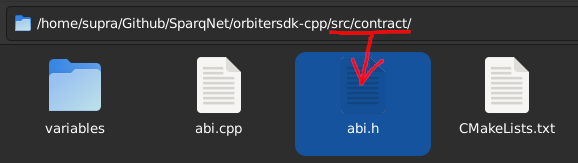

# 3.7 - Solidity ABI

Sparq is a *native* blockchain and has no EVM, but the vast majority of the smart contract ecossystem operates and depends on [Solidity](https://docs.soliditylang.org/en/latest) - not only the contracts themselves but also the data they share across each other.



The **ABI** namespace, declared in `src/contract/abi.h`, contains a few classes with several Solidity ABI-related operations for managing and manipulating data in Solidity format.

This is only an overview, check the [Doxygen](https://doxygen.nl) docs for more details on how those classes work.

## Solidity types

The **Types** enum contains the supported Solidity data types in the ABI. Each value has an intrinsic equivalency with both the Solidity data type and the native C++ data type that it represents.

Replace the **X** in "uintX" with the desired size number. The ABI supports every size from 8 to 256 (inclusive), in multiples of 8 (e.g. 8, 16, 24, 32, 40, 48, ..., until 256).

| Enum        | Solidity  | C++                       |
|:-----------:|:---------:|:-------------------------:|
| uintX       | uintX     | uintX_t                   |
| uintXArr    | uintX[]   | std::vector\<uintX_t>     |
| address     | address   | Address                   |
| addressArr  | address[] | std::vector\<Address>     |
| boolean     | bool      | bool                      |
| booleanArr  | bool[]    | std::vector\<bool>        |
| bytes       | bytes     | Bytes                     |
| bytesArr    | bytes[]   | std::vector\<Bytes>       |
| string      | string    | std::string               |
| stringArr   | string[]  | std::vector\<std::string> |

## The MethodDescription class

The **MethodDescription** class contains the structure for a given Solidity method, such as its name, type, inputs and outputs, and state mutability.

## The Encoder class

The **Encoder** class is responsible for encoding and packing native C++ data types into Solidity ABI-formatted strings.

The class automatically does the encoding on the constructor, so all you have to do is invoke it with a list of the supported types above (in the C++ column), and optionally a string with the functor (the full function header with no spaces between arguments, e.g. `func(type1,type2)`).

Here's an example:

```c++
ABI::Encoder e(
  {
    1000000000000000000,
    Address(std::string("0x1a2b3c4d5e6f7e8d9c0b1a2b3c4d5e6f7e8d9c0b"), false)
  },
  "transfer(uint256,address)"
);
std::cout << e.getData() << std::endl;
$ b7760c8f0000000000000000000000000000000000000000000000000de0b6b3a76400000000000000000000000000001a2b3c4d5e6f7e8d9c0b1a2b3c4d5e6f7e8d9c0b
```

You can also store the encoder variables separately with the `EncVar` type (which is just a `std::vector` underneath the alias) and pass it directly to the encoder:

```c++
ABI::Encoder::EncVar eV;
eV.push_back(1000000000000000000);
eV.push_back(Address(std::string("0x1a2b3c4d5e6f7e8d9c0b1a2b3c4d5e6f7e8d9c0b"), false)});
ABI::Encoder e(eV, "transfer(uint256,address)");
std::cout << e.getData() << std::endl;
$ b7760c8f0000000000000000000000000000000000000000000000000de0b6b3a76400000000000000000000000000001a2b3c4d5e6f7e8d9c0b1a2b3c4d5e6f7e8d9c0b
```

## The Decoder class

The **Decoder** class is responsible for decoding Solidity ABI-formatted strings back to native C++ data types.

The class automatically does the decoding on the constructor, so all you have to do is invoke it with the Solidity string and a list with the respective enum types, in order. Note that the Solidity string has to be in **raw bytes** format.

Here's an example:

```c++
ABI::Decoder d(
  {ABI::Types::uint256, ABI::Types::address},
  Hex(std::string("0000000000000000000000000000000000000000000000000de0b6b3a76400000000000000000000000000001a2b3c4d5e6f7e8d9c0b1a2b3c4d5e6f7e8d9c0b")).bytes()
);
uint256_t value = d.getData<uint256_t>(0);
Address to = d.getData<Address>(1);
std::cout << value << std::endl;
std::cout << to.hex().get() << std::endl;
$ 1000000000000000000
$ 1a2b3c4d5e6f7e8d9c0b1a2b3c4d5e6f7e8d9c0b
```
