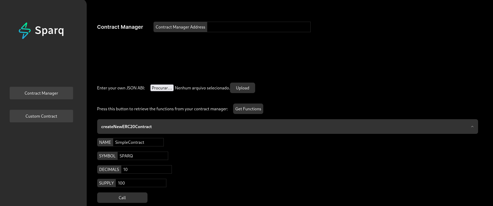

# 3.8 - Contract Tester

Sparq Labs has developed a web application so that the logic of customized contracts can be tested in a simple, fast and intuitive way. Contract Tester can be accessed through [this repository](https://github.com/SparqNet/contract-tester).

## Step 1 - Cloning the repository

First, you should clone the Contract Tester repository to your local device and go to the project folder. This can be done using the command:

```bash
git clone https://github.com/SparqNet/contract-tester && cd contract-tester
```

## Step 2 - Installing dependencies

After cloning the repository, you should install all project dependencies. This can be done using the command:

```bash
sudo apt install npm && sudo npm install --global yarn next react@latest react-dom
```

## Step 3 - Running the OrbiterSDK

Remember that the idea is to test the interaction of your customized contracts with the OrbiterSDK testnet, therefore, configure the environment and run the network locally, as can be seen in [section 3.3](https://github.com/SparqNet/sparq-docs/blob/main/Sparq_en-US/ch3/3-3.md)

## Step 4 - Deploying the application

After installing all dependencies, you should deploy the application. This can be done using the command:

```bash
yarn install && yarn build && yarn start
```

After that, you should be able to access the application through the address `http://localhost:3000`.

**Note 1:** If you want to deploy the application in a different port, you can use this command instead: `yarn install && yarn build && yarn start -p PORT_NUMBER`.

**Note 2:** The default port is `3000`, so, if you already have an application running on this port, you should use a different one using the command above or stop the application running on port `3000` with the command `sudo kill $(sudo lsof -t -i:3000)`.

## Step 5 - Using the application

After deploying the application, you should be able to access it through the address `http://localhost:3000` (or the port you chose in the previous step). The application should look like this:


When you open the home page, it'll automatically ask for you to connect to MetaMask. You can also click on the "Connect MetaMask" button on the bottom of the left sidebar to do it manually:


The application has two main sections: the **Contract Manager** and the **Custom Contract**. The first one shows the function calls for the default Contract Manager protocol contract that we have supplied within the OrbiterSDK project, and the second one is where you will call your custom contracts.

### Contract Manager

If you want to use the default contract, just type the required parameters on the function you want to call, and call it by clicking the "Call" button beside it. For example, let's create a new contract with the following parameters, based on the [SimpleContract example](https://github.com/SparqNet/sparq-docs/blob/main/Sparq_en-US/ch3/3-4.md)

- `NAME`: "SimpleContract"
- `SYMBOL`: "SPARQ"
- `DECIMALS`: 10
- `SUPPLY`: 100



After that, you should wait for the transaction to be mined and the contract to be created. You can check the transaction status on MetaMask. After the transaction is mined, you can click on the "getDeployedContracts" button to see the address of the contract you just created:


If you want to create a custom version of the Contract Manager, you will need to follow these steps:

  1. Deploy the custom contract to the network. You can refer to the [section 3.4](https://github.com/SparqNet/sparq-docs/blob/main/Sparq_en-US/ch3/3-4.md) for more information on how to do it;


  2. Take the custom contract address and put it at the top, in the “Contract Manager Address” field
    Add the custom contract's ABI by clicking the button next to the "Enter your own JSON ABI" label, choosing your JSON ABI file, and then clicking "Upload";

  3. Add the custom contract's ABI by clicking the button next to the "Enter your own JSON ABI" label, choosing your JSON ABI file, and then clicking "Upload";


  4. Finally, click the “Get Functions” button to show the custom contract's functions and input fields.


**Note 3**: We do not advise you remove the “getDeployedContracts” function on any custom contract implementations you create. We have a statically placed table at the end of the page for quick reference to all the contracts deployed on the network by the contract manager. Use this to quickly fetch the addresses of deployed contracts to be able to interact with them.

### Custom Contract

If you want to interact with a custom contract, make sure the type is defined and added to the Contract Manager so you can deploy an instance of the contract.

After deploying, grab the address from the “Deployed Contracts” list, click on the “Custom Contract” tab and repeat steps 1-4 as you did earlier with the Contract Manager.

Every time you want to change contracts, deploy a new one, change the address and ABI using the inputs, and get the functions.

**Note 4**: If you are passing an array as input values, just separate them by commas, and the application will do all the necessary changes.

Let's use the SimpleContract example from the [section 3.4](https://github.com/SparqNet/sparq-docs/blob/main/Sparq_en-US/ch3/3-4.md), because we already registered it earlier on the Contract Manager section. Firstly, develop the contract and deploy it to the network. After that, you can use the Contract Tester to interact with it. The solidity code for the contract is:

```solidity
// SPDX-License-Identifier: MIT
pragma solidity ^0.8;

contract SimpleContract {
  address owner;
  string name;
  uint256 value;

  constructor(string memory argName, uint256 argValue) {
    owner = msg.sender;
    name = argName;
    value = argValue;
  }

  function getName() public view returns(string memory) {
    return name;
  }

  function getValue() public view returns(uint256) {
    return value;
  }

  function setName(string memory argName) public {
    require(msg.sender == owner, "Not owner");
    name = argName;
  }

  function setValue(uint256 argValue) public {
    require(msg.sender == owner, "Not owner");
    value = argValue;
  }
}
```

We can use Remix IDE to generate the contract ABI. Firsly, go to the [REMIX IDE Website](https://remix.ethereum.org). There, you can just create a solidity file (.sol extension) and paste the code above. After that, you can compile the contract by clicking on the "Compile" button on the left sidebar. You should see something like this:


Now, you can click on the 'ABI' button to copy the ABI JSON structure of the SimpleContract. Finally, you can just save it in a json file and use it in the Contract Tester. This is the JSON ABI for the SimpleContract:

```json
[
	{
		"inputs": [
			{
				"internalType": "string",
				"name": "argName",
				"type": "string"
			},
			{
				"internalType": "uint256",
				"name": "argValue",
				"type": "uint256"
			}
		],
		"stateMutability": "nonpayable",
		"type": "constructor"
	},
	{
		"inputs": [],
		"name": "getName",
		"outputs": [
			{
				"internalType": "string",
				"name": "",
				"type": "string"
			}
		],
		"stateMutability": "view",
		"type": "function"
	},
	{
		"inputs": [],
		"name": "getValue",
		"outputs": [
			{
				"internalType": "uint256",
				"name": "",
				"type": "uint256"
			}
		],
		"stateMutability": "view",
		"type": "function"
	},
	{
		"inputs": [
			{
				"internalType": "string",
				"name": "argName",
				"type": "string"
			}
		],
		"name": "setName",
		"outputs": [],
		"stateMutability": "nonpayable",
		"type": "function"
	},
	{
		"inputs": [
			{
				"internalType": "uint256",
				"name": "argValue",
				"type": "uint256"
			}
		],
		"name": "setValue",
		"outputs": [],
		"stateMutability": "nonpayable",
		"type": "function"
	}
]
```

Now, you can use the Contract Tester to interact with the SimpleContract. Firstly, you need to get the address of the deployed contract. You can do that by going to the Contract Manager tab and clicking on the "Get Deployed Contracts" button. Remembering that we already did this step and our contract address is: ```0x5b41CEf7F46A4a147e31150c3c5fFD077e54d0e1```. Now, you can go to the Custom Contract tab and paste the address in the "Contract Address" field. After that, you can upload the ABI JSON file and click on the "Get Functions" button. You should see something like this:


Now, you can interact with the contract. Firstly, you can set name and value by using the "setName" and "setValue" functions. After that, you can get the name and value by using the "getName" and "getValue" functions. You can also check the transactions on Metamask.

Just remember this steps when tou decide to develop and test your own contracts:

1. Develop the contract and deploy it to the network.
2. Get the contract address by creating a new contract instance on the Contract Manager tab and clicking on the "Get Deployed Contracts" button.
3. Use a tool like Remix IDE to generate the contract JSON ABI.
4. Go to the Custom Contract tab and paste the contract address in the "Contract Address" field and upload the ABI JSON file.
5. Click on the "Get Functions" button and interact with the contract.


 

