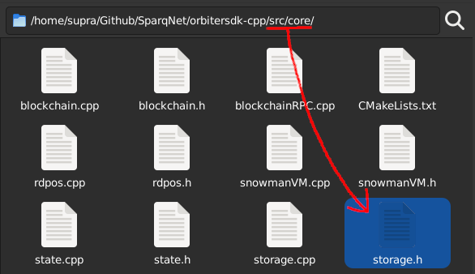

# 4.1 - Storage

The **Storage** class, declared in `src/core/storage.h`, represents the blockchain's history.

It maintains a collection of blocks approved and validated by the network, other nodes, or itself. Those blocks store transactions, contracts, accounts, and can't be altered once they're in the blockchain, only searched for or read from.

On node initialization, a history of up to 1000 of the most recent blocks is loaded into memory. Those blocks were stored in a previous initialization in the [database](../ch2/2-4.md). If there are no blocks (e.g. blockchain was just deployed and initialized for the first time), a "genesis" block is automatically created and loaded in memory.

Once a block and its transactions are received from the network, they're stored in memory. If more than 1000 blocks (or 1 million transactions) are stored in memory at a given time, older blocks are periodically saved to the database. This makes the blockchain lightweight memory-wise and extremely responsive.

Searching for and reading from blocks in history is done in several places in the system, so we can say the Storage and DB classes, working together, are the end point of the blockchain's operations history.
