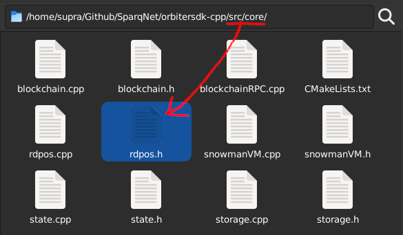
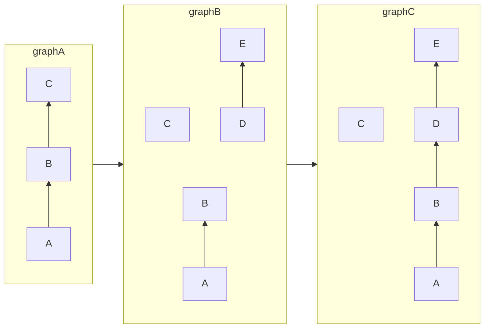
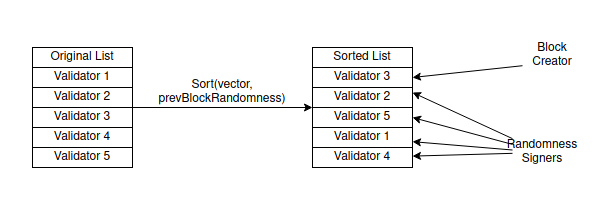
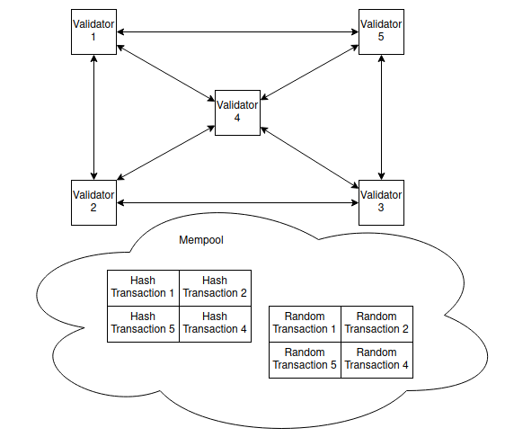
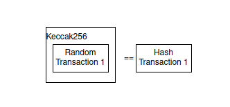
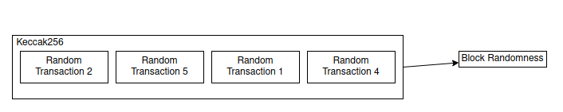
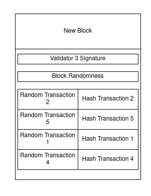

# 4.2 - rdPoS

The **rdPoS** class, declared in `src/core/rdpos.h`, implements the *Random Deterministic Proof of Stake* algorithm used by the Sparq network. It's also considered a smart contract, but remains part of the Sparq core protocol. This subchapter is dedicated to explaining how it works in concept.

## Blockchains overview

One of the biggest problems of blockchain development is having to deal with "rollbacks".

For example, on the Bitcoin chain, assuming there is a "latest" block that has another block after it. If a node receives a block that replaces the "latest" block, the next block and all the transactions in it are replaced too, which results in a rollback of the blockchain state by one block.

The Bitcoin and derived chains follow the "longest lived chain" rule (the biggest chain, the one with the most accumulated proof of work, is the main chain). However, rollbacks introduce problems with that rule. For example, when creating DApps where the developer has to deal with such specific conditions, which can require a bigger effort depending on the size/complexity of the application.

In the diagram above, block C was replaced by block D followed by block E, rolling back the transactions made in block C.

The solution to the problem is avoiding the rollback condition altogether. This can be done by randomly and deterministically defining which node can create a block, that way a "block race condition" never happens and everyone in the network stays synced to the same block.

## How rdPoS works

A block in an rdPoS network is created by the following rules:

1) Get a list of Validators from the network and randomly sort the list, using the "randomness" seed from the previous block.

2) The first Validator from the list will be the block creator, while the others (at least 4) will create a random 32 byte string and make two transactions with it: one containing the hash of said string, and another containing the string itself, both signed.

3) The hashes are verified to make sure they match their respective random strings.

4) A new block is created by the first Validator, concatenating and hashing the other Validators' random strings to create a new "randomness" seed that will be used next time on step 1.

5) The block is signed and published to the network by the first Validator, while the other Validators verify if all transaction signatures (random and hashed) correspond to the list in step 1.

For the genesis block (the first block in the chain), since there are no validators in the network, the "randomness" seed is hardcoded. Also, to bootstrap the network, at least 5 hardcoded Validators are required as well, since each block requires at least 4 Validators for signing and one for signing the block itself.

As quoted by [Supra](https://github.com/Jean-Lessa): "*It's like playing poker but everyone hashes their hands first before showing the real cards*".

## Validator implementations

There are three provided implementations for Validators: *decentralized*, *centralized*, and *semi-decentralized*. Which one to use is up to the developer, but at the moment we have a prototype of a centralized implementation.

### Decentralized

In a decentralized implementation, **all Validators are forced to take part in block creation** to make sure there won't be collusions.

A totally decentralized network using rdPoS can be potentially flawed when the number of Validators on the network reaches a certain number (10000, for example) - the latency between those nodes can become a problem.

To solve this, the block time in a decentralized network needs to be bigger (between 15 and 30 seconds, for example), so all the nodes have enough time to answer.

Validators can be added to the network by locking a certain amount of tokens in the rdPoS contract (the class that also implements the rdPoS logic itself).

### Centralized

In a centralized implementation, every network has a "master address" that can add as many Validators as desired - in this case, the developer, who has the responsibility of keeping the chain up and running.

The recommended number of nodes for this implementation is at least 32, but more or less nodes can be used depending on the necessity of the application.

### Semi-decentralized

In a semi-decentralized implementation, both Validator types are used:

* A normal Validator, simply called "Validator", similar to the decentralized one and added to the network the same way (locking tokens); and
* A Validator called "Sentinel", similar to the centralized one and added to the network the same way (with a "master address").

The difference is neither Validators nor Sentinels can create a block on their own - the "randomness" hash requires *at least one* of the transactions from a Sentinel, and whoever will publish the block is forced to follow the Validator list order.

This makes it possible to have a smaller number of validators on the network (16, for example), requiring less computing power to verify while keeping a high security profile. Since Sentinels take part in the process, every extra byte in the concatenated "randomness" seed will change the resulting hash.

## Slashing

What happens when a node answers with a "randomness" hash that does not match its own hash? Or when a node creates an invalid block with invalid transactions? Or when a node can't create a block before reaching the network's time limit?

Misbehaving nodes suffer consequences. Since Validator signatures are required at protocol level, if a Validator tries to break the rules, it's possible to know who it is thanks to the signature, and "slash" it from the network.

At the moment the biggest problem is a group of Validators being "slashed" and halting network activity. This can be solved by adding extra conditions to the network - for example, if the network wants to change the current block creator (in case it's been "slashed"), at least 90% of the Validators in the network have to sign a transaction consenting with the change, always maintaining the majority's consensus.

