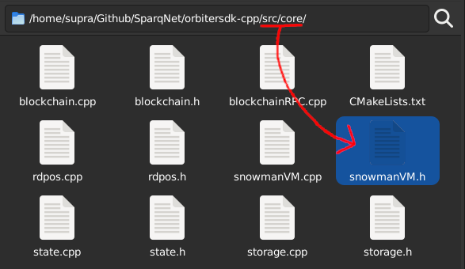

# 4.3 - SnowmanVM

The **SnowmanVM** class, declared in `src/core/snowmanvm.h`, is the abstraction of an interface to communicate with the AvalancheGo ecossystem.

It controls blocks received through the AvalancheGo network and contains information such as the preferred block (chosen by the network), if the block is being processed, if it was approved or rejected.

When a block reaches consensus (as in, it stops being "processed" and is either "approved" or "rejected"), it is removed from here and properly discarded (if rejected) or moved to [Storage](4-1.md) (if approved).

A block that was already received before can't be accepted anymore. This applies to every status a block can be in, and to prevent that from happening, the status of all received blocks is stored in a list (`cachedBlockStatus`).
