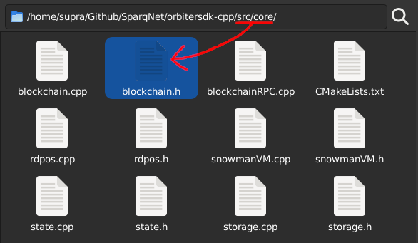

# 4.5 - Blockchain and Syncer

The **Blockchain** class, declared in `src/core/blockchain.h`, acts as the mother class that unites all the other components described throughout the docs, such as (but not limited to):

* The global options singleton
* [The database](ch2/2-4.md)
* [The blockchain state](ch4/4-4.md)
* [The blockchain history/storage](ch4/4-1.md)
* [The SnowmanVM abstraction layer](ch4/4-3.md) (for interfacing with AvalancheGo)
* [The rdPoS protocol](ch4/4-2.md)
* The gRPC, HTTP and [P2P](ch5/5-2.md) servers, and the Syncer

The **Syncer** class, declared in the same file, is responsible for syncing the blockchain with other nodes in the network, as well as doing the proper transaction broadcasts and block creations (if the node happens to be a Validator).

Think of the Blockchain class as "the power button on Sparq's PC case" - its objective is to be the entry point of the system and act as a mediator for the other components, passing data around to each other.
