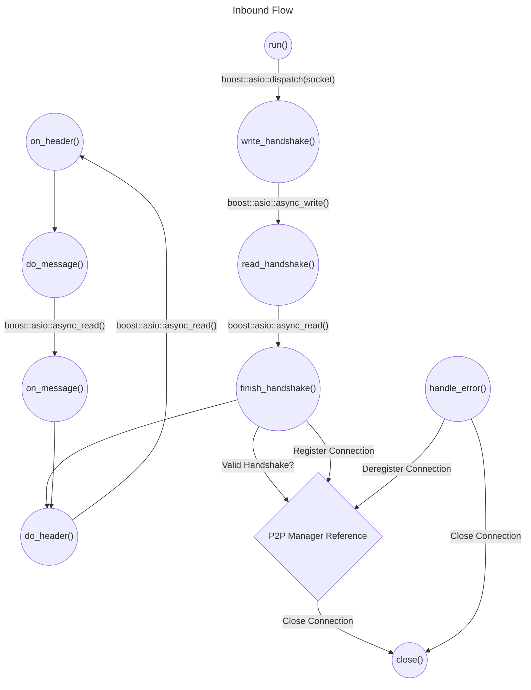
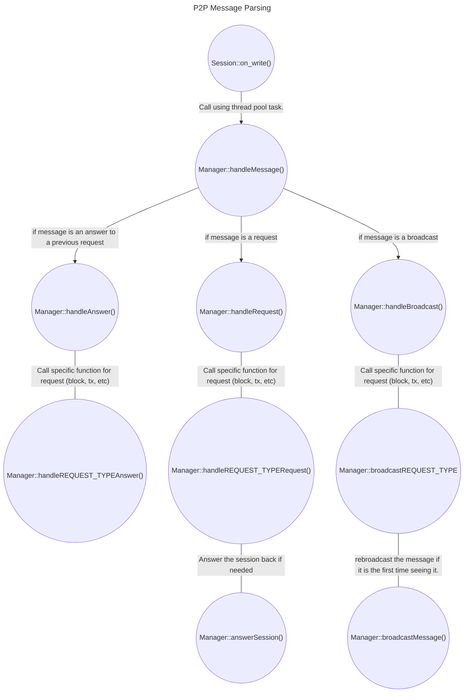

# 5.2 - P2P Overview

This subchapter provides a comprehensive overview of the P2P classes and their organization within the OrbiterSDK. It further elaborates on the life-cycle of a P2P connection and the dynamic flow of data between nodes.
## P2P::Session

The Session class serves as a fundamental base class for both ClientSession and ServerSession. It encapsulates a TCP connection with a remote node, transforming it into a "session", thereby streamlining the process of sending and receiving messages.

The Session class is responsible for managing the handshake process, reading socket data, and dispatching messages. It incorporates a queue for outbound messages, allowing any thread that is responsible for sending a message to carry on with its task without having to wait for the message transmission to complete.

The Session is designed to be used with shared_from_this to manage its lifecycle, as it primarily exists within the handlers of io_context. Once a session has successfully established a connection with a remote node, it is added to the P2P Manager's list of sessions.

It is critical to properly manage this shared_ptr. The destructor of the Session class is intrinsically linked to the destructor of the socket, which, in turn, calls the io_context. If the shared_ptr persists but its referenced io_context is no longer existent, this will lead to a program crash.

For instance, functions called by the thread pool to parse asynchronous operations accept a std::weak_ptr as a parameter, which is then converted into a shared_ptr. This design choice ensures the Session object is still viable. In addition, the manager session mutex is locked to prevent the shared_ptr from unexpectedly becoming a unique shared_ptr and causing a segmentation fault while attempting to delete a session in the absence of its corresponding io_context.

Here is a pseudocode representation of the base Session class:

```cpp
class Session {
  protected:
    boost::asio::ip::tcp::socket socket_;
    std::shared_ptr<Message> inboundMessage_;
    std::shared_ptr<Message> outboundMessage_;
    std::deque<std::shared_ptr<Message>> message_queue_;
    const uint64_t maxSize_ = 1024 * 1024 * 128; // 128MB
    BytesArr<3> inboundHandshake_; 
    BytesArr<3> outboundHandshake_;
    BytesArr<8> inboundHeader_;
    BytesArr<8> outboundHeader_;
    std::unique_ptr<dynamic_vector_buffer> inboundBuffer_;
    std::unique_ptr<dynamic_vector_buffer> outboundBuffer_;
    std::mutex queueMutex;
    void virtual write_handshake();
    void virtual read_handshake();
    void virtual finish_handshake();
    void virtual do_header();
    void virtual on_header();
    void virtual do_message();
    void virtual on_message();
    void virtual write_add_queue();
    void virtual do_write();
    void virtual on_write();
    void virtual handle_error();
  public:  
    Session() {...};
    void virtual run();
    void virtual close();
    void virtual write(std::shared_ptr<Message> msg);
}
```

The life-cycle of a session can be described as follows:

Upon instantiation, a session's run() method is invoked. This method dispatches write_handshake() using boost::asio::dispatch. This function, in turn, utilizes boost::asio::async_write to send the handshake, setting read_handshake() as its callback. Following this, read_handshake() initiates an asynchronous read operation to receive the remote endpoint's handshake, using finish_handshake as its completion handler. The finish_handshake method then validates the received handshake through the P2P Manager and proceeds to call do_header(). This sets off a sequence of operations: do_header() leads to on_header(), which in turn calls do_message() with the size information derived from the header buffer. After this, do_message() triggers on_message() and passes the received message forward for parsing. Finally, do_header() is invoked again, setting up for the next round of data exchange. This process continues cyclically for the duration of the connection.

Here is a flowchart of the process:



For messages originating from the local node (outbound messages), the process is outlined as follows:

An external thread invokes the write() function, supplying a shared_ptr<Message>. Within this function, the queueMutex is locked, and a check is made to see if the outbound message is null. If it is, the outbound message is assigned the Message passed as an argument, and boost::asio::post is called with do_message_header() as it's handler, with the appropriate write strand. If the outbound message is not null, indicating an ongoing message write process, the argument Message is simply added to the queue. The write strand is designed to handle it at a later time.

The write strand initially sends the header (comprising 8 bytes that contain the message size), followed by the message itself. This sequence triggers the calling of functions in the following order: do_write_header() -> on_write_header() -> do_write_message() -> on_write_message(). The function on_write_message() stands out as it locks the queue mutex, transfers any message from the queue to the outboundPtr, and subsequently invokes do_write_header() again. If the queue is empty, the outboundPtr is set to null, bringing a halt to any further callbacks from the write strand.

```mermaid
---
title: "Outbound"
---
flowchart
	311944(("write()")) -->|"boost::asio::post() if condition is met"| 474425(("do_header_write()"))
	474425 -->|"boost::asio::async_write()"| 476584(("on_header_write()"))
	639173(("do_message_write()")) ---|" boost::asio::async_write()"| 562806(("on_message_write()"))
	476584 --> 639173
	562806 -->|"if queue not empty, move ptr and call<br>"| 474425

%% Mermaid Flow Diagram Link
%% Keep this link to make future edits to your diagram
%% https://www.mermaidflow.app/flowchart#N4IgZgNg9g7iBcoB2UAmBTAzgg2qGAlqgC4AWCAjAAwBsANCKegQOanGW0NEIgDMFCgE4ALCJAMADlEwFiBKEgSgAHggDsNdQDpBFABwBWGvqojD6gEyWGATwSX1Q7TUOH9mkRT6P9AXwZUAENiIOUQAGMIIMxMLFwAXQZMYlsIePgcJJBogCN0CF4YACc5dAAKAEoJEFQCYvQI+UVeABUAIRrioKQAa0wAEW6YJUQAkEkghqRiACUe3oQqQOGAZVT0hGJigFd0cdTJdF4I+qj0ADk0Y+SN47HkgsbidFQEMCCIOKkZOQUkACCuUwUAgOxe4TU8E0Oj0RhMZgs1jsDicLjcHhoXh86n8KyCLBYBCQLHenziAXwRDIlCxDCYrHYtJE3De8BAInUYkshhq0lkzVGqg0VD42ioQhoCLEIi0ZhR8EMIjFVAoIlVFEsBiE1Bo42CoXCURicWwmWyKTSGSyDDyBV4qCgAH0mEEMMUnSUylUanUGk1-m1Ogxun1BsMheNJtM5gslviYOsrVtdvsGId7pEzukrhgapbNg8QHF0k1XmSvugfgL-kCQWCIYgQFD1KLxZLpWI5SyQPZFcrxWqNVr9DraPruoTiaT4B9K5SQIQSOR4BQ6YxmGwOKv1zx2ZzXPpxNW-i0my3LDRtEI+HxTFYREJ1N59AqnzpL63RU5zM+8bUQjCJtjVia0LTuM0bRyIJ8kKdlFBddA3XQD0vReH1AnqZ5A3ZDougWcMghGZQoymdAZnmPp41qNY7hTPYDlsI4TmzS5rnzOiixLZ5y1nckqwmX5BTrUFwXuYVoUva9b3vSxH2fO833UD85W-UQLAMPwFyXGlVycelNyZPShFZXhjEsUwaD5IScIknlnCsdRjCoXE+FFPhXAVLRLG0QwqCodw701TUhH1QCjWiUDIPAq1ottGD7XgpAnQAWywTACXQT1SnQ6pMP9QUg3wsMhiIyMpDIii43gZYaKIpNC22Bj0yYzNTmKc5cxuYtOOAcZuLLNk52+QSa0UESG3E5sHEMBzHGc1z3M83sEG83z-MC-RgssUL8SnEkKwpOgqWXSh9I3Rltwoc69xAGg+B1dQ+GssahWm+BHyobR9C1PgMScP63HoFb4CfMV7vMREREcSwwsNYDItNRJbli5HoNgh1nTS2JMuy708tqLCAzPEA8JDAjSuIoto3I2MqJqhMGvuJq0xADMWI6nN2JRws+seUsXiG-iT2E4FRMbCTPu+37-pvNxjCU8G+Eh8xoasCcCSJA6+PnbJXhYa1QHZ9kIh2FIoBSmoUqmXoUPWKZtxAKAjiUBhreKW3igAUSQNlBOJDhuBmFCgmJpAAHVqRXSxaoLKaUmKKBbcj07V3GW79fQABaVsaCoI8dpEfR7vzKAdg6zMBGEMQalCYoDcdzluV5dMpgbgAJHpUELEAKFL8uInQTvfZ7vvAnCps7TgkBcigGRiHgeAYgURf+WIKoAAICDADeIkUOpBS3zAN7SwOcnIlhdIobhMC9g-p0O1mAC8AElffQKFqFjp5BsfhdjciGbYgFsrY2ztnXR2ztyKgI9ihH2ftpABxqAHEOYcU66RjjzeO2wk7oHQSuCg6c-aZyzmuYws1lLuFlP3CuvAm7QxbmzNu6BG6aCobXZhxBh7d0zGPYsZcK7cNHr6CeoAp68FnvPRey8oDSMwLYJAEQ8a5RqOkEkV8b53z+NrYaz834YE-v5fmPEhbzmOmzVqJwgEgLdmA4o9tiiQJdjAz28DeBQNdiAFB3Q0FRwcLHXqPVE7Jz8WnZIAjB68Huo9Z64SB5Dy7sI1u9cWFmRoBZWgHCUlcMSZmSwyDiGoANjnHUys+C4mfFiGoPQCDW0Fo-ce8NQBx1wEE3B8AADEuQKDdNyFZbIBBb73x0cLdGiUQAb0kSkORK8l7yMUcoio1Rxiv3foY7+AteK6P-pYk21jLa2NgfYiB7jnGHNcb7XgiCZjIODj4wU+D-FYPCAnXBjywn8PiXQthR4aGDyEXkrJDcokPWurEph2SAW8HyaZdkJC1Sq38tDIQAVqlIFqSELZoyDRAWaZxHAbTbadN6T0-pmjhkzm2QwVZBjOAbJMX-cxADTbmwOSAd2nsHFOOgecuBlz2TXLPt40ODzQmYJ6smJsryQmp0IXE2h7JzKWT+QkkevCgWpP3FyBhGqclqt4HwjORTs4eEfEIIwCknBooxfUnWI0cUvPxYS9AxKemkpAAMoZ2jKWjPEeybeG8ACOew9gbxQMQDe6AUqSFSHQE+UAABu6AN4xuKBvLuu9PgQAADy5GKAAPhACs-RH86XGN-na-Y2QE0EHQDAaQjjIQzS+tDcpnIMl50lHwBUxhxSWAEDQTUo55KqmpXPS2NVtCaCPOU2atAxD+T1PqAgBJugpQALIsKCAMURhMCo4VJsGcAicZjrpCC8Yo4R5DEB7gAeXBLPHYlzl37qTXFSIFs0ozHfSBJG5p063xUA24gAAFHoBRb3OPgCzBgLBoC5E+HfA2rRdmgFQDsT4DScjEnQCh5i7J6w8AYJnM9Ry8OZg8TUPe0BL3si6W6vpRbYPwc+F1cjV7dkgAKj0ODbE8wMGo1AWjIAOn+TE1QGoCGIi9BYInJ9qAADCoIhO8A6WAdTGnJNCfdEpmjqnxP+S08Ud0rRSAEGk0gdKvBCNvBvjuzATBTEUj8EAA
```



## ClientFactory

The ClientFactory Class serves as an intermediary that allows the Manager to instantiate and launch a new outbound Session given an IP address and port. It does not directly manage these instances, but rather facilitates their creation and execution within an io_context.

At present, the ClientFactory operates the io_context across four threads. This necessitates the use of strands to effectively manage and execute asynchronous operations within the Sessions.

The code snippet below, extracted from the ClientFactory Class, demonstrates how a new Session is instantiated and put into operation by the ClientFactory.

```cpp
  void ClientFactory::createClientSession(const boost::asio::ip::address &address, const unsigned short &port) {
    tcp::socket socket(this->io_context_);
    auto session = std::make_shared<Session>(std::move(socket), ConnectionType::OUTBOUND, manager_, this->threadPool_, address, port);
    session->run();
  }
  void ClientFactory::connectToServer(const boost::asio::ip::address &address, const unsigned short &port) {
    boost::asio::post(this->connectorStrand_, std::bind(&ClientFactory::createClientSession, this, address, port));
  }
```


## Server

The Server operates as a straightforward TCP server, listening for incoming connections and creating a new Session for each incoming connection.

Similar to the ClientManager, the Server's does not directly manage the Sessions. Instead, it focuses on accepting new connections, creating corresponding Sessions, and executing them within a designated io_context.

## ManagerBase and its Derivatives

The Manager acts as the backbone of the P2P network. It bears the responsibility of managing the Sessions, the Server, and the ClientFactory.

Once a Session has successfully completed a handshake, it is registered with the Manager, which then oversees the Session's lifecycle. The Manager's responsibilities include maintaining a registry of Sessions, handling incoming and outgoing requests and responses, and managing the communication amongst these Sessions.

Given its extensive duties, it's imperative that the functions within the Manager remain as "lightweight" as possible within their respective mutexes. This is to ensure the Manager is not locked for extended periods, as it is concurrently accessed by multiple threads to register/deregister Sessions, parse incoming messages, or request information from other nodes. Prolonged locking of the Manager risks blocking the node, with potential repercussions extending to the entire network.

Furthermore, the Manager oversees the operations of the P2P Server and ClientFactory, and therefore indirectly manages the io_context.

When discussing the Manager, it is important to be aware of some points before adding or modifying any code that uses it. Sessions do not manage their io_context, which means that if you retrieve a shared_ptr to a specific session, perform operations on it, and that pointer is deleted elsewhere, you could end up with a pointer that triggers an exception when used - because the io_context it refers to has already been destroyed. Awareness of the lifespan of the io_context and the objects that use it is crucial before adding or modifying any code that uses it.

## Request and Response Flow

Every incoming message is promptly parsed by the Manager via the handleMessage() function. These messages can fall into one of three categories: Request, Response, or Broadcast, and each type is handled distinctly by the Manager.

### Request

A Request message indicates a query for specific data from another node, which might include a list of blocks, transactions, etc. Upon receiving a Request, the Manager invokes the corresponding function to address the request and subsequently sends the requested data back to the originating node as a Response.

When the Manager initiates a request to another node, it generates a random 8-byte ID and registers this ID internally. Upon receiving a response, the Manager cross-verifies whether the ID is registered. If it is, the Manager fulfills the associated Request Future with the received response and removes the ID from its registry. However, if the ID isn't registered, the response is disregarded.

On the recipient's end, the node processes the request, formulates a response, and assigns it the same ID. This response is then dispatched back to the requesting node by the Manager.

### Response

A Response message signifies an answer to a previously dispatched request from the node. The Manager checks if the response ID is registered in its system. If it is, the Manager fulfills the corresponding Request Future with the response. If the ID isn't registered, the response is discarded.

### Broadcast

A Broadcast message signals a unilateral dissemination of certain data such as a new block or transaction. This type of communication contrasts with Request and Response messages which follow a bidirectional Request-Response flow. Here, the recipient node doesn't dispatch a response back to the sender. Instead, it verifies the received data and takes appropriate action, such as rebroadcasting the message or adding it to the blockchain.

### Assynchronous Message Parsing

The first thread under our control that accesses the Message is the io_context executing that particular Session. To optimize the performance of io_context and avoid any bottleneck, we offload the task of message parsing to a separate thread pool. This pool handles both parsing of the message and writing back to the Session, which involves adding tasks to the Session's write strand or queue.

One performance-enhancing strategy we employ is the use of shared_ptr for each Message. This prevents unnecessary copying of the Message and provides significant benefits when dealing with broadcasts. In such cases, a single Message instance can be utilized by multiple writing sessions, thereby offering a performance boost to the P2P network.

Our current design uses shared_ptr for all Messages. However, we plan to transition to a system where unique_ptr is used for inbound messages and shared_ptr for outbound messages. The rationale behind this is to better handle memory ownership. The use of unique_ptr provides clearer ownership semantics and improved performance. However, since unique_ptr cannot be moved into a std::function (which would be the task posted to the thread pool), we are retaining shared_ptr for the time being.

### Function Flow

The following diagram illustrates the flow of Message being received by the Manager, and the subsequent actions taken by the Manager.



Some observations:

- REQUEST_TYPE is the name for the request, such as ```Info```, ```RequestNodes``` and others.
- Manager::handleAnswer always fills a std::promise with the answer. A thread that called a request within the manager towards another node will wait for a few seconds or until the answer is received. 