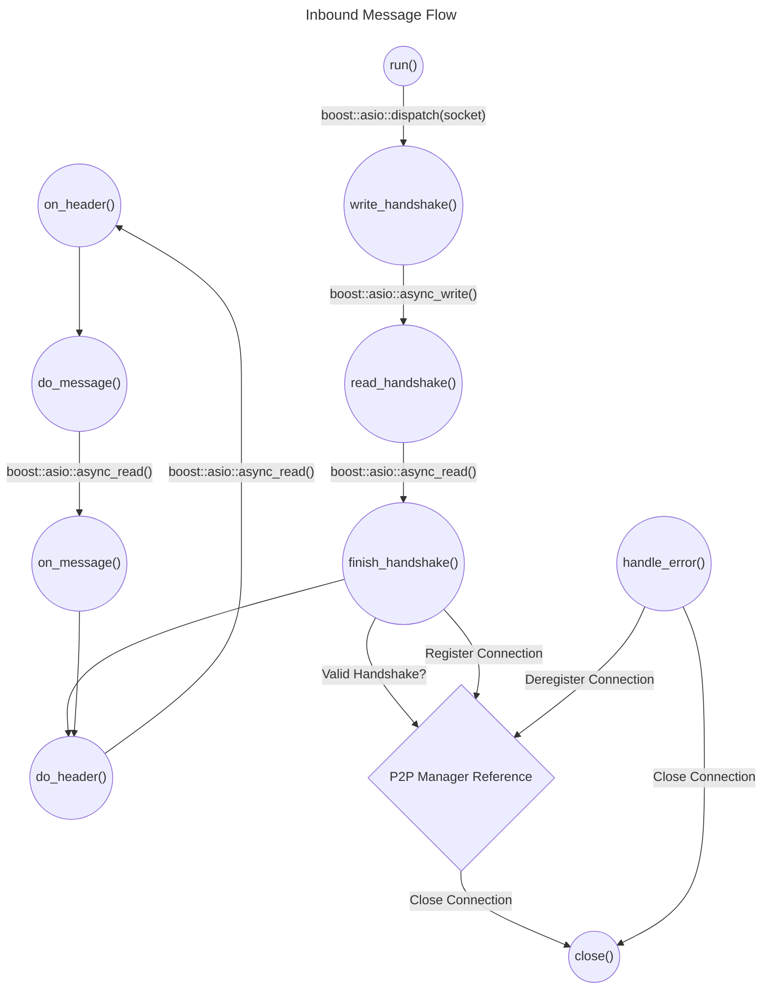
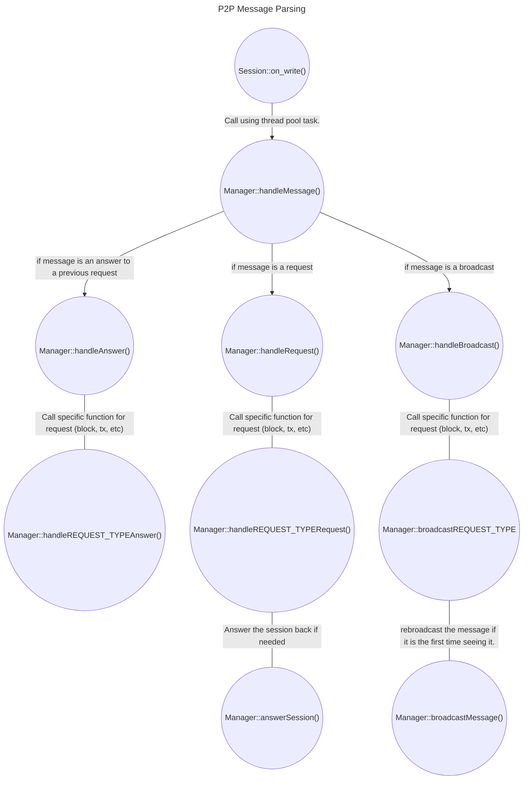

# 5.2 - P2P Overview

This subchapter provides a comprehensive overview of the P2P classes and their organization within the OrbiterSDK. It further elaborates on the life-cycle of a P2P connection and the dynamic flow of data between nodes. All classes described here are inside the `src/net/p2p` folder. Check their header files for full details on how each of them work.

## Session

The `Session` class (`session.h`) encapsulates a TCP connection with a remote node, responsible for managing handshakes, sending and receiving messages by reading and writing socket data. It has a queue for outbound messages, allowing any thread that is responsible for sending a message to carry on with its task without having to wait for the message transmission to complete, and serves as a base for the `ClientSession` and `ServerSession` specialized classes.

Sessions are designed to be used as `shared_ptr`s with `shared_from_this` to manage their lifecycles, as they primarily exist within the handlers of Boost's `io_context`. Once a session has successfully established a connection with a remote node, it is added to a list of sessions controlled by a manager. It is critical to properly manage those shared pointers, as the destructor of the `Session` class is intrinsically linked to the destructor of the socket, which, in turn, calls the `io_context`. If the pointer persists but its referenced `io_context` no longer exists, this will lead to a program crash.

For instance, functions called by the thread pool to parse asynchronous operations accept a `weak_ptr` as a parameter, which is then converted into a `shared_ptr`. This design choice ensures the `Session` object is still viable. In addition, the manager session mutex is locked to prevent the `shared_ptr` from unexpectedly becoming a `unique_ptr`, which would cause a segmentation fault while attempting to delete a session in the absence of its corresponding `io_context`.

## Life cycle of a session

Upon instantiation, a session's life-cycle is composed of three different routines: *handshake*, *read* and *write*.

### Handshake routine

The first routine is giving a handshake to a remote endpoint, effectively making a connection so data can be shared between both ends. It happens like this:

* The `run()` method is called first, and uses `boost::asio::dispatch()` to dispatch a call of `write_handshake()`
* `write_handshake()` uses `boost::asio::async_write()` to send a handshake to the remote endpoint, and sets `read_handshake()` as a callback for when the handshake is properly answered
* `read_handshake()` initiates an asynchronous read operation to receive the remote enpoint's handshake, and sets `finish_handshake()` as a callback for when the operation is complete
* `finish_handshake()` validates the recived handshake through the P2P manager and calls `do_read_header()` to start the next routine

Here is a flowchart of the routine:

TODO: ask Ita to split the graphs in three and put the handshake part here

### Read routine

The second routine is reading inbound messages coming from the remote endpoint. This routine is executed cyclically through the entire duration of the connection, and goes like this:

* `do_read_header()` reads an incoming message's header (8 bytes that contain the message's full size), and calls `on_read_header()` when done
* `on_read_header()` is a callback for when the header read process is complete, calling `do_message()` next
* `do_read_message()` reads the full message, using the size in bytes passed to it by `on_header()`, and calls `on_read_message()` when done
* `on_read_message()` is a callback for when the message read process is complete, parsing the message passed by `do_read_message()`, then calling `do_reaD_header()` once again and starting the next round of data exchange

Here is a flowchart of the routine:

TODO: ask Ita to rename the functions in the graph according to the points above



### Write routine

The third routine is writing outbound messages going to the remote endpoint, like this:

* An external thread calls `write()` with a shared pointer to a message. Within this function, the queue mutex is locked, and a check is made to see if the outbound message is null
    * If it is null, the outbound message is assigned to the message passed as an argument, and `boost::asio::post()` is called with `do_message_header()` as its handler, with the appropriate write strand
    * If it is *not* null (which indicates a write process is already going on), the message is added to the queue, and the write strand will handle it later
* The write strand then begins the following chain of actions:
    * `do_write_header()` writes the message's header (8 bytes that contain the message's full size), and calls `on_write_header()` when done
    * `on_write_header()` is a callback for when the header write process is done, calling `do_write_message()` next
    * `do_write_message()` writes the full message, and calls `on_write_message()` when done
    * `on_write_message()` is a callback for when the message write process is done, locking the queue mutex, grabbing the next message from the queue, and calling `do_write_header()` again - this loop goes on until the queue is empty, where the outbound message pointer is set to null and any further callbacks from the write strand come to a halt

Here is a flowchart of the routine:

TODO: ask Ita to rename the functions in the graph according to the points above



```mermaid
---
title: "Outbound Message Flow"
---
flowchart
	311944(("write()")) -->|"boost::asio::post() if condition is met"| 474425(("do_header_write()"))
	474425 -->|"boost::asio::async_write()"| 476584(("on_header_write()"))
	639173(("do_message_write()")) ---|" boost::asio::async_write()"| 562806(("on_message_write()"))
	476584 --> 639173
	562806 -->|"if queue not empty, move ptr and call<br>"| 474425

%% Mermaid Flow Diagram Link
%% Keep this link to make future edits to your diagram
%% https://www.mermaidflow.app/flowchart#N4IgZgNg9g7iBcoB2UAmBTAzgg2qGAlqgC4AWCAjAAwBsANCKegQOanGW0NEIgDMFCgE4ALCJAMADlEwFiBKEgSgAHggDsNdQDpBFABwBWGvqojD6gEyWGATwSX1Q7TUOH9mkRT6P9AXwZUAENiIOUQAGMIIMxMLFwAXQZMYlsIePgcJJBogCN0CF4YACc5dAAKAEoJEFQCYvQI+UVeABUAIRrioKQAa0wAEW6YJUQAkEkghqRiACUe3oQqQOGAZVT0hGJigFd0cdTJdF4I+qj0ADk0Y+SN47HkgsbidFQEMCCIOKkZOQUkACCuUwUAgOxe4TU8E0Oj0RhMZgs1jsDicLjcHhoXh86n8KyCLBYBCQLHenziAXwRDIlCxDCYrHYtJE3De8BAInUYkshhq0lkzVGqg0VD42ioQhoCLEIi0ZhR8EMIjFVAoIlVFEsBiE1Bo42CoXCURicWwmWyKTSGSyDDyBV4qCgAH0mEEMMUnSUylUanUGk1-m1Ogxun1BsMheNJtM5gslviYOsrVtdvsGId7pEzukrhgapbNg8QHF0k1XmSvugfgL-kCQWCIYgQFD1KLxZLpWI5SyQPZFcrxWqNVr9DraPruoTiaT4B9K5SQIQSOR4BQ6YxmGwOKv1zx2ZzXPpxNW-i0my3LDRtEI+HxTFYREJ1N59AqnzpL63RU5zM+8bUQjCJtjVia0LTuM0bRyIJ8kKdlFBddA3XQD0vReH1AnqZ5A3ZDougWcMghGZQoymdAZnmPp41qNY7hTPYDlsI4TmzS5rnzOiixLZ5y1nckqwmX5BTrUFwXuYVoUva9b3vSxH2fO833UD85W-UQLAMPwFyXGlVycelNyZPShFZXhjEsUwaD5IScIknlnCsdRjCoXE+FFPhXAVLRLG0QwqCodw701TUhH1QCjWiUDIPAq1ottGD7XgpAnQAWywTACXQT1SnQ6pMP9QUg3wsMhiIyMpDIii43gZYaKIpNC22Bj0yYzNTmKc5cxuYtOOAcZuLLNk52+QSa0UESG3E5sHEMBzHGc1z3M83sEG83z-MC-RgssUL8SnEkKwpOgqWXSh9I3Rltwoc69xAGg+B1dQ+GssahWm+BHyobR9C1PgMScP63HoFb4CfMV7vMREREcSwwsNYDItNRJbli5HoNgh1nTS2JMuy708tqLCAzPEA8JDAjSuIoto3I2MqJqhMGvuJq0xADMWI6nN2JRws+seUsXiG-iT2E4FRMbCTPu+37-pvNxjCU8G+Eh8xoasCcCSJA6+PnbJXhYa1QHZ9kIh2FIoBSmoUqmXoUPWKZtxAKAjiUBhreKW3igAUSQNlBOJDhuBmFCgmJpAAHVqRXSxaoLKaUmKKBbcj07V3GW79fQABaVsaCoI8dpEfR7vzKAdg6zMBGEMQalCYoDcdzluV5dMpgbgAJHpUELEAKFL8uInQTvfZ7vvAnCps7TgkBcigGRiHgeAYgURf+WIKoAAICDADeIkUOpBS3zAN7SwOcnIlhdIobhMC9g-p0O1mAC8AElffQKFqFjp5BsfhdjciGbYgFsrY2ztnXR2ztyKgI9ihH2ftpABxqAHEOYcU66RjjzeO2wk7oHQSuCg6c-aZyzmuYws1lLuFlP3CuvAm7QxbmzNu6BG6aCobXZhxBh7d0zGPYsZcK7cNHr6CeoAp68FnvPRey8oDSMwLYJAEQ8a5RqOkEkV8b53z+NrYaz834YE-v5fmPEhbzmOmzVqJwgEgLdmA4o9tiiQJdjAz28DeBQNdiAFB3Q0FRwcLHXqPVE7Jz8WnZIAjB68Huo9Z64SB5Dy7sI1u9cWFmRoBZWgHCUlcMSZmSwyDiGoANjnHUys+C4mfFiGoPQCDW0Fo-ce8NQBx1wEE3B8AADEuQKDdNyFZbIBBb73x0cLdGiUQAb0kSkORK8l7yMUcoio1Rxiv3foY7+AteK6P-pYk21jLa2NgfYiB7jnGHNcb7XgiCZjIODj4wU+D-FYPCAnXBjywn8PiXQthR4aGDyEXkrJDcokPWurEph2SAW8HyaZdkJC1Sq38tDIQAVqlIFqSELZoyDRAWaZxHAbTbadN6T0-pmjhkzm2QwVZBjOAbJMX-cxADTbmwOSAd2nsHFOOgecuBlz2TXLPt40ODzQmYJ6smJsryQmp0IXE2h7JzKWT+QkkevCgWpP3FyBhGqclqt4HwjORTs4eEfEIIwCknBooxfUnWI0cUvPxYS9AxKemkpAAMoZ2jKWjPEeybeG8ACOew9gbxQMQDe6AUqSFSHQE+UAABu6AN4xuKBvLuu9PgQAADy5GKAAPhACs-RH86XGN-na-Y2QE0EHQDAaQjjIQzS+tDcpnIMl50lHwBUxhxSWAEDQTUo55KqmpXPS2NVtCaCPOU2atAxD+T1PqAgBJugpQALIsKCAMURhMCo4VJsGcAicZjrpCC8Yo4R5DEB7gAeXBLPHYlzl37qTXFSIFs0ozHfSBJG5p063xUA24gAAFHoBRb3OPgCzBgLBoC5E+HfA2rRdmgFQDsT4DScjEnQCh5i7J6w8AYJnM9Ry8OZg8TUPe0BL3si6W6vpRbYPwc+F1cjV7dkgAKj0ODbE8wMGo1AWjIAOn+TE1QGoCGIi9BYInJ9qAADCoIhO8A6WAdTGnJNCfdEpmjqnxP+S08Ud0rRSAEGk0gdKvBCNvBvjuzATBTEUj8EAA
```

## ClientFactory

The `ClientFactory` class (`client.h`) serves as an intermediary that allows the P2P manager to instantiate and launch a new outbound client session with a given IP address and port. It does not directly manage these instances, but rather facilitates their creation and execution within an `io_context`. At present, the class operates the `io_context` across *four* threads. We use strands to effectively manage and execute asynchronous operations within the sessions.

The code snippet below, demonstrates how a new `ClientSession` is instantiated and put into operation by `ClientFactory`:

```cpp
void ClientFactory::createClientSession(const boost::asio::ip::address &address, const unsigned short &port) {
  tcp::socket socket(this->io_context_);
  auto session = std::make_shared<Session>(std::move(socket), ConnectionType::OUTBOUND, manager_, this->threadPool_, address, port);
  session->run();
}

void ClientFactory::connectToServer(const boost::asio::ip::address &address, const unsigned short &port) {
  boost::asio::post(this->connectorStrand_, std::bind(&ClientFactory::createClientSession, this, address, port));
}
```

## Server

The `Server` class (`server.h`) acts as a straightforward TCP server, listening for and creating new sessions for each incoming connection. It does not directly manage the sessions, it only focuses on accepting connections, creating corresponding sessions, and executing them within a designated `io_context`.

## ManagerBase and derivatives

The P2P manager acts as the backbone of the P2P network. It bears the responsibility of managing `Session`s, the `Server`, and the `ClientFactory`, overseeing their operations and indirectly managing the `io_context`. Just like the `Session` class and its derivatives, the `ManagerBase` class (`managerbase.h`) serves as a base for the `ManagerNormal` (for Normal nodes) and `ManagerDiscovery` (for Discovery nodes) specialized classes.

Once a `Session` has successfully completed a handshake, it is registered within the manager, which then oversees the `Session`'s lifecycle. The manager's responsibilities include maintaining a registry of active `Session`s, handling incoming and outgoing requests and responses, and maintaining the communication between them.

Given its extensive duties, it's imperative that the functions within the manager remain as "lightweight" as possible within their respective mutexes. This is to ensure the manager is not locked for extended periods, as it is concurrently accessed by multiple threads to (de)register `Session`s, parse incoming messages, and/or request information from other nodes. If the manager stays locked for a long time, the node risks being blocked altogether, with potential repercussions extending to the entire network.

It's also important to be aware of the lifespan of the `io_context` and the objects that use it, before adding or modifying any code that uses the manager. `Session`s do not manage their `io_context`, which means that if you retrieve a `shared_ptr` to a specific `Session`, perform operations on it, and that pointer is deleted elsewhere, you could end up triggering an exception if using the now-dangling pointer because the `io_context` it refers to has already been destroyed.

## Message types

Every incoming message is promptly parsed by the manager via the `handleMessage()` function. These messages can fall into one of three categories: `Request`, `Response`, or `Broadcast`, and each type is handled distinctly by the manager.

A `Request` message represents a query for specific data from another node (e.g. a list of blocks, a list of transactions, info about the node itself, etc.), while a `Response` message represents an answer to said query. Both types work together in a bidirectional flow that goes like this:

* The sender node initiates a `Request` by generating a random 8-byte ID, registering it internally and sending it alongside the message
* The receiver node receives the `Request`, its manager processes it by invoking the corresponding function to address it, formulates a `Response` with the requested data, assigns it the same ID and sends it back to the sender node
* The sender node receives the `Response` and checks if the received ID is the same one that was registered earlier. If it is, the manager fulfills the associated `Request` future with the received `Response` and deregisters the ID. If the ID is *not* registered, the `Response` is discarded altogether

A `Broadcast` message signals a unilateral dissemination of certain data such as a new block or transaction. This type of communication contrasts the `Request`<->`Response` bidirectional flow, as the receiver node doesn't have to answer back to the sender. Instead, it verifies the received data and adds it to its own blockchain, rebroadcasting it to other nodes if necessary.

## Asynchronous Message Parsing

The first thread under our control that accesses the message is the `io_context` executing that particular `Session`. To optimize the performance of `io_context` and avoid any bottleneck, we offload the task of message parsing to a separate thread pool. This pool handles both parsing of the message and writing back to the `Session`, which involves adding tasks to its write strand or queue.

One performance-enhancing strategy we employ is the use of `shared_ptr` for handling each message. This prevents unnecessary copying and provides significant benefits when dealing with broadcasts. In such cases, a single message can be utilized by multiple writing sessions, thereby offering a performance boost to the network.

Our current design uses `shared_ptr` for all messages, however, we plan to transition to a system where `unique_ptr` is used for inbound messages and `shared_ptr` for outbound messages. The rationale behind this is to better handle memory ownership. The use of `unique_ptr` provides clearer ownership semantics and improved performance. Since `unique_ptr` cannot be moved into a `std::function` (which would be the task posted to the thread pool), we are simply using `shared_ptr` for now.

The following diagram illustrates the flow of a message being received by the manager, and the subsequent actions taken by it:



Some observations:

- REQUEST_TYPE is the name for the request, such as `Info`, `RequestNodes`, and other request types described in [Chapter 5.3](5-3.md)
- `handleAnswer()` always fills a `std::promise` with the answer. A thread that called a request within the manager towards another node will wait for a few seconds or until the answer is received