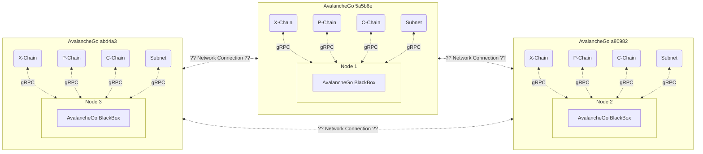
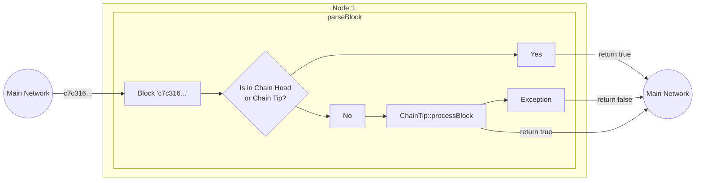
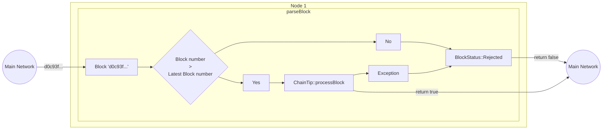

# File core/subnet.md

### Summary

* **About the Object**
* **Role of AvalancheGo Daemon**
* **Why AvalancheGo?**
* **Pre-initialization**
* **Initialization**
* **Class members of Subnet**
* **Shutdown**

## About the object Subnet

As examplified in [entry-point file](../src/main.md) the objective of the class Subnet is to encapsulate and redirect modules of Nodes, where the Subnet will act like an intermediator, the Subnet (Subnetooor) will also handle smart-contracts written in [Solidity](https://github.com/ethereum/solidity) while participating in a Network made of Sparq Subnets.

Currently, the only integration layer to communicate with other Nodes is dependent on VMs (Virtual Machines, more in [AvalancheGo](https://github.com/ava-labs/avalanchego/tree/master/vms)) by [AvaLabs](https://www.avalabs.org/), and is being developed a communication peer-to-peer between Subnets (Subnetooor) with a proper structure of requests.

## Role of AvalancheGo Daemon

The AvalancheGo and our Subnet communicate between the service/protocol to access other nodes, AvalancheGo itself is a Virtual Machine executing the Subnet binary (Subnetooor), the same VM serve as a Mainnet for the Nodes, the VM will read the terminal output in "``std::cout << "1|19|tcp|" << server_address << "|grpc\n" << std::flush;``" and propagate the IP to the connected Nodes being executed in parallel (script ``scripts/AIO-setup.sh``), furthermore the AvalancheGo includes the Subnet (Subnetooor) as a valid and available blockchain.

According to the [_documentation_](https://docs.avax.network/subnets/create-a-local-subnet) by AvaLabs every initialization (of the VMs) creates the blockchain; X-Chain, P-Chain and C-Chain, and every "Chain" running their applications and contracts, the role of AvalancheGo Daemon is to behave as a Local Mainnet where the registred Nodes can connect and transit to any Node in between.



### Caution

Every Virtual Machine of AvalancheGo is executing a copy of Subnetooord (our binary), observe the file **_debug.txt_** inside each VM in **_$GO_DIRECTORY/src/github.com/ava-labs/avalanchego/node{n}_** to get the logs of every binary, the same file can be read at the root directory when executing as Standalone.

## Why AvalancheGo

One of the pre-requisites to be satisfied in at the project's beginning was the implementation of AvalancheGo itself, great achievement that increased the project scope but also benefits the public image of the project.

## Pre-initialization

After initialization the VMs of AvalancheGo the Subnet binary has 60 seconds to initialize, because after the timelimit expires a request to register the Subnet will be sent (using cURL).

**cURL request in AIO_Setup.sh:**

```json
{
  "jsonrpc": "2.0",
  "method": "platform.createBlockchain",
  "params" : {
      "subnetID"   : "'$SUBNET_ID'",
      "vmID"       : "'$SUBNET_ID'",
      "name"       : "Subnetooor",
      "genesisData": "0x68656c6c6f776f726c648f8f07af",
      "username"   : "'$USERNAME'",
      "password"   : "'$PASSWORD'"
  },
  "id": 1
}
```

This timelimit happens because it is a pre-requisite of the VMs to be "prepared", that is the Mainnet receive a request to _create a blockchain_ with the Node's credentials represented in ```platform.createBlockchain``` request, right after the initialization ```Subnet::start``` of our binary will output the service port in terminal.

During the process of ```Subnet::start``` we create an instance of a server gRPC (```shared_ptr Subnet::grpcServer```) allowing a request channel to be called asynchronously by AvalancheGo, methods like; Initialize, Shutdown and block validation, the entire interface can be found at ```proto/vm.proto```.

## Initialization

After the AvalancheGo added our Subnet to the list of connected Nodes, the Mainnet will emit the command ```rpc Initialize(InitializeRequest)``` equivalent to the method ```Subnet::initialize```, starting the following instances (stored in Subnet's pointer):

* DB
* gRPC Client
* State
* ChainHead
* ChainTip
* BlockManager
* P2PManager
* HttpServer

Meanwhile, the Subnet stores in a struct ```InitializeRequest``` a collection of data from the Mainnet, like chainId, subnetId, etc.

### About DB

Any record in 'ChainHead' will be stored in a key pair <Key/Value> inside the DB (LevelDB), the 'database scheme' is an inherit of previous iteractions where we directly stored the data in AvalancheGo.

The database scheme is the following:

| Prefixo | Tipo de Dado | Comportamento | Valor                   |
| ------- | ------------ | ------------- | ----------------------- |
| 0001    | Key          | Block Hash    | Block                   |
| 0002    | Key          | Block nHash   | Block Hash              |
| 0003    | Key          | Tx Hash       | Transactions            |
| 0004    | Key          | Address       | Native Balance + nNonce |
| 0005    | ERC20        | -             | Tokens/State            |
| 0006    | ERC721       | -             | Tokens/State            |
| 0007    | Key          | Tx Hash       | Block Hash              |

The access of the data and its instance is a member of ```Subnet::dbServer```, the object's behaviour is based on the structure found in **_proto/rpcdb.proto_**.

### About gRPC Client

AvalancheGo expects a 'gRPC Client' when the Node needs to request anything related, for that to happen the 'gRPC Client' must have the behaviour of any (or all the) file(s) **_proto/aliasreader.proto_**, **_proto/keystore.proto_**, **_proto/metrics.proto_** and **_proto/sharedmemory.proto_**.

### About State

The class 'State' stores the current state of the system, activities like native balance, contract states, mempool of transactions (non-ordered list composed of Hash, Base and SafeHash), balance of tokens and variables/procedures of the blockchain. Only new blocks can update the 'State', by creating one itself or receive a new block from the network.

### About Chain Head

The 'Chain Head' tracks data from the blockchain, it stores confirmations of blocks and transactions, this data can be accessed in various parts of the system.

### About Chain Tip

'Chain Tip' is similar to 'Chain Head', but tracks only rejected blocks, blocks being processed at the time and preferred block (block with greater chance) of being accepted.

### About Block Manager

**_TODO:_** Waiting full implementation in the system to be described.

### About P2PManager

This service peer-to-peer 'P2PManager' is done with web-sockets, this service is responsible for propagation of transactions and data about the block being processed to other Subnets (Subnetooor).

### About HttpServer

We provide a 'HttpServer' so any web application using the popular frameworks (Web3, ethers, etc) can consume the Subnet, apps like MetaMask, Coinbase and Frame.

## Class members of Subnet

As previously mentioned on the topics '**Pre-initialization**' and '**Initialization**', the _Mainnet_ make asynchronous requests of various methods related to the state of Blockchain (see **__proto/vm.proto__** for more details), either to validate if the data is synced or use block validator. 

### Subnet: SetState

According to the AvalancheGo's source-code implementing **_proto/vm.proto_**, this method is called when the _Mainnet_ emits the current State the network (more in [net/grpcserver.md](../net/grpcserver.md)).

**_Caution:_** Currently not implemented because of its recent inclusion on Avalabs side.

### ParseBlock

The _Mainnet_ sends a block to be parsed by the Node, if present in 'Chain Head' or 'Chain Tip', ignoring the rejection or acceptance of the block in 'Chain Head', and meeting the following conditions:

1. In two occurrences it can return **_true_**, the first when it has already been processed previously, and the second when it is added to the 'Chain Tip' for processing.

2. The only ocorrence it can return **_false_** at this stage is when the 'Chain Tip' throws an exception.

### Condition 1.



### Condition 2.



**_Caution ¹:_** We avoid the rejection of Blocks in the future (higher number height or Unknown), this prevention is because AvalancheGo can negate to resend the same block at the right time, making the Chain invalid. 

**_Caution ²:_** 'ParseBlock' **does not validate the transaction logic**, it only checks the signatures.

### Subnet: acceptBlock

The method ```Subnet::acceptBlock``` receives from the _Mainnet_ the Hash of a block present in 'Chain Tip', this triggers the system to add from 'Chain Tip' to the 'Chain Head', the AvalancheGo should never send another block with the same number height, otherwise an exception will be thrown.

### Subnet: rejectBlock

This method is called by the _Mainnet_ when a block previously sent to the 'Chain Tip' should be rejected.

### Subnet: setPreference

The _Mainnet_ sends a Hash of the block present at 'Chain Tip', the selected block will be set to preferred block.

### Subnet: validateTransaction

Validates a transaction, exclusive only for Sparq Subnets (Subnetooor), it checks if the account has balance, 'nonce' is valid and if the transaction is missing at 'memory pool'.

**_Caution:_** This allocation of transaction in 'memory pool' does not alter the 'State' of the program (check the **_state.h_**).

### Subnet: verifyBlock

Verifies the transactions of a given block, if the Hash of the new block has the previous block present at 'Chain Head', if its height order is sequenced, and whether the block signature is consistent with the primary validator in the list of connected Nodes.

If all the mentioned conditions are satisfied the block will be added to the end of 'Chain Tip'.

### Subnet: getAncestors

Checks the origins of a given block, its depth, size and time, if the block is present in 'Chain Head', if the block exists within the 'Chain Head', a verification is made from the starting point (position of the found Block) to the most recent block.

### Subnet: getBlock

Returns a block if exists in 'Chain Head' or in 'Chain Tip', if the block is found in 'Chain Head' returns the block with ```Status: Accepted```, otherwise the block is present in 'Chain Tip' the status can be ```Status: Unknown | Processing | Rejected```, otherwise the block was not found.

### Subnet: blockRequest

Create a new block if a preferred block is in 'Chain Tip' (see **setPrefence**).

### Subnet: connectNode

Stores in the memory the connection of a Node, this method can be used by _Mainnet_.

### Subnet: disconnectNode

Discart a Node connection from memory.

## Shutdown

Similar to the initialization, the shutdown procedure is requested by AvalancheGo, the function is located at ```Subnet::stop```, with the following sequence:

1. Write the contents of 'Chain Head' from memory to the database.
2. Write the contents of 'State' from memory to the database.
3. Shutdown a database.
4. Turn off 'HttpServer' service.
5. Full shutdown with the Subnet::shutdownServer method.