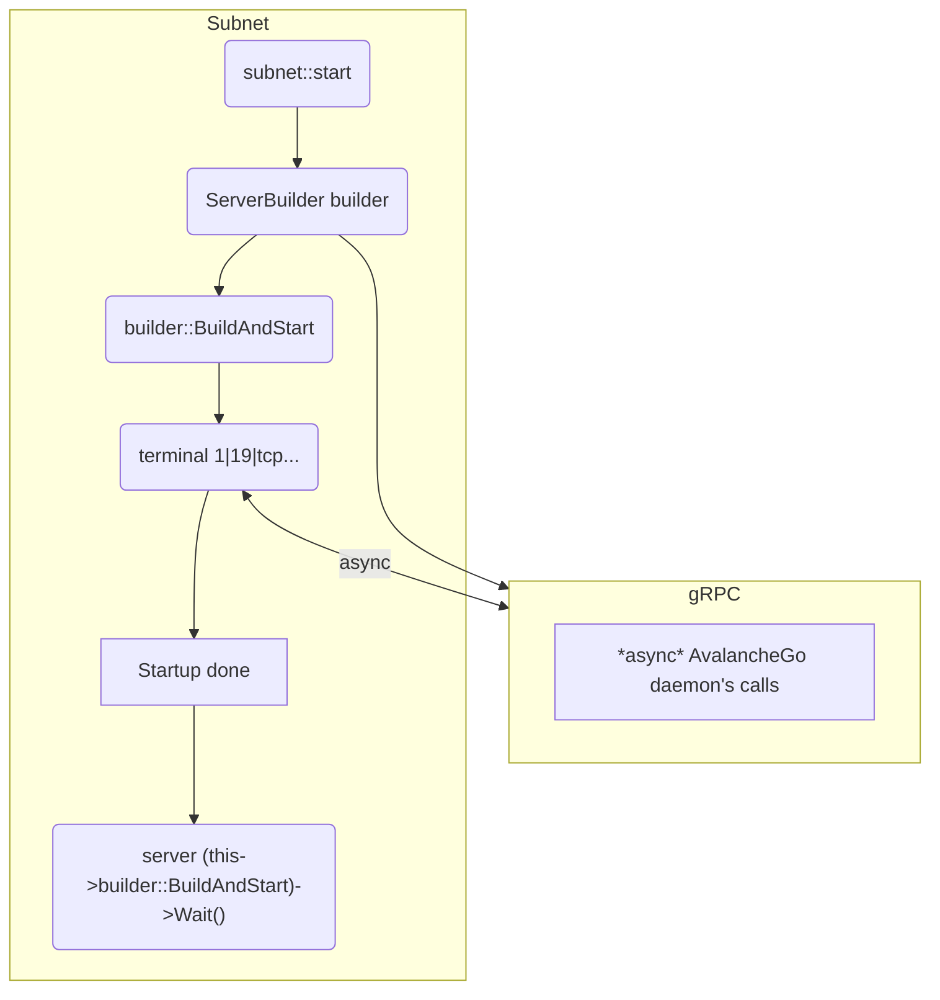

# Arquivo Main.cpp

Em nosso *ponto de entrada* é criado um [**ponteiro único**](https://en.cppreference.com/w/cpp/memory/unique_ptr) para a instância de Subnet, observe que o ponteiro é definido fora do bloco da função "*int main() {...code}*" tornando-a um ponteiro global único.

A Pré-inicialização da Blockchain é feito pelo membro da classe *subnet->start*, esse processo consiste na preparação dos serviços que são utilizados para acessar a _Rede Principal_ (AvalancheGo), vale ressaltar que esse procedimento apenas prepara o ambiente para a _Rede Principal_, onde em determinado momento irá receber as informações da Mainnet e começar o processo de inicialização.

O principal serviço iniciado em *subnet->start* é o 'gRPC Server', que na implementação atual é nosso único canal de recepção onde a _Rede Principal_ envia os dados, sua instância pode ser encontrada em ```Subnet::grpcServer```.

O papel de 'gRPC Server' é de intermediador das solicitações dá controle a Subnet em quaisquer operações, imagine-o como um controlador de conteúdo que direciona os dados para as conexões dos Nodes (disponível pelo gRPC e a interface AvalancheGo Daemon) para transações e operações solicitadas.

Para exemplificar melhor considere o seguinte fluxograma:



## Para saber mais...

Visite [**esse documento**](../core/subnet.md) com as relações da classe base do Subnet e outros diagramas.
