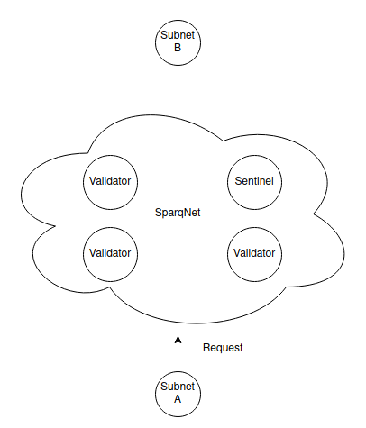
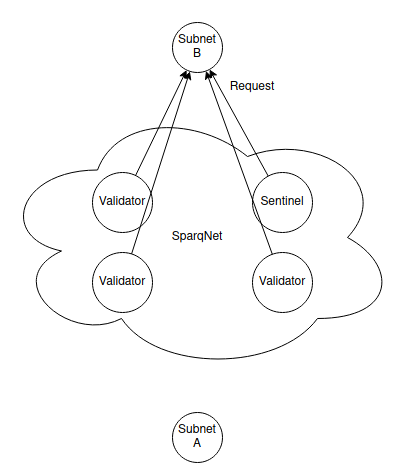
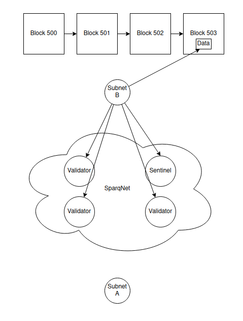
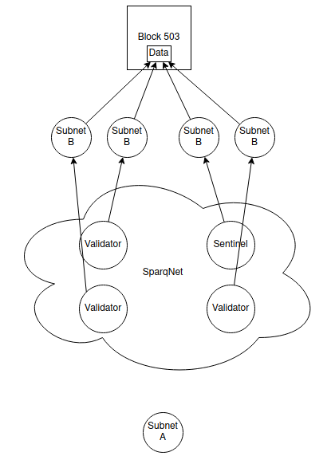
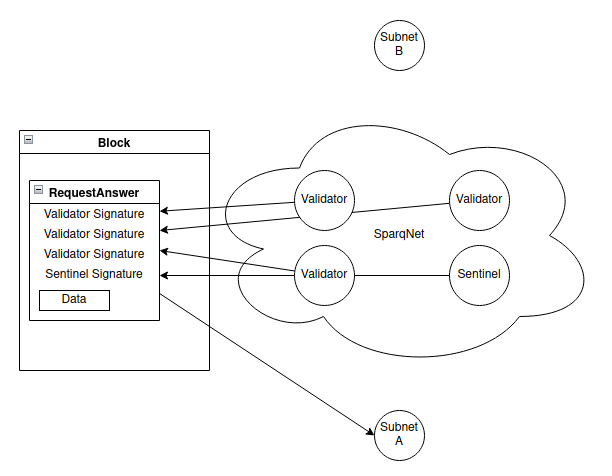

# Sparq Bridging

The biggest problem in using our tools/SDK to create your own Subnet/DAPP chain is that it is not as flexible as VM's chains, you are not able to easily deploy new contracts to the chain, for example, imagine that you have set up a triple AAA DAPP chain that uses NFT's for its game, but your chain doesn't have an NFT Marketplace for your game, what now? You would need a mandatory network update to implement such a marketplace. Due to the decentralized nature of blockchains, this could take days or even weeks until the marketplace is fully active and heavily damage the reputation of your project.

Our solution is to natively allow Sparq-enabled Blockchains to natively "read/write" into each other by using the Sparq Network as a middleman for the communication.

### Arbitrary data Sparq <-> Sparq Bridging

Bridging from a Sparq Subnet (A) to another Sparq Subnet (B) is simple.

- firstly, Subnet A writes the requests to the next block and relays the request with the block reference to the Sparq Network

- Then, the randomly selected validators/sentinels (using RandomGen) check the request on Subnet A and request the data to Subnet B

- Subnet B publishes the answer data within its blockchain and inside a merkled item, then sends the Sparq Network the published data and the reference for it within its blockchain to be permanently stored.

- Validators and Sentinels checks the data sent by Subnet B against other nodes of Subnet B to ensure that the data is inside that given block.

- Validators and Sentinels signs the data and publish them inside the SparqNet network, besides also relaying it back to Subnet A

)

- Subnet A verifies the signatures made on the answer, checks if the randomly selected nodes were using the network RandomGen

### Token Sparq <-> Sparq Bridging

The same method for Arbitrary data is used for token bridging, but there are extra checkups to guarantee that a given Subnet is not simply minting another Subnet token while bridging.

Due to the design of the system, we can only ensure that "data exists" not that "data is valid in context" when doing a cross-chain transaction, by doing that, it allows a given Subnet to mint the native token of another Subnet when trying to do a cross-chain transaction because the SparqNet does not verify if the token is valid inside that network.

We avoid this problem by keeping a token table of the Subnets, a token table is a simple "spreadsheet" of the subnets and their token balance, except for the Subnet native token, because the Subnet itself has the rights of minting freely his token (minting of it's token requires checks within its Subnet), we don't need to keep it.

For example, we have Subnet A, B, and C, each one with tokens of another one, where the Sparq Network keeps track of:

-  How many B/C's exist on A
-  How many A/C's exist on B
-  How many A/B's exist on C

When bridging another Subnet's token, the Sparq Network verifies if that Subnet has enough balance to bridge, when bridging your own token, it will only increase the balance on the target Subnet because, for the "exit" transaction from your Subnet to be valid in the Sparq Network, it has to be included in one of your blocks, which means it has been verified inside your network which validates the minting transactions of your token.

Sparq <-> Sparq Bridge follows mint/burn mechanisms.

### External Network Bridging (Ethereum, Solana, Etc)

Due to the limited processing power of these networks (Ethereum, for example), the current implementation for the bridging is Centralized and owned by Sparq Labs Inc.

Sparq <-> External bridge follows lock/release mechanisms.

### How is safety ensured?

The nodes selected to read from a given Subnet are determined using RandomGen, the trustless decentralized randomness generator developed by Sparq Labs Inc. Read rdPoS to understand more about it.

By that, we ensure to keep a "fair" selection of nodes, but even, there is the possibility of a 51% attack, for example, if a given malicious user has 50 nodes on the network and the network has a total of 100 nodes, and all of the malicious user gets selected for driving a cross-chain request and a block, they could collude and forward any message.

We avoid this by introducing Sentinels to the network, Sentinels are Sparq Labs powered Validators that help to ensure that collusion does not happen, Sentinels are not able to push new blocks, but rather work together with Validators to drive the network forward, read rdPoS for more information.