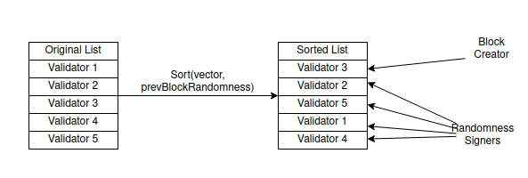
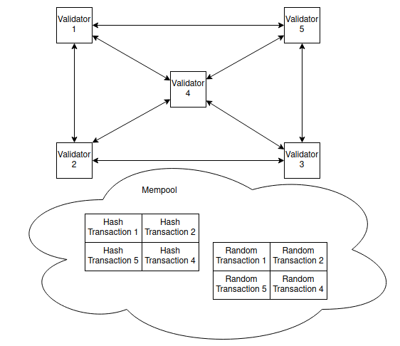
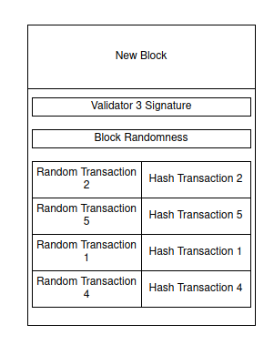

# rdPoS - Random Deterministic Proof Of Stake

Este documento explica o algoritmo rdPoS (Random Determinstic Proof Of Stake), usado pela rede Sparq.

* [Visão geral dos blockchains](#visão-geral-dos-blockchains)
* [Como o rdPoS funciona](#como-o-rdpos-funciona)
* [Implementações de validadores](#implementações-de-validadores)
  * [Descentralizada](#descentralizada)
  * [Centralizada](#centralizada)
  * [Semi-descentralizada](#semi-descentralizada)
* [Slashing](#slashing)
* [Implementação do rdPoS](#implementação-do-rdpos)

## Visão geral dos blockchains

Um dos grandes problemas do desenvolvimento de blockchains é ter que lidar com os chamados "rollbacks".

Por exemplo, no chain do Bitcoin, supondo que há um bloco "latest" que possui outro bloco após o mesmo. Se um nó recebe um bloco que substitui esse bloco "latest", o bloco seguinte e todas as transações feitas nele também são, o que resulta em um rollback do estado do blockchain em um bloco.

Os chains do Bitcoin e similares seguem a regra do "longest lived chain" (o chain maior, ou seja, com maior prova de trabalho acumulada, é o chain principal), porém rollbacks introduzem problemas com essa regra. Por exemplo, ao criar DApps onde o desenvolvedor tem que lidar com essas condições especiais, o que pode dar mais trabalho dependendo do tamanho/complexidade da aplicação.

TODO: flowchart aqui

No caso do diagrama acima, o bloco C foi substituído pelo bloco D seguido do E, fazendo rollback das transações feitas no bloco C.

A solução para esse problema é evitar a condição de rollback propriamente dita. Isso pode ser feito definindo deterministicamente qual nó da rede pode criar um bloco, assim um "block race condition" não acontece e todos na rede ficam sincronizados no mesmo bloco.

## Como o rdPoS funciona

Um bloco numa rede rdPoS é criado seguindo certas regras:

1) Receba uma lista de validadores da rede e sorteie essa lista de forma aleatória, usando o seed "randomness" do bloco anterior.

2) O primeiro validador da lista será o criador do bloco, enquanto cada um dos outros (no mínimo 4) criarão um string aleatório de 32 bytes e farão duas transações com ele: uma contendo o hash desse string, outra contendo o próprio string puro, ambos assinados.

3) Os hashes são verificados para garantir que correspondem aos respectivos strings aleatórios.

4) Um novo bloco é criado pelo primeiro validador, concatenando e hasheando os strings aleatórios dos outros validadores para criar um novo seed "randomness" que será usado na próxima vez no passo 1.

5) O bloco é assinado e publicado na rede pelo primeiro validador, enquanto os outros validadores verificam se todas as assinaturas das transações (aleatórias e hasheadas) correspondem com a lista do passo 1.

No caso do bloco genesis (o primeiro bloco do chain), como não há validadores na rede, o seed "randomness" é fixo (hardcoded). Além disso, para fazer o bootstrap da rede, é necessário ter 5 validadores fixos também, pois cada bloco requer pelo menos 4 validadores para as assinaturas e um para assinar o bloco em si.

## Implementações de validadores

Como os validadores são adicionados na rede fica por conta do desenvolvedor, mas é providenciado três tipos de implementações: *descentralizada*, *centralizada*, e *semi-descentralizada*.

### Descentralizada

Em uma implementação descentralizada, **todos os validadores são obrigados a participar da criação do bloco** para garantir que não haverá conluios.

Uma rede totalmente descentralizada usando rdPoS pode ser potencialmente falha quando o número de validadores na rede atinge um certo número (10000, por exemplo) - a latência entre esses nós pode se tornar um problema.

Para resolver isso, o tempo do bloco numa rede descentralizada precisa ser maior (entre 15 a 30 segundos, por exemplo), assim todos os nós terão tempo de responder.

Validadores podem ser adicionados à rede trancando ("locking") uma certa quantidade de tokens dentro do contrato do BlockManager (a classe que mantém a lógica do rdPoS).

### Centralizada

Em uma implementação centralizada, toda rede tem um "endereço mestre" que é permitido adicionar quantos validadores quiser - nesse caso, o desenvolvedor, que tem a responsabilidade de manter o chain rodando.

O número de nós recomendados nessa implementação é 32, mas pode-se usar mais ou menos nós dependendo da necessidade da aplicação.

### Semi-descentralizada

Em uma implementação semi-descentralizada, são usados os dois tipos de validadores das implementações anteriores:

* Um validador normal, simplesmente chamado de "validador", similar ao da rede descentralizada e adicionado da mesma forma (trancando tokens); e
* Um validador chamado "sentinela", similar ao da rede centralizada e adicionado da mesma forma (com um "endereço mestre")

O detalhe aqui é que nem validadores nem sentinelas conseguem criar um bloco por conta própria - o "randomness" requer *pelo menos uma* das transações vindas de uma sentinela, e quem for enviar o bloco é obrigado a seguir a ordem da lista de validadores.

Isso permite um número menor de validadores na rede (16, por exemplo), necessitando de menor poder de computação para verificar, mas mantendo padrão alto de segurança. Como as sentinelas participam do processo, qualquer byte extra no string concatenado de "randomness" vai mudar o hash resultante.

## Slashing

O que acontece quando um nó responde um "randomness" que não corresponde ao próprio hash? Ou quando um nó cria um bloco inválido com transações inválidas? Ou quando um nó não consegue criar um bloco antes do tempo limite da rede?

Nós da rede com um comportamento fora do padrão sofrem consequências. Como assinaturas de validadores são requeridas a nível de protocolo, se um validador tentar quebrar as regras, é possível saber quem ele é por causa da assinatura e "cortá-lo" ("slashing") da rede.

No momento o maior problema é um grupo de validadores sendo "cortados" e fazendo a atividade da rede parar por causa disso. Pode-se resolver o problema adicionando condiçoes extras na rede, por exemplo, se a rede quiser trocar o criador atual do bloco (caso ele tenha sido "cortado"), pelo menos 90% dos validadores da rede precisam assinar uma transação consentindo com a troca, sempre mantendo o consenso da maioria.

TODO: precisamos listar todos os edge cases aqui (verbatim do Ita)

## Implementação do rdPoS

No código atual, a classe BlockManager é a classe que mantém e aplica toda a lógica do rdPoS. O motor de "randomness" está em `utils/random.h` e também inclui embaralhamento de vetores.

No momento está sendo feito um protótipo rodando de forma centralizada.

TODO: provavelmente isso aqui vai continuar? Quando surgirem mais informações colocamos aqui

