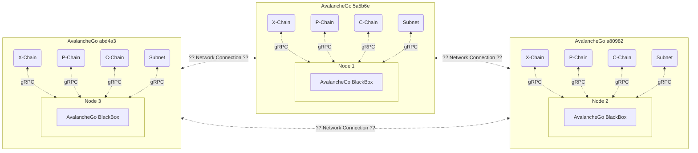

# Arquivo core/subnet.md

### Sumário

* **Sobre o Objeto**
* **O Papel do AvalancheGo Daemon**
* **Por que AvalancheGo?**
* **Pre-inicialização**
* **Inicialização**
* **Métodos do objeto Subnet**
* **Protocol Buffer e gRPC**
* **Desligamento**
* **Referências**

**_TODO:_** Sempre atualizar o Sumário com os tópicos mais recentes

## Sobre o objeto Subnet

Conforme exemplificado anteriormente no [arquivo ponto de entrada](../src/main.md) a finalidade da classe Subnet é encapsular e redirecionar os módulos dos Nodes onde a Subnet atuará como um intermediador, a Subnet (Subnatooor) também atuará como uma engine de execução para aplicações de smart contracts em [Solidity](https://github.com/ethereum/solidity) com integração de múltiplas vias da Rede Subnets Sparq.

Atualmente a única integração de comunicação dos Nodes é dependente das VM (Virtual Machines, mais em [AvalancheGo](https://github.com/ava-labs/avalanchego/tree/master/vms)) da [AvaLabs](https://www.avalabs.org/), e está sendo desenvolvido uma comunicação de Ponta-A-Ponta entre as Subnets (Subnatooor) e também um modelo de requisições para que outras Subnets realizem a conexão e comuniquem entre sí.

## O Papel do AvalancheGO Daemon

A AvalancheGo e nossa Subnet se comunicam pelo serviço gRPC para se comunicar com os nodes, o mesmo é uma Virtual Machine executando o binário Subnet (Subnetooor*) que servirá como Rede Principal para os Nodes, a própria VM Local faz a leitura da saída do terminal em "``std::cout << "1|19|tcp|" << server_address << "|grpc\n" << std::flush;``" e faz a propagação do IP para os Nodes que estão sendo executados em paralelo (pelo comando ``scripts/AIO-setup.sh``), além disso, o AvalancheGo adiciona a Subnet (Subnetoor*) a lista de chains disponíveis.

De acordo com a [*documentação*](https://docs.avax.network/subnets/create-a-local-subnet) do AvaLabs cada alocação gera as block-chain; X-Chain, P-Chain e C-Chain, e cada "Chain" com suas aplicações e contratos em execução, o papel do AvalancheGO Daemon é de uma Rede Principal Local onde os Nodes façam a conexão com a Subnet desejada fora da rede e internamente as solicitações são validadas.



#### Atenção

Cada Virtual Machine do AvalancheGo está executando uma cópia de Subnetoord, verifique o arquivo **_debug.txt_** de cada VM em **_$GO_DIRECTORY/src/github.com/ava-labs/avalanchego/node{n}_** para os logs do binário de cada Virtual Machine, o mesmo arquivo se encontra no diretório do projeto para os logs do binário local.

## Por que AvalancheGo?

Um dos pré-requisitos a serem satisfeitos no início do projeto foi a implementação do próprio AvalancheGo, grande feito que surgiu impacto no escopo do projeto más também beneficiou a imagem pública do projeto.

## Pre-inicialização

Após a inicialização das VMs do AvalancheGo temos 60 segundos até a inicialização do binário da Subnet (Subnatooor), pois assim que o tempo limite (60 segundos) for atingido todas as VMs irão receber uma solicitação cURL para o registro da blockChain na rede AvalancheGo.

**cURL em AIO_Setup.sh:**

```json
{
  "jsonrpc": "2.0",
  "method": "platform.createBlockchain",
  "params" : {
      "subnetID"   : "'$SUBNET_ID'",
      "vmID"       : "'$SUBNET_ID'",
      "name"       : "Subnetooor",
      "genesisData": "0x68656c6c6f776f726c648f8f07af",
      "username"   : "'$USERNAME'",
      "password"   : "'$PASSWORD'"
  },
  "id": 1
}
```

Esse tempo limite ocorre porque é um pré-requisito das VMs que sejam "configuradas", isto é receber na rede principal a solicitação de registro do Node Intermediário pelo método ```platform.createBlockchain``` e logo em seguida a inicialização do ```Subnet::start``` do nosso binário com a saída da porta do serviço pelo terminal.

Durante o processo de ```Subnet::start``` é inicializado um servidor gRPC (```shared_ptr Subnet::grpcServer```) que disponibiliza de forma assíncrona um canal de comunicação ao AvalancheGo, os métodos como; inicialização, shutdown e validar blocos, entre outros são recebidos por esse canal e podem ser encontrados em ```proto/vm.proto```.

## Inicialização

Após o AvalancheGo registrar a Subnet em sua lista de Nodes, ele sinalizará o comando ```rpc Initialize(InitializeRequest)``` que corresponde ao método ```Subnet::initialize``` do Subnet (Subnatooor), onde nele irá ser instanciado os membros:

* DB
* grpc Client
* State
* ChainHead
* ChainTip
* BlockManager
* P2PManager
* HttpServer

Além disso, a Subnet armazena no struct ```InitializeRequest``` as informações da rede que ele está conectado como o IP do servidor, chainID, subnetID entre outros.

### Sobre DB

As informações são armazenadas por um par de valores <Chave/Valor> dentro do DB, utilizando LevelDB, a única limitação presente é a estrutura dos dados que deve ser idêntica ao AvalancheGo, para a escrita e leitura dos registros armazenados na base de dados é necessário o acompanhamento da tabela abaixo.

| Prefixo | Tipo de Dado | Comportamento | Valor                   |
| ------- | ------------ | ------------- | ----------------------- |
| 0001    | Key          | Block Hash    | Block                   |
| 0002    | Key          | Block nHash   | Block Hash              |
| 0003    | Key          | Tx Hash       | Transactions            |
| 0004    | Key          | Address       | Native Balance + nNonce |
| 0005    | ERC20        | -             | Tokens/State            |
| 0006    | ERC721       | -             | Tokens/State            |
| 0007    | Key          | Tx Hash       | Block Hash              |

A transmissão de leitura e escrita do DB é realizada pelo membro ```Subnet::dbServer``` que possui a implementação do protocolo em **_proto/rpcdb.proto_**.

### Sobre gRPC Client

O 'gRPC Client' pode solicitar diretamente ao AvalancheGo os procolos nos arquivos **_proto/aliasreader.proto_**, **_proto/keystore.proto_**, **_proto/metrics.proto_** e **_proto/sharedmemory.proto_**.

### Sobre o State

A classe de 'State' serve para armazenar o estado atual do sistema, atividades como saldo nativo (native balance), estados de contratos, mempool de transações (lista não ordenada de Hash, Base, SafeHash), balanço de tokens e variáveis/processos da block-chain. Somente blocos podem atualizar o 'State', seja por ele mesmo criar um ou receber um novo bloco da rede.

### Sobre Chain Head

A 'Chain Head' realiza o rastreamento da própria block-chain, fáz o armazenamento das confirmações de blocos/transações, essas informações são consultadas em diversas partes do sistema.

### Sobre o Chain Tip

O 'Chain Tip' é similar ao 'Chain Head', porém ele realiza o rastreamento dos blocos rejeitados e blocos sendo processados no momento, o mesmo também rastreia o bloco preferencial (bloco com maior chance) de ser aceito.

### Sobre o Block Manager

**_TODO:_** Aguardando documentação do Itamar

### Sobre o P2PManager

O serviço de ponta-a-ponta 'P2PManager' é feito por web-sockets, esse serviço é responsável pela propagação de transações e informações do bloco processado para as demais Subnets (Subnatooor).

### Sobre o HttpServer

O 'HttpServer' disponibiliza uma conexão direta para serviços dos frameworks web (Web3, ethers, etc) como MetaMask, CoinBase e Frame.

## Métodos do objeto Subnet

**_TODO:_** escrever esse tópico.

## Protocol Buffer e gRPC

**_TODO:_** escrever esse tópico.

## Desligamento

**_TODO:_** escrever esse tópico.

## Referências

**_TODO:_** escrever esse tópico.
