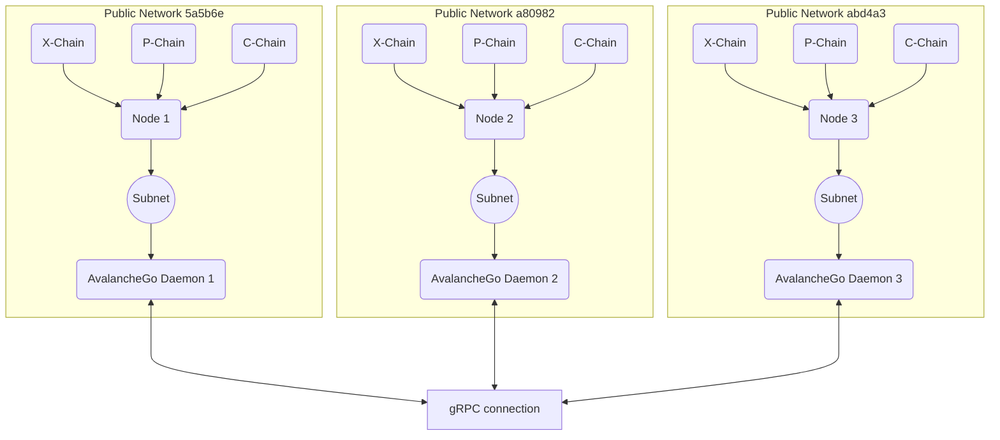

# Arquivo core/subnet.md

### Sobre o objeto Subnet

Conforme descrito anteriormente no [arquivo ponto de entrada](../src/main.md) a finalidade da classe Subnet é encapsular e redirecionar os módulos dos Nodes onde a Subnet atuará como um intermediador para remediar a lentidão apresentada em redes convencionais de block-chain, atualmente a comunicação dos Nodes é dependente das VM (Virtual Machines, mais em [AvalancheGo](https://github.com/ava-labs/avalanchego/tree/master/vms)) da [AvaLabs](https://www.avalabs.org/), e até o momento é discutido uma ferramenta in-house para a substituição das Virtual Machines, contanto esteja ciente que esse e outros documentos terão uma revisão referente a implementação ou desenvolvimento das ferramentas citadas.

### O Papel do AvalancheGO Daemon

A Subnet utiliza um serviço gRPC na criação da Virtual Machine que servirá como Rede Principal para os Nodes, a própria VM Local faz a leitura da saída do terminal em "``std::cout << "1|19|tcp|" << server_address << "|grpc\n" << std::flush;``" e faz a propagação do IP para os Nodes que estão sendo executados em paralelo (pelo comando ``scripts/AIO-setup.sh``).

De acordo com a [*documentação*](https://docs.avax.network/subnets/create-a-local-subnet) do AvaLabs cada alocação gera as block-chain; X-Chain, P-Chain e C-Chain, e cada "Chain" com suas aplicações e contratos em execução, o papel do AvalancheGO Daemon é de uma Rede Principal Local onde os Nodes façam a conexão com a Subnet desejada fora da rede e internamente as solicitações são validadas, o grande diferencial da nossa Subnet das demais implementações (Avalanche's Subnets por exemplo***teoricamente* seria quando ocorre o intermédio da nossa Subnet no encapsulamento dos processos? Supreme me ajuda pf.**

