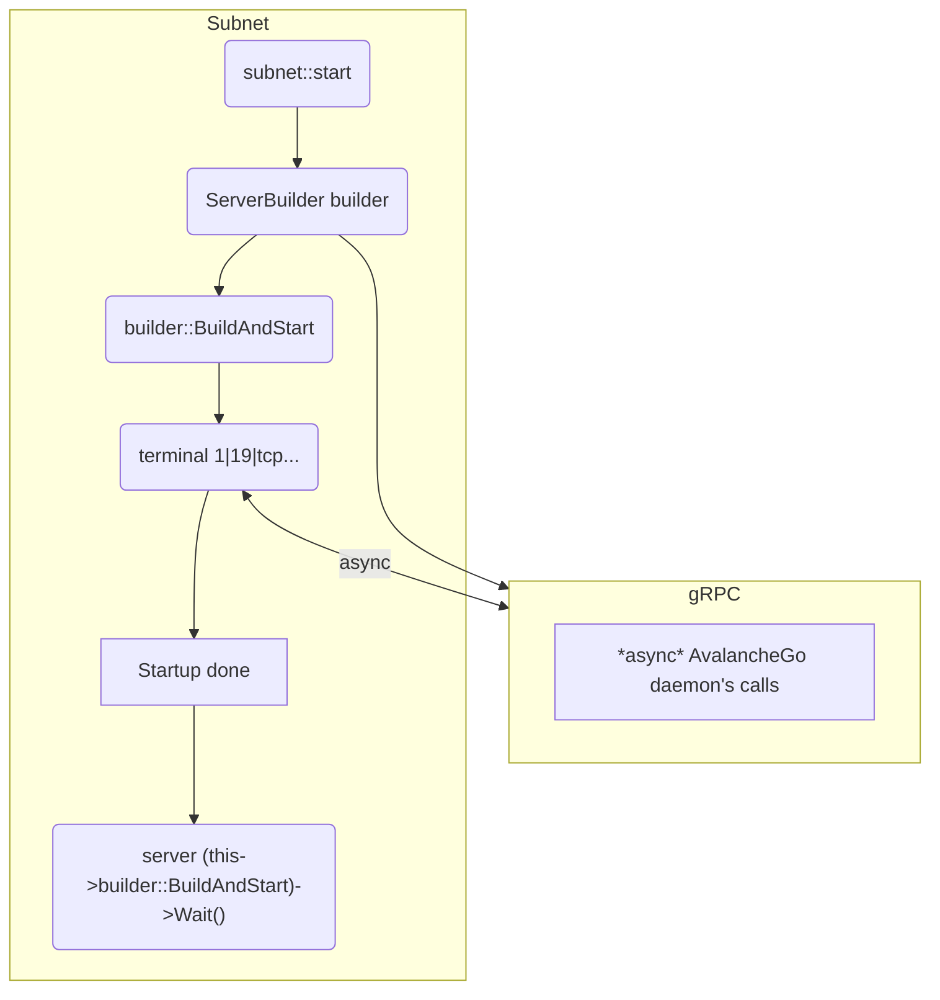

# File Main.cpp

In our *entrypoint* an [**unique pointer**](https://en.cppreference.com/w/cpp/memory/unique_ptr) is created for the Subnet instance, observe that the pointer is defined outside the function block "*int main() {...code}*" becoming a unique global pointer.

The Blockchain preinitialization is made by the class member *subnet->start*, this proccess consists of preparing the services that are used to access the _Mainnet_ (AvalancheGo), note that this procedure only prepares the ambient for the _Mainnet_, where at some point will receive data of the _Mainnet_ and start the process initialization.

The main service started in *subnet->start* is the 'gRPC Server', which in the current implementation is our only reception channel where the _Mainnet_ sends data, its instance can be found in ```Subnet::grpcServer```.

The role of 'gRPC Server' is being the middleman between AvalancheGo to the Subnet instance in any operations. Imagine it as a data source, as blocks and other operations are transmited by AvalancheGo to the Subnet.

To exemplify better consider the following flowchart:



## To know more...

Visit [**this document**](..core/subnet.md) with the Subnet base class relations and other diagrams.


